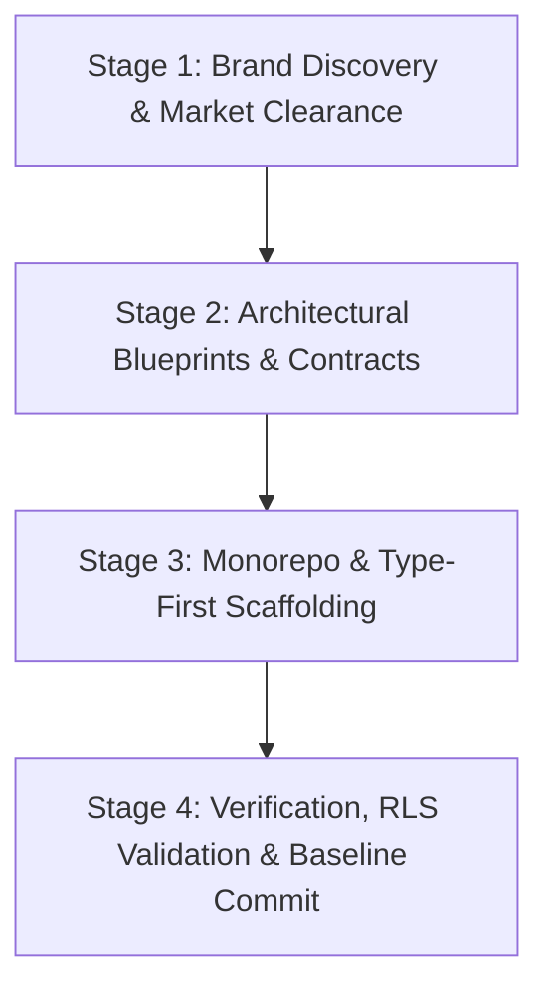

# Project Preparation & Inception Playbook (Phase 0)

This skill provides an end-to-end, battle-tested methodology for preparing, validating, and starting a software project from a blank canvas to an operational, compiling monorepo baseline.

---

## The 4-Stage Inception Framework



---

## Stage 1: Brand Discovery & Market Clearance

Before writing any code or initializing repositories, validate the brand identity and legal/commercial viability:

1. **Linguistic & Cultural Rooting**:
   - Ideate memorable, phonetically clear names with strong cultural resonance (e.g., regional dialects, Sanskrit, Indonesian root words).
   - Ensure the name clearly hints at the value proposition (e.g., *SiDaya* = *Si Daya* / Sang Penjual / Pemberdaya Niaga).
   - Formulate a compelling, rhyming or sticky slogan (e.g., *"Urusan Dagang, Gudang & Surat Jalan? SiDaya Aja!"*).

2. **Trademark & Search Risk Clearance**:
   - **Search Collision Check**: Search for existing apps, domains, and trademarks with similar names.
   - **Classification Differentiation**: If an entity uses the name in a completely different domain (e.g., government welfare programs), differentiate based on Nice Classification:
     - Class 9: Downloadable mobile applications & software.
     - Class 35: Business management, POS, inventory, commercial wholesale administration.
     - Class 42: SaaS, hosted web portals, cloud computing services.
   - **Corporate Parent Alignment**: Attribute the brand to a parent organization (e.g., *SiDaya by Ashvin Labs*) to prevent ambiguity.

---

## Stage 2: Architectural Blueprints & Contracts (Before Code)

Never begin scaffolding code without foundational documentation in place. In the `docs/` folder, draft:

1. **System Architecture & Tech Decision Log** (`docs/technical/01_SYSTEM_ARCHITECTURE.md`, `02_TECH_STACK_AND_DECISION_LOG.md`):
   - Clear justification of stack choices (e.g., React Native/Expo for mobile POS, Next.js for client PayLink, PostgreSQL with RLS for multi-tenant cloud).
   - Offline-first sync engine topology (local SQLite / WatermelonDB delta sync).

2. **Relational Database Schema & Data Model** (`docs/technical/04_DATABASE_SCHEMA_AND_DATA_MODEL.md`):
   - Mermaid ERD showing all entity relationships.
   - Complete DDL table specifications with foreign keys, constraints, and compound indexes.
   - Row-Level Security (RLS) policies defined upfront (tenant isolation, cashier COGS masking, driver invoice masking).

3. **API Contracts & Payment Gateway Specifications** (`docs/technical/05_API_SPECIFICATION.md`, `07_MODULAR_PAYLINK_AND_CHECKOUT.md`):
   - Global standard headers (`X-Tenant-ID`, `Authorization`, `Idempotency-Key`).
   - Unified payment gateway interface (`IPaymentGatewayProvider`) before provider-specific code is written.

4. **Dynamic Entitlements Matrix**:
   - Dynamic feature keys (`FeatureKey`) mapping modules to subscription tiers (`FREE_STARTER`, `RETAIL_STARTER`, `GROSIR_PRO`, `ENTERPRISE`).

5. **Implementation Deviation & Documentation-First Sync Invariant**:
   - Every time an implementation must change or deviate from the planned system (e.g. changing state management libraries, schema modifications, subdomain additions), update the documentation in `docs/` FIRST before writing or modifying code.

---

## Stage 3: Monorepo & Type-First Scaffolding (Phase 0)

Execute the scaffolding in strict dependency order:

### 1. Root Workspace Configuration
* Initialize git (`git init`) and comprehensive `.gitignore` (ignoring `node_modules`, `dist`, `.next`, `.expo`, `*.tsbuildinfo`, `.env*`).
* Configure package manager: `package.json` with `pnpm` workspaces (`pnpm-workspace.yaml`).
* Establish root `tsconfig.base.json` with maximum strictness:
  ```json
  {
    "compilerOptions": {
      "target": "ES2022",
      "module": "NodeNext",
      "moduleResolution": "NodeNext",
      "strict": true,
      "noImplicitAny": true,
      "exactOptionalPropertyTypes": true,
      "skipLibCheck": true
    }
  }
  ```

### 2. Foundational Types Package (`packages/shared-types`)
* Build this package **first** before any other package.
* Export domain enums (`FeatureKey`, `UserRole`, `SubscriptionTier`, `OrderPaymentStatus`).
* Export Zod schemas and inferred TypeScript models (`Product`, `InventoryBatch`, `SalesOrder`, `CashierShift`, `DeliveryOrderManifest`).
* Embed pure domain mathematical engines (e.g. `calculateCompoundDiscount` for wholesale `5%+2%+Rp1.000` math).
* Enforce security constraints at the type level (e.g., driver `DeliveryOrderItem` strictly omits unit price, subtotal, and discount columns).
* Verify build: `pnpm --filter @sidaya/shared-types run build`.

### 3. Database Layer (`packages/database`)
* Store initial DDL as versioned SQL files (`migrations/00001_initial_schema.sql`).
* Implement PostgreSQL RLS policies in SQL.
* Provide helper functions to inject session context (`SET LOCAL app.current_tenant_id = ...`).

### 4. Core Abstraction & Service Layers
* **Payment Layer (`packages/payment-core`)**:
  * Define `IPaymentGatewayProvider` with `createPaymentSession`, `verifyWebhookSignature`, `parseWebhook`.
  * Create concrete adapters for regional acquirers (e.g., Xendit, Midtrans, Duitku).
  * Build a pluggable `PaymentGatewayRegistry`.
* **API Core (`packages/api-core`)**:
  * Multi-tenancy middleware (`tenant-context.middleware.ts`) extracting tenant headers and setting RLS.
  * Feature gate middleware (`feature-gate.middleware.ts`) validating dynamic entitlements.
  * Domain services for orders, shift reconciliation, and logistics dispatch.

### 5. Application Skeletons (`apps/*`)
* **Mobile POS App (`apps/mobile`)**:
  * Expo SDK configuration (`app.json`).
  * Offline SQLite local schema.
  * Feature-Sliced Design: `src/database/`, `src/modules/pos/`, `src/modules/shift/`, `src/modules/delivery/`, `src/services/sync/`.
* **Client Checkout Web Portal (`apps/paylink-web`)**:
  * Lightweight (<60KB) responsive checkout renderer.
  * Real-time payment settlement stream listener (SSE/WebSocket).

---

## Stage 4: Topological Build & Strict Typecheck Verification

Never conclude Phase 0 without executing full verification across the entire monorepo:

1. **Workspace Dependency Linking**:
   ```bash
   pnpm install
   ```
2. **Topological Monorepo Build**:
   ```bash
   pnpm run build
   ```
   Ensure all packages build in topological order (`shared-types` -> `database` & `payment-core` -> `api-core` -> `apps/*`) with exit code 0.
3. **Whole-Monorepo Strict Typecheck**:
   ```bash
   pnpm run typecheck
   ```
   Ensure zero implicit `any`, zero missing optional types, and clean resolution of all workspace imports.
4. **Summary Documentation**:
   Update `walkthrough.md` to capture all created components and verification results.

---

## Reference Checklist

For an actionable step-by-step checklist during execution, refer to [references/inception-checklist.md](./references/inception-checklist.md).
