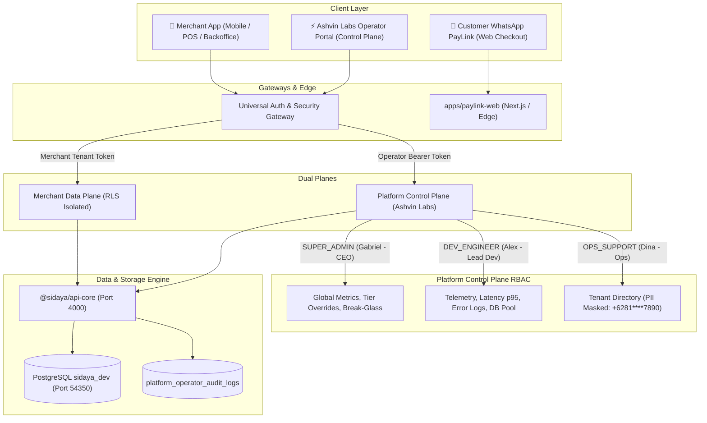

<div align="center">

# ⚡ SiDaya
### Institutional-Grade Mobile SaaS & ERP for Wholesale Distribution & Trade

[](https://github.com/gabrielfermy/siDaya/actions/workflows/ci.yml)
[](https://www.typescriptlang.org/)
[](https://pnpm.io/)
[](https://www.postgresql.org/)
[](docs/technical/06_SECURITY_COMPLIANCE_AND_TENANCY.md)
[](LICENSE)

<p align="center">
  <strong>SiDaya</strong> (by <strong>Ashvin Labs</strong>) is a next-generation, mobile-first SaaS operating system designed specifically for Indonesian wholesale merchants (<em>grosir sembako, beras, bahan bangunan, distributor FMCG</em>) and distribution fleets.
</p>

[Explore Documentation](docs/README.md) •
[Package Manifest](docs/technical/12_PACKAGE_AND_MODULE_MANIFEST.md) •
[Security & VAPT](docs/technical/11_SECURITY_ASSESSMENT_FRAMEWORK.md) •
[Dual Payment Engine](docs/technical/09_DUAL_PATH_AND_PLUGGABLE_PAYMENT_ENGINE.md) •
[API Specification](docs/technical/05_API_SPECIFICATION.md)

</div>


---

## 🌟 Executive Overview

In the Indonesian B2B supply chain, traditional wholesale trade is dominated either by manual carbon paper receipts (*bon kontan / nota rangkap*) or rigid, single-cashier POS software that fails to model real-world trade dynamics:
- **Wholesale Price Tiers & Multi-Unit Conversions** (e.g. *Karung 50KG* vs *Sak 25KG* vs *Kg Eceran* with compound discounts like `5% + 2%`).
- **Warehouse Aging & Inbound FIFO** (Rice aging, FIFO lot selection to prevent grain spoilage, multi-zone/bin tracking).
- **Logistics Privacy (Surat Jalan)** (Drivers and logistics partners must receive delivery manifests with **zero commercial pricing** to protect merchant margins).
- **WhatsApp PayLink & Automated Reconciliation** (Dynamic QRIS, Virtual Accounts, and automated receivables ledger).
- **Platform Control Plane & UU PDP Compliance** (Ashvin Labs operator command center, PII masking for customer support, and immutable break-glass audit trails).

SiDaya unifies all these capabilities into a high-performance **Offline-First Monorepo Architecture**.

---

## 🏛️ System Architecture: Dual-Plane Separation

SiDaya enforces a strict architectural boundary between customer business operations (**Merchant Data Plane**) and platform management (**Platform Control Plane**):



---

## 📦 Monorepo Structure (`pnpm-workspace`)

```
siDaya/
├── apps/
│   ├── mobile/                    # Native iOS & Android POS & Logistics client (React Native / Expo)
│   └── paylink-web/               # Customer-facing dynamic PayLink portal (QRIS, VA, E-Wallet)
├── packages/
│   ├── shared-types/              # Zero-dependency TypeScript models, DTOs, feature keys & RBAC enums
│   ├── database/                  # PostgreSQL migrations, schema DDL, RLS policies & seed scripts
│   ├── hardware-core/             # ESC/POS thermal & ESC/P2 dot-matrix multi-ply invoice printing
│   ├── payment-core/              # Midtrans, Xendit, and Duitku payment gateway integrations
│   └── api-core/                  # Core domain services (Orders, Shifts, FIFO, Surat Jalan, Admin API)
├── docs/
│   ├── business/                  # Tier 1: Investor, market & GTM roadmap documentation
│   └── technical/                 # Tier 2: System architecture, ADRs, database schema, and API specs
├── preview/                       # Interactive pairing & live prototype showcase (Port 3333)
├── supabase/                      # Local Supabase configuration, migrations, and seed data
└── docker-compose.yml             # Development PostgreSQL cluster on port 54350
```

---

## ⚡ Feature Matrix Comparison

| Feature Dimension | Paper Bon Manual | Legacy POS (Moka, Majoo) | e-Nota / Utility Apps | **SiDaya Enterprise OS** |
| :--- | :--- | :--- | :--- | :--- |
| **Primary Platform** | Physical Paper | Android Tablet / Desktop | Android Single-User | **Offline-First Native Mobile + Responsive Web** |
| **Multi-Tenancy** | None | Rigid accounts | Single device local | **Strict RLS Multi-Tenancy & Subdomain Routing** |
| **Inbound Logistics & Bins** | Paper slips | Basic inventory counts | Single stock number | **Inbound POs, arrival dates, Multi-Bin zones** |
| **Stock Rotation** | Manual memory | None | None | **Automated FIFO / FEFO Batch Allocation** |
| **Logistics Surat Jalan** | Handwritten paper | Extra add-on | Manual export | **Price-Masked Driver Manifest + Digital Signature** |
| **Wholesale Discounting** | Manual calculation | Basic discount | Eceran/Grosir toggle | **Multi-tier pricing, unit conversion & 5%+2% compound** |
| **Hardware Printing** | Carbon copy | Thermal only | Thermal only | **Bluetooth 58/80mm Thermal, WiFi A4 & Dot Matrix ESC/P2** |
| **Receivables (Piutang)** | Manual ledger | Extra add-on | Basic unpaid flag | **Automated Piutang Ledger with PayLink partial payments** |
| **Payment Collection** | Cash / Manual check | Register terminal | Manual transfer check | **Dynamic WhatsApp PayLink (QRIS, VA) with instant reconciliation** |
| **Operator Control Plane** | None | Limited backoffice | None | **Ashvin Labs Command Center, UU PDP Masking & Audit Trail** |

---

## 🚀 Quick Start Guide

### Prerequisites
- **Node.js**: `v20.x` or `v22.x`
- **Package Manager**: `pnpm` (`v9.x` or `v11.x`)
- **Container Runtime**: Docker Desktop or Podman

### 1. Clone & Install Dependencies
```bash
git clone https://github.com/gabrielfermy/siDaya.git
cd siDaya
pnpm install
```

### 2. Start PostgreSQL Container
```bash
# Spins up PostgreSQL on localhost:54350 with schema and seed data
docker compose up -d
```

### 3. Build Monorepo
```bash
pnpm run build
```

### 4. Run Development Servers
You can start all development services in separate terminals:

```bash
# Terminal 1: Core API & Admin Engine (Port 4000)
pnpm run dev:api

# Terminal 2: Customer WhatsApp PayLink Web Portal (Port 3000)
pnpm run dev:web

# Terminal 3: Interactive Prototype & Preview Shell (Port 3333)
pnpm run dev:preview
```

Open `http://localhost:3333` to access the **Interactive Showcase & Dual Login Gateway**.

---

## 🧪 Automated Verification Test Suites

Run the full end-to-end verification suites covering both Merchant Data Plane and Ashvin Labs Control Plane:

```bash
# 1. Verify Phase 2 Multi-Tenant, FIFO Inbound, and Surat Jalan
pnpm run test:phase2
# or: npx tsx packages/api-core/test/verify-phase2.ts

# 2. Verify Ashvin Labs Operator Control Plane & Super Admin RBAC
npx tsx packages/api-core/test/verify-operator-control-plane.ts
```

**Expected Result**:
- `verify-phase2.ts`: 9/9 automated checks passed.
- `verify-operator-control-plane.ts`: 8/8 automated checks passed.

---

## 🛡️ Security, Privacy & UU PDP Compliance

SiDaya is engineered in strict adherence to **Indonesian Law No. 27 of 2022 on Personal Data Protection (UU PDP)**:
1. **Merchant Trade Secrets Protection**: Wholesale cost prices (*COGS / HPP*), supplier purchase discounts, and merchant net margins are strictly hidden from cashiers, drivers, and third-party customer support personnel.
2. **Support Agent Redaction**: When customer operations operators (`OPS_SUPPORT`) browse the tenant fleet, phone numbers are masked (`+6281****7890`) and owner identities initialized (`B*** S***`).
3. **Break-Glass Diagnostic Protocol**: Super admins and lead developers can only initiate emergency diagnostic sessions by linking an approved incident ticket (`INC-XXXX`) and justification, issuing an encrypted 60-minute token and immutably logging the event to `platform_operator_audit_logs`.

---

## 📚 Complete Documentation Sitemap

| Category | Document | Description |
| :--- | :--- | :--- |
| **Business** | [01_EXECUTIVE_SUMMARY.md](docs/business/01_EXECUTIVE_SUMMARY.md) | Vision, problem statement, solution, and executive pitch |
| **Business** | [02_MARKET_AND_PROBLEM.md](docs/business/02_MARKET_AND_PROBLEM.md) | Indonesian SMB market sizing and competitor positioning |
| **Business** | [03_PRODUCT_VALUE_PROPOSITION.md](docs/business/03_PRODUCT_VALUE_PROPOSITION.md) | Feature matrix, PayLink viral loop, and customer stickiness |
| **Business** | [04_BUSINESS_MODEL_AND_SAAS_METRICS.md](docs/business/04_BUSINESS_MODEL_AND_SAAS_METRICS.md) | Subscription tiers, payment rake economics, and unit margins |
| **Business** | [05_GO_TO_MARKET_AND_ROADMAP.md](docs/business/05_GO_TO_MARKET_AND_ROADMAP.md) | Migration playbook, acquisition channels, and Gantt roadmap |
| **Technical** | [01_SYSTEM_ARCHITECTURE.md](docs/technical/01_SYSTEM_ARCHITECTURE.md) | Monorepo topology, C4 diagrams, and real-time CDC engine |
| **Technical** | [02_TECH_STACK_AND_DECISION_LOG.md](docs/technical/02_TECH_STACK_AND_DECISION_LOG.md) | Architectural Decision Records (ADR 1 to 11) |
| **Technical** | [03_OFFLINE_FIRST_AND_SYNC_ENGINE.md](docs/technical/03_OFFLINE_FIRST_AND_SYNC_ENGINE.md) | WatermelonDB, SQLite, conflict resolution, and queue engine |
| **Technical** | [04_DATABASE_SCHEMA_AND_DATA_MODEL.md](docs/technical/04_DATABASE_SCHEMA_AND_DATA_MODEL.md) | Complete multi-tenant SQL schema, triggers, and indices |
| **Technical** | [05_API_SPECIFICATION.md](docs/technical/05_API_SPECIFICATION.md) | Complete REST API contract, auth endpoints, and admin APIs |
| **Technical** | [06_SECURITY_COMPLIANCE_AND_TENANCY.md](docs/technical/06_SECURITY_COMPLIANCE_AND_TENANCY.md) | Supabase RLS, cashier PINs, COGS masking, and UU PDP compliance |
| **Technical** | [07_MODULAR_PAYLINK_AND_CHECKOUT.md](docs/technical/07_MODULAR_PAYLINK_AND_CHECKOUT.md) | Dynamic QRIS, payment webhooks, and ledger auto-settlement |
| **Technical** | [08_AI_AGENT_DEVELOPMENT_GUIDE.md](docs/technical/08_AI_AGENT_DEVELOPMENT_GUIDE.md) | Agent development playbook, feature guards, and coding standards |

---

## 👥 Contributors & Ownership

- **Lead Architecture & Engineering**: Ashvin Labs Core Team ([@gabrielfermy](https://github.com/gabrielfermy))
- **Product & Commercial Direction**: Ashvin Labs Enterprise Solutions
- **Repository**: [github.com/gabrielfermy/siDaya](https://github.com/gabrielfermy/siDaya)

---

<div align="center">
  <sub>Built with precision by Ashvin Labs for Indonesian Commerce. Copyright © 2026 Ashvin Labs. All Rights Reserved.</sub>
</div>
