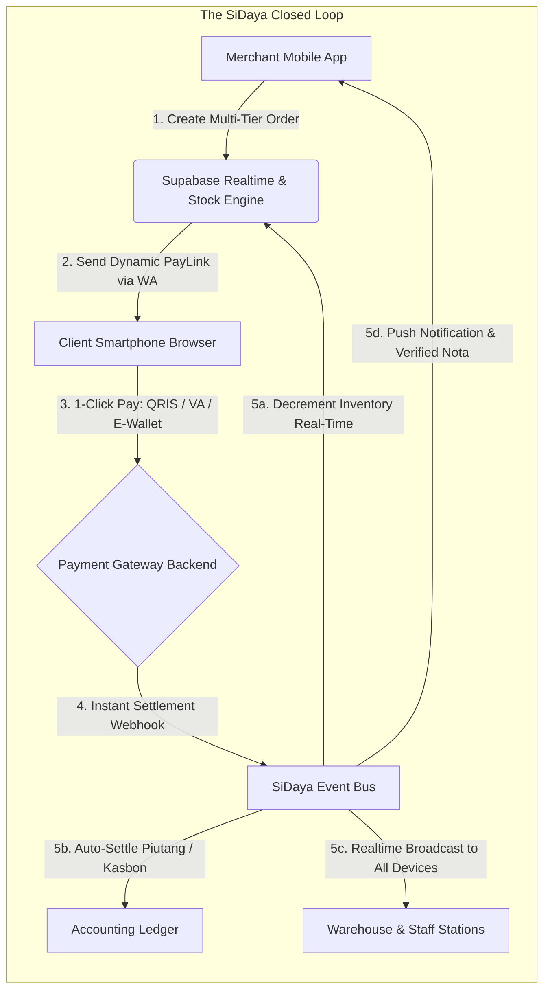

# Executive Summary
> **SiDaya by Ashvin Labs: Reimagining the Operating System for Wholesale & SMB Commerce**

---

### 1. Executive Snapshot

Small-to-medium businesses (SMBs / UMKMs), wholesale traders, and distributors are the economic backbone of developing economies, representing over **99% of total business establishments** and employing over **97% of the domestic workforce** in Southeast Asia. Yet, despite rapid consumer digitization, **over 80% of independent merchants still manage their daily operations using paper receipt pads (*nota kontan*), mental arithmetic, and unstructured WhatsApp chats**.

Existing software solutions have overwhelmingly failed this demographic:
* **Traditional Point-of-Sale (POS) systems** (e.g., Moka, Majoo, Pawoon) are expensive, desktop/tablet-bound, complex to operate, and tethered to constant high-speed Wi-Fi.
* **Incumbent Android receipt utilities** (most notably **e-Nota by Canggih Software** with 500k+ downloads) pioneered basic mobile receipt creation and wholesale pricing for Indonesian merchants. However, they suffer from critical architectural bottlenecks: severe multi-device synchronization delays, manual payment recording with no automated gateway settlement, ad-riddled interfaces, and fragile file-based desktop export/import.

**SiDaya** (developed by **Ashvin Labs**) bridges this multi-billion dollar gap with a **mobile-first, offline-ready, real-time SaaS platform** engineered specifically for the smartphone in a merchant's pocket. It combines all the battle-tested local features Indonesian merchants demand (*Eceran/Grosir* multi-tier pricing, `5% + 2% + Rp` compound discounts, unit conversions, ESC/POS Bluetooth & continuous-form dot matrix printing, and *piutang* tracking) with two game-changing modern differentiators:
1. **Dynamic Client PayLinks**: When an order is created, SiDaya delivers an interactive web link to the client via WhatsApp. The client taps the link, views the itemized invoice, and pays instantly via QRIS, Virtual Account, or E-Wallet. Payment settles automatically, the merchant's inventory decrements in real time, the debt ledger clears, and a verified digital receipt is issued—with zero manual intervention.
2. **Sub-Second Supabase Realtime Synchronization**: Powered by a PostgreSQL CDC (Change Data Capture) WebSocket backbone, every connected device—cashier counters, stockroom/warehouse, driver logistics, and owner smartphones—remains in continuous, conflict-free synchronization without the delays that plague legacy tools.

---

## 2. The Core Problem

Small merchants face a chronic trifecta of operational friction:

1. **The "Order-to-Cash" Choke Point**:
   Merchants spend up to **15 hours per week** calculating totals on calculators, writing manual paper receipts, sending photos of handwritten notes over WhatsApp, and manually checking mobile banking apps to confirm whether a customer actually transferred payment.
2. **Multi-Device Sync Latency & Phantom Inventory**:
   As stores grow past a single cashier, existing tools (like Canggih Software's e-Nota) break down: updates between devices lag, stock counts desynchronize, and cashiers routinely sell out-of-stock items, cutting net profit margins by 12–18%.
3. **Severe Working Capital Drag (Uncollected "Kasbon" / Debts)**:
   In emerging markets, 40–60% of wholesale and retail B2B orders operate on informal credit terms. Without automated payment reminders, escrow, or digital payment links, up to 15% of SMB receivables turn into delinquent bad debt.
4. **Lack of Tenant Staff & Shift Controls**:
   Store owners cannot safely delegate operations to staff because simple apps lack role-based access control (RBAC), fast cashier PIN switching, shift cash drawer balancing, and the ability to hide cost-of-goods-sold (COGS/Modal) from employees. Furthermore, rigid pre-set roles fail when an employee wears multiple hats (e.g. cashier also receiving warehouse goods).

---

## 3. The Solution: Frictionless, Modular, and Real-Time

SiDaya delivers six operational breakthroughs:

* **Dual-Surface Architecture: Mobile-First Field Ergonomics + Desktop Web Backoffice**:
   Engineered mobile-first for the smartphone in a field salesman's or cashier's pocket, complemented by a fully responsive **Merchant Web Backoffice Portal** (`app.sidaya.id`) for store owners and warehouse managers to manage catalog, inbound supply, and financial reports from any desktop or laptop browser.
* **Extreme User Experience (UX) Simplicity with Wholesale Power**:
   Designed for speed and minimal cognitive overhead. A cashier or owner can add products with dynamic *Eceran vs Grosir* price tiers, apply compound discounts (`5% + 2% + Rp 1,000`), switch unit conversions (*PCS $\rightarrow$ Dus*), and finalize an order in under **10 seconds**, entirely on a handheld smartphone.
* **Granular Checkbox Permission Matrix & Role-Adaptive Views**:
   Replaces rigid, brittle roles with an intuitive **Owner Checkbox Matrix**. Store owners can toggle modular capabilities (`pos:checkout`, `warehouse:inbound`, `logistics:dispatch`, `catalog:view_cogs`, `finance:reports`) per employee. Mobile and web interfaces automatically adapt, hiding unauthorized tabs to keep field screens uncluttered and protecting sensitive wholesale cost prices (COGS).
* **Complete Merchant Inventory, Inbound Logistics & Batch Rotation**:
   Tracks the entire lifecycle of goods from supplier purchase order to warehouse arrival. Records exact receiving dates, unit counts, storage bins (Warehouse $\rightarrow$ Zone $\rightarrow$ Rack $\rightarrow$ Bin), and supplier return policies (RTV). Employs automated **FIFO (First In, First Out)** and **FEFO** allocation so merchants (such as bulk rice, commodity, or grocery distributors) plan which batch to sell and dispatch first, eliminating stock spoilage and aging.
* **Outbound Logistics & Driver Working Permits (*Surat Jalan*)**:
   Instantly generates price-stripped driver working permits directly from sales invoices. Couriers and truck drivers receive a clear manifest showing products, quantities, units, and warehouse pickup bins—**with zero monetary amounts** to protect commercial privacy and prevent theft—while retaining a verifiable QR code linked to the master invoice.
* **The "Client PayLink" Ecosystem (The Core Differentiator)**:
   Instead of sending a static PDF or relying on manual bank transfer checks, SiDaya generates a hosted, branded payment portal. Customers can pay via National QRIS, bank transfer, or digital wallet with instant verification. The merchant does not need to reconcile bank statements—the system updates order status and inventory atomically upon payment completion.
* **Sub-Second Supabase Realtime Sync Engine**:
   Using Supabase Realtime / PostgreSQL CDC integrated with local SQLite/WatermelonDB, all tenant devices (cashier terminals, warehouse scanners, driver apps, owner monitors) stay synced with zero perceptible lag, even over erratic 4G/cellular networks.
* **Dynamic Modularity & Tenant Entitlement Engine**:
   The platform is built on an enterprise-grade **Domain-Driven Modular Monolith**. Features (such as Grosir Multi-Tier, Inbound Inventory & FIFO Batches, Surat Jalan Permits, Dot Matrix Drivers, or Piutang Ledger) can be dynamically activated or deactivated per tenant based on their active subscription plan without requiring client updates. (Niche modes like Cafe Table Management and Minimarket Fast-Scan are deferred to a low-priority backlog).
* **Ashvin Labs Platform Operator & Super Admin Control Plane (`admin.sidaya.id`)**:
   A dedicated management environment for Ashvin Labs executives, developers, and customer operations teams. Enables multi-tenant fleet monitoring (aggregated GMV, subscription status, active stores, API latency, error telemetry), subscription plan overrides, and privacy-preserving operator RBAC. Customer support officers manage onboarding and account resets with strict masking of merchant proprietary data (COGS, raw customer phone books), while developers execute break-glass diagnostics backed by an immutable audit trail.

---

## 4. Market Sizing & Opportunity

| Market Layer | Scope | Valuation / Target Size |
| :--- | :--- | :--- |
| **TAM (Total Addressable Market)** | 64.2 Million registered MSMEs in Indonesia alone; >150M across ASEAN. | **$18.5B USD** annualized addressable commerce software & payment take-rate market. |
| **SAM (Serviceable Addressable Market)** | Retail, food & beverage stalls, distributors, fashion, and services operating on smartphones. | **$3.2B USD** addressable software subscription and digital payment volume. |
| **SOM (Serviceable Obtainable Market)** | High-growth, digitally active merchants transacting via WhatsApp & social commerce (Years 1–3). | **$45M USD** ARR target (capturing 250,000 active paid subscribers and processing $600M GMV). |

---

## 5. Monetization & Business Model

SiDaya operates a high-margin, dual-engine revenue model:

1. **SaaS Recurring Subscription**:
   * **Free Tier (Starter)**: Single device, up to 50 orders/month (fuels organic viral acquisition).
   * **Pro Tier ($4.99 / IDR 69,000/month)**: Unlimited orders, full inventory management, automated WhatsApp receipts, and low-stock alerts.
   * **Business / Multi-Outlet ($14.99 / IDR 199,000/month)**: Multi-staff PINs, multi-warehouse stock sync, and advanced analytics.
2. **Fintech Payment Processing Take-Rate (MDR Margin)**:
   * A net margin of **0.3% to 0.6%** on all gross payment volume (GPV) routed through the client PayLink gateway (QRIS, Virtual Accounts, Credit Cards, and E-Wallets).
3. **Ancillary Value-Added Services**:
   * Official WhatsApp Business API messaging credits.
   * Merchant working capital referral commissions via licensed lending partners (Ashvin Capital network).

---

## 6. Financial Targets & Milestones

| Metric | Year 1 (Launch & Product-Market Fit) | Year 2 (Growth & Scale) | Year 3 (Market Leadership) |
| :--- | :--- | :--- | :--- |
| **Active Merchants** | 25,000 | 100,000 | 300,000 |
| **Monthly Paying Subscribers** | 4,500 (18% conversion) | 28,000 (28% conversion) | 105,000 (35% conversion) |
| **Annual Processed GMV (PayLink)** | $30 Million USD | $220 Million USD | $850 Million USD |
| **Blended ARR (SaaS + Fintech)** | **$580,000 USD** | **$3.85 Million USD** | **$16.2 Million USD** |
| **LTV / CAC Ratio** | 3.4x | 5.2x | 6.8x |

---

## 7. Investment & Strategic Highlights

* **Hyper-Defensible Network Effects**: Every PayLink sent to a consumer or wholesale client features an unobtrusive *"Powered by SiDaya - Start Invoicing Your Customers"* viral loop, turning end-customers into future merchant leads.
* **Resilient Offline-First Technology**: Unlike web-only tools that stall during frequent cellular connectivity drops, SiDaya's native SQLite synchronization guarantees 100% operational uptime at the checkout counter.
* **Prepared for Enterprise Scale**: Engineered with modular micro-boundaries and row-level tenant security, allowing rapid geographic expansion across Southeast Asia without core refactoring.
