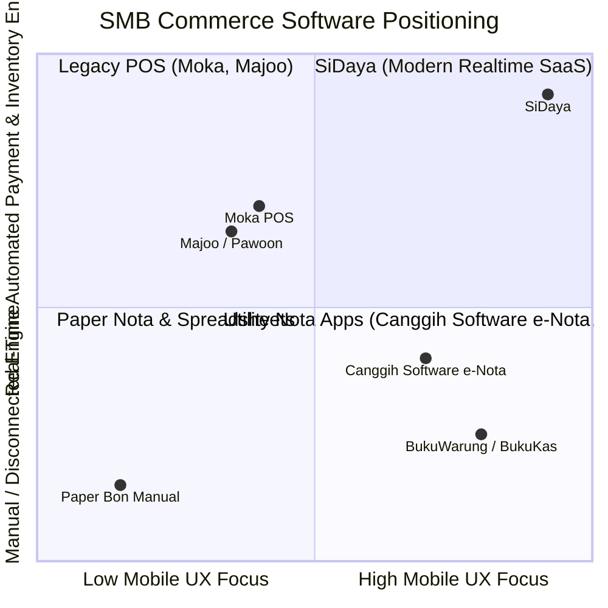
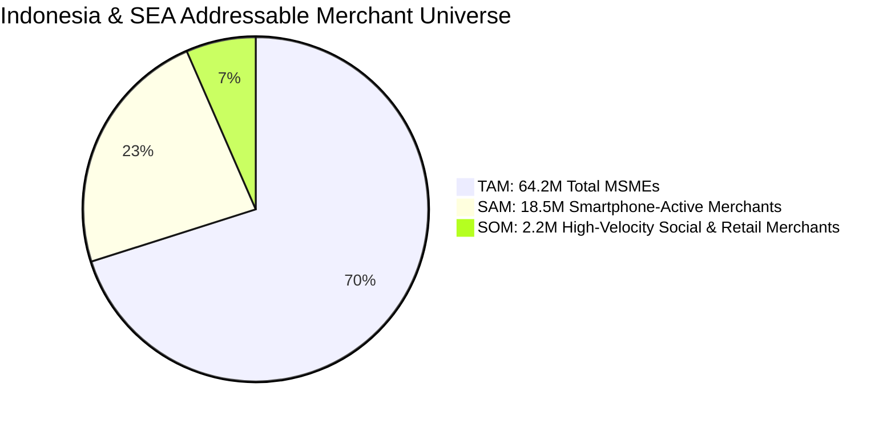

# Market Analysis & The Core Problem
> **Understanding the MSME Operating Environment, Competitive White Space, and the User Experience Void**

---

## 1. Macro Market Context: The MSME Landscape

In Southeast Asia—and specifically Indonesia—Micro, Small, and Medium Enterprises (MSMEs / *UMKM*) represent the lifeblood of economic activity:

* **64.2 Million** registered MSMEs in Indonesia alone (accounting for 61% of national GDP).
* **97% of domestic employment** is generated within this sector.
* **>80% Mobile-First Population**: While desktop computer penetration remains below 18% among small business owners, smartphone adoption exceeds **91%**.
* **The Rise of Social Commerce**: Over 70% of non-store retail transactions take place via WhatsApp chats, Instagram DMs, and TikTok inquiries rather than formalized eCommerce storefronts.

Despite the ubiquitous presence of smartphones and government-backed instant payment rails like **QRIS** (which has surpassed 30+ million merchant adopters), **the internal operational back-office of these merchants remains functionally stuck in the 1990s**.

---

## 2. Deep Dive: The Pain Points of SMB Inventory & Ordering

Small and medium enterprises suffer from four systemic operational bottlenecks that directly erode revenue and waste merchant time:

### Pain Point 1: The "Manual Nota" Bottleneck (Slow, Error-Prone, Unprofessional)
* **The Reality**: Cashiers and shop owners write paper slips (*nota kontan* / *bon manual*) with carbon copies. Each transaction requires 2 to 4 minutes to write down product names, calculate totals on a handheld calculator, and hand the slip to the customer.
* **The Cost**: During peak hours, checkout queues form, leading to abandoned purchases. Handwritten slips are routinely illegible, resulting in price discrepancies and accounting arguments.

### Pain Point 2: Disconnected Inventory ("Selling Ghost Stock")
* **The Reality**: Small merchants sell across multiple channels simultaneously (in-store counter sales, WhatsApp pre-orders, and phone deliveries). Because paper receipts do not communicate with the storeroom, stock counts are only updated when someone physically notices an empty shelf.
* **The Cost**: Merchants frequently accept pre-orders or customer deposits for items they do not possess, resulting in canceled orders, customer dissatisfaction, and rushed emergency restocks at unfavorable wholesale prices.

### Pain Point 3: The Payment Confirmation Nightmare (Manual Fraud & Friction)
* **The Reality**: When selling remotely via WhatsApp, the merchant sends their personal bank account number (BCA, Mandiri, BRI) or e-wallet phone number. The customer takes a screenshot of their transfer receipt and texts it back.
* **The Cost**:
  1. *Screenshot Fraud*: Customers use fake transfer receipt generator apps.
  2. *Reconciliation Hell*: The merchant must exit WhatsApp, open their mobile banking app, log in with biometrics, navigate transaction mutasi, and search for the exact matching amount before packaging goods.
  3. *Lost Sales Momentum*: Customers delayed in getting bank account details often change their minds before sending money.

### Pain Point 4: Runaway Receivables ("Kasbon" / Uncollected Customer Debt)
* **The Reality**: B2B distributors, boutique wholesalers, catering businesses, and neighborhood stores routinely extend informal credit to recurring customers. Debts are recorded in paper notebooks or mental memory.
* **The Cost**: Without automated payment reminders or convenient digital links to settle debts instantly, 10–15% of extended credit becomes uncollectible, strangling the merchant's working capital.

### Pain Point 5: The Inbound-to-Delivery Black Hole (Spoilage, Bins & Leaked Margins)
* **The Reality**: High-volume wholesale merchants (such as bulk rice dealers, FMCG agents, grain distributors, and building material suppliers) order continuous supply from upstream mills and factories. They receive dozens of sacks and crates without recording storage locations, arrival dates, or supplier return policies (RTV). When customers order, warehouse staff pick random bags without FIFO (First In, First Out) discipline, leaving older stock to age, degrade, or get infested.
* **The Cost**:
  1. *Stock Spoilage & Margin Loss*: Failure to rotate batches via FIFO costs agricultural and grocery merchants 5–8% in damaged or unsellable inventory.
  2. *Driver Working Permit Friction & Leaked Margins*: Merchants dispatch drivers with full sales invoices. Handing delivery drivers documents containing wholesale prices and profit margins leaks commercial secrets, invites price haggling from clients, and increases driver theft or extortion risks. Conversely, handwriting manual delivery slips (*surat jalan*) disconnects logistics from the billing ledger.

---

## 3. Competitive Landscape & Structural Flaws

To understand SiDaya's competitive advantage, we examine the four incumbent approaches currently available to merchants:

### Detailed Competitor Comparison

| Feature / Metric | Paper Receipt Pad | Legacy POS (Moka, Majoo) | Canggih Software e-Nota | Bookkeeping Apps (BukuWarung) | **SiDaya (by Ashvin Labs)** |
| :--- | :--- | :--- | :--- | :--- | :--- |
| **Setup Cost** | ~$1 (Pad of paper) | $300 - $800 (Tablet + Printer + Stand) | $0 (Android smartphone) | $0 | **$0 (iOS & Android smartphone)** |
| **Monthly Fee / Model** | None | IDR 250,000 - 500,000 / mo | Freemium (Ad-supported) / Basic Sub | Free (Struggling to monetize) | **Freemium to Modular Tiered SaaS** |
| **Multi-Device Realtime Sync**| None | Local network or slow cloud sync | **High latency; frequent cross-device delays & lost notes** | Basic cloud sync (slow) | **Sub-second Supabase Realtime WebSocket engine** |
| **Hardware Printing Support** | Carbon paper | Thermal printer (58/80mm) | Thermal Bluetooth, WiFi, Dot Matrix | Limited thermal | **Thermal ESC/POS (58/80mm), WiFi A4 & Dot Matrix ESC/P2** |
| **Wholesale & Retail Logic** | Manual calculation | Basic or enterprise tier only | Eceran, Grosir, customer tiers, 5%+2% | None (pure single price) | **Native multi-tier pricing, unit conversions & compound discounts** |
| **Tenant Staff & Shift Control**| Single person | Multi-role (complex) | Limited cashier / sales tagging | Single user only | **Granular RBAC, fast PIN switch, Shift Cash Float & X/Z reports** |
| **Customer Payment Loop** | Cash or manual transfer | In-store EDC / Cash drawer | Manual payment recording only | Generic PPOB / Remittance | **Dynamic Client PayLink (QRIS / VA / E-Wallet)** |
| **Payment Verification** | Manual bank app checking | On-premise POS only | Manual WhatsApp screenshot checking | Manual or basic ledger | **100% Automated Instant Webhook Reconciliation** |
| **Real-time Inventory Loop** | None | Yes (Store-bound) | Unreliable across multiple devices | Rudimentary | **Atomic real-time decrement across POS & PayLink** |
| **System Modularity & Plans** | None | Rigid monolithic tiers | Fixed monolithic app; ad-cluttered | Monolithic utility | **Pluggable Feature Registry (dynamic plan toggles)** |

---

## 4. The White Space: Why Existing Tools Miss the Mark

### Why Canggih Software's e-Nota Falls Short:
With over 500,000 downloads on Google Play, **e-Nota by Canggih Software** is one of the most widely adopted digital receipt tools among Indonesian wholesalers (*toko grosir*), minimarkets, and retail shops. It proved that merchants urgently need mobile tools tailored to local commerce realities (tiered discounts, multi-unit conversions, continuous-form dot matrix printing, and piutang tracking). However, practical usage reveals severe structural limitations:

1. **Severe Multi-Device Synchronization Latency**:
   As a store grows beyond one person, merchants attempt to run e-Nota on multiple cashier phones, tablet registers, and warehouse devices. The synchronization engine is notoriously delayed—notes created on one device take minutes to appear on another, resulting in duplicate sales numbers and conflicting inventory.
2. **Disconnected Payment Loop (No Automated Gateway)**:
   e-Nota records whether an order is cash or credit, but it cannot collect digital payments. The merchant must manually copy their bank details into WhatsApp, wait for a transfer screenshot, and open their mobile banking app to verify settlement.
3. **Unreliable Stock Decrement**:
   Merchants frequently report that creating a sales note does not reliably update the central stock count across stations in real time, leading to overselling ("phantom stock").
4. **Ad-Supported Legacy Architecture**:
   The free tier is cluttered with full-screen and banner ads that slow down cashier operations. Even paid tiers lack modern cloud security, relying on fragile desktop export/import (TokoPro) and lacking role-based access control to hide cost-of-goods-sold (*harga modal*) from cashiers.

### Why Legacy POS Systems Fail Small Merchants:
Platforms like Moka, Majoo, and Pawoon were designed for formal mall boutiques and franchise cafes:
1. They demand heavy upfront hardware investments ($300–$800 for dedicated Android tablets, stands, and LAN printers).
2. Their user interfaces feature 40+ nested menus and complex configuration trees, causing high cognitive friction for fast-moving wholesale environments.
3. They are structurally locked to fixed checkout counters, rendering them useless for mobile wholesalers who take orders while walking warehouse aisles or chatting on WhatsApp.

---

## 5. Market Opportunity Sizing (TAM / SAM / SOM)

### 1. TAM (Total Addressable Market) - $18.5 Billion USD
* 64.2 Million Indonesian MSMEs + 80 Million across ASEAN.
* Encompasses the entire potential market for business productivity software, hardware, and merchant financial services.

### 2. SAM (Serviceable Addressable Market) - $3.2 Billion USD
* 18.5 Million merchants operating in retail, food & beverage, fashion apparel, auto-parts, building materials, and personal services who own smartphones and conduct repeat commerce.
* Potential ARR: 18.5M merchants × $120 blended software + payment processing value/year = $2.22B in Indonesia alone, expanding to $3.2B in Tier 1 ASEAN.

### 3. SOM (Serviceable Obtainable Market) - $45 Million USD ARR (Years 1–3)
* Target demographic: 250,000 digitally active merchants who:
  * Already use WhatsApp daily for customer communication.
  * Suffer from uncollected customer debt (*kasbon*).
  * Process between 300 and 3,000 orders monthly.
  * Are eager to eliminate manual bank transfer checking through automated PayLinks.
