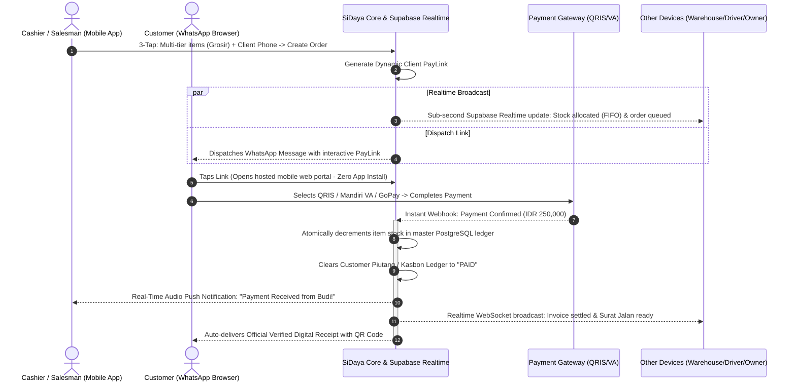
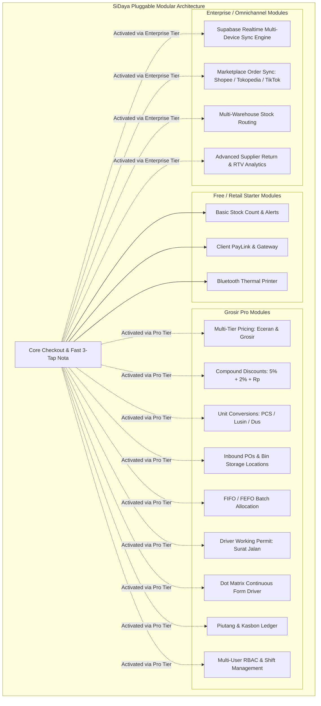

# Product Value Proposition & User Experience
> **The Frictionless Commerce Engine: Why User Experience & Client PayLinks Win the Merchant's Pocket**

---

## 1. Product Philosophy: Zero-Friction Human-Centered Design

Most enterprise software is designed from the database outward. **SiDaya (by Ashvin Labs) is designed from the merchant's physical hands inward.** 

A small store owner, wholesale trader, or busy shopkeeper does not have time to sit through an onboarding tutorial, navigate nested menu ribbons, or type lengthy descriptions while customers and delivery trucks are waiting. Every screen, animation, and tactile response in SiDaya is engineered around three non-negotiable principles:

1. **The 3-Tap Rule**: Any primary action—taking an order, issuing a digital receipt, checking stock—must never take more than **3 taps** from the home screen.
2. **One-Handed Mobile Ergonomics**: 85% of merchants operate their phones with one thumb while holding stock, packing a box, or talking to a customer. Core interactive controls are anchored to the bottom thumb-zone.
3. **Zero-Latency Feel**: Instant local feedback. Even in a basement storeroom with 1 bar of Edge network signal, buttons click immediately, items add instantaneously, and search operates locally with sub-10ms response times.
4. **Role-Adaptive Field Clarity**: Field staff are never overwhelmed by irrelevant buttons. A cashier's phone opens directly to the register, a warehouse runner sees receiving bins, a delivery driver sees manifests and signature pads, and the store owner sees executive turnover and profit margins—all governed by the granular Owner Checkbox Matrix.

---

## 2. The Core Differentiator: PayLink Loop & Real-Time Sync vs. Legacy e-Nota

While incumbent tools like **Canggih Software's e-Nota** digitized the paper invoice for Indonesian wholesalers and shops, they remain trapped in disconnected, single-device manual workflows:

### How Traditional E-Nota Apps Work (The Broken Flow):
```
Merchant creates nota on phone 
  -> Multi-device sync lags or fails to update other stations
  -> Exports static image/PDF 
  -> Sends PDF to Client on WhatsApp 
  -> Client reads text: "Transfer to BCA 123456" 
  -> Client switches apps, transfers manually, takes screenshot 
  -> Client texts screenshot back to merchant
  -> Merchant opens m-Banking, verifies transfer mutasi
  -> Merchant manually updates debt ledger & spreadsheet stock
(Total time: 10–25 minutes. High fraud risk. Out-of-sync multi-device stock.)
```

### How SiDaya Works (The Instant Closed-Loop Flow):


---

## 3. Comprehensive Feature Parity with Canggih Software's e-Nota

SiDaya matches and modernizes every core feature that makes Canggih Software's e-Nota indispensable to Indonesian businesses, while eliminating its structural flaws:

### 1. Wholesale & Retail Multi-Tier Pricing
* **Price Classes**: Assign distinct prices for *Eceran* (Retail), *Grosir 1*, *Grosir 2*, *Tipe Pelanggan* (Regular, Member, VIP, Distributor), and *Salesman*.
* **Multi-Unit Conversions**: Automatically converts between packaging tiers (e.g., `1 Karton = 12 Lusin = 144 PCS`). Pricing and stock deduction calculate automatically based on the selected sales unit.
* **Compound Trade Discounts**: Native support for standard Indonesian wholesale discounting formats (e.g., `5% + 2% + Rp 1,000`).

### 2. Complete Merchant Inventory, Inbound Logistics & Batch Allocation
* **Inbound Procurement & Arrival Tracking**: Record supplier purchase orders, expected vs actual delivery dates, carrier info, and received unit quantities.
* **Granular Storage Location Hierarchy**: Multi-tier physical binning (Warehouse $\rightarrow$ Zone / Cold Room $\rightarrow$ Aisle $\rightarrow$ Rack / Bin / Pallet, e.g., `Gudang Utama -> Zona Beras -> Rak B-02`). Always know exactly where every sack or box is stored.
* **Supplier Return Policies (RTV)**: Built-in tracking of supplier return terms, damage/pest claim inspection windows (e.g., 7 days), and debit note reconciliation.
* **Automated Batch & Lot Allocation (FIFO / FEFO)**:
  * Batches record harvest/milling dates, expiry dates, and lot numbers (e.g., `LOT-BERAS-20260901-01`).
  * When a sales order is created, the system algorithmically allocates stock via **FIFO (First In, First Out)** to ensure older stock is sold and dispatched first, preventing aging or weevil infestation in commodities like rice.
* **Driver Working Permit (*Surat Jalan* / Delivery Order)**:
  * Instantly generated from the sales invoice as the driver's official authorization to withdraw allocated stock from the warehouse.
  * **Price-Stripped for Security**: Explicitly **omits all financial values** (no unit prices, no subtotal, no discounts, no invoice total) so drivers and third parties cannot view merchant profit margins or invoice values.
  * **Direct Invoice Linkage**: Embeds the master Sales Invoice Number and an encrypted QR code linking back to the verified order record.
  * Multi-signature verification: *Petugas Gudang (Stock Release)*, *Sopir (Driver Custody)*, and *Penerima (Proof of Delivery)*.
  * Supports Bluetooth thermal (80mm), standard A4, and Continuous Form Dot Matrix (Epson LX-310 2/3-ply).

### 3. Multi-Hardware Printer Engine
* **ESC/POS Bluetooth Thermal Printers**: Instant receipts for 58mm and 80mm mobile thermal printers.
* **Network & Wi-Fi Printers**: Full A4 / Letter invoice printing for formal corporate buyers.
* **Dot Matrix / Continuous Form (Epson ESC/P2)**: Native printing for 2-ply and 3-ply carbon paper dot matrix printers, essential for Indonesian B2B grosir logistics and Surat Jalan manifests.

### 4. Accounts Receivable (*Piutang & Kasbon*) Ledger
* **Debt Aging & Status**: Real-time tracking of unpaid and partially paid invoices.
* **PayLink Debt Settlement**: Customers can settle overdue *kasbon* through their dynamic PayLink using partial or full digital payments.
* **Automated WhatsApp Debt Reminders**: Polite, automated payment link reminders sent directly to customers before debt delinquency.

### 5. Multi-User Tenant Management & Fast Cashier PIN Switch
* **Role-Based Access Control (RBAC)**: Distinct permissions for *Owner*, *Store Manager*, *Cashier (Kasir)*, *Salesman*, and *Warehouse (Gudang)*.
* **4–6 Digit Station Lock / Quick Switch**: Allows multiple cashiers on high-turnover shared counters to switch shifts in seconds without re-entering credentials.
* **Cash Drawer & Shift Balancing**: Opening cash float, cash drop tracking, and automated X-Report / Z-Report end-of-day reconciliation.
* **COGS / Margin Protection**: Protects store profitability by hiding cost-of-goods-sold (*harga modal*) from cashier views via PostgreSQL Row-Level Security.

### 6. Marketplace Order & Legacy TokoPro Import
* **Marketplace Connectors**: Synchronizes order queues and revenue from Tokopedia, Shopee, and TikTok Shop.
* **Legacy e-Nota / TokoPro Data Importer**: 1-click CSV/Excel ingestion allowing merchants using Canggih Software or desktop software to migrate their full product catalog and customer database in seconds.

### 7. High-Speed Barcode & Massive Catalog Engine (Scale to 50,000+ Items)
* **Instant SKU Barcode Scanning**: Scan retail (EAN-13/UPC) and wholesale case barcodes (Code 128/ITF-14) using device cameras or Bluetooth/USB laser scanners.
* **Sub-5ms O(1) Index Lookup**: Effortlessly search and checkout across catalogs containing **thousands to tens of thousands of items** without lagging or typing.
* **Multi-Purpose Scanner Workflows**:
  - **POS Cashiering**: Continuous barcode scan-to-cart with automatic quantity increments and audio beeps.
  - **Inbound Receiving**: Scan pallet/box barcodes to quickly assign batch lot numbers and warehouse storage bins.
  - **Physical Stock Opname**: Rapid handheld shelf scanning for instant stock discrepancy audits.

---

## 4. Built for Radical Modularity: Pluggable Feature Registry

To ensure the app remains blazing fast for a simple solo merchant while scaling seamlessly to a multi-store enterprise, SiDaya utilizes a **Pluggable Feature Registry Engine**. Features are decoupled into standalone domain modules that activate dynamically based on the tenant's subscription plan:



### Why Dynamic Tenant Modularity Matters:
1. **Instant Plan Upgrades without App Updates**: When a merchant upgrades their plan in the portal, the backend updates the tenant's entitlement flags. The mobile client receives a real-time WebSocket update and unlocks the features immediately without requiring an app store update.
2. **Zero Clutter for Solo Merchants**: A small food kiosk only sees the basic 3-tap cashier. Wholesale distributors see full multi-tier pricing, unit conversion pickers, and dot matrix print buttons.
3. **Strict Isolation & Zero Regressions**: Modules communicate exclusively through the Domain Event Bus and strict TypeScript interfaces. Updating the marketplace sync connector will **never** destabilize counter checkout.

### Why Extreme Modularity Matters to the Business:
1. **Zero System Regressions**: The Payment Gateway module operates independently via decoupled event subscriptions. Upgrading payment rails or adding new e-wallets will **never** cause checkout screen lag or inventory discrepancies.
2. **Adaptive Complexity**: A solo food-stall owner sees only the lightning-fast 3-tap counter. A 5-store fashion boutique activates multi-outlet inventory, employee shift controls, and custom PayLink branding without changing apps.
3. **Continuous Monetization**: Advanced modules can be unlocked individually or bundled into higher-tier SaaS subscriptions, driving Expansion ARR and Net Dollar Retention (NDR).

---

## 5. Summary of Tangible Merchant ROI

| Metric | Before SiDaya (Paper / Manual) | With SiDaya Mobile SaaS | Net Business Impact |
| :--- | :--- | :--- | :--- |
| **Checkout Speed** | 2–3 minutes per customer | Under 10 seconds | **6x faster checkout throughput** |
| **Payment Collection Speed** | 3–7 days (manual WhatsApp follow-up) | Within 30 minutes of PayLink delivery | **85% reduction in Days Sales Outstanding (DSO)** |
| **Inventory Shrinkage** | 8% to 15% stock discrepancy | < 0.5% audited variance | **Direct gross margin savings of 5–10%** |
| **Administrative Labor** | 12 hours/week spent balancing books | 0 hours (100% automated ledger) | **Recaptures 1.5 workdays/week for merchant** |
