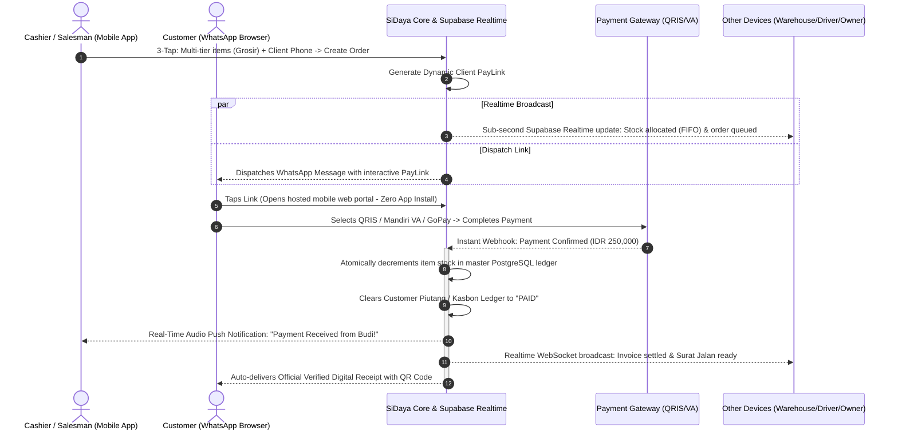
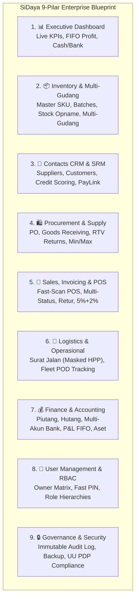
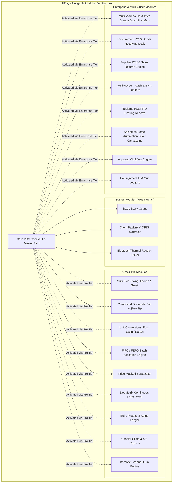

# Product Value Proposition & User Experience
> **The Frictionless Commerce Engine: Why User Experience & Client PayLinks Win the Merchant's Pocket**

---

## 1. Product Philosophy: Zero-Friction Human-Centered Design

Most enterprise software is designed from the database outward. **SiDaya (by Ashvin Labs) is designed from the merchant's physical hands inward.** 

A small store owner, wholesale trader, or busy shopkeeper does not have time to sit through an onboarding tutorial, navigate nested menu ribbons, or type lengthy descriptions while customers and delivery trucks are waiting. Every screen, animation, and tactile response in SiDaya is engineered around three non-negotiable principles:

1. **The 3-Tap Rule**: Any primary action—taking an order, issuing a digital receipt, checking stock—must never take more than **3 taps** from the home screen.
2. **One-Handed Mobile Ergonomics**: 85% of merchants operate their phones with one thumb while holding stock, packing a box, or talking to a customer. Core interactive controls are anchored to the bottom thumb-zone.
3. **Zero-Latency Feel**: Instant local feedback. Even in a basement storeroom with 1 bar of Edge network signal, buttons click immediately, items add instantaneously, and search operates locally with sub-10ms response times.
4. **Role-Adaptive Field Clarity**: Field staff are never overwhelmed by irrelevant buttons. A cashier's phone opens directly to the register, a warehouse runner sees receiving bins, a delivery driver sees manifests and signature pads, and the store owner sees executive turnover and profit margins—all governed by the granular Owner Checkbox Matrix.

---

## 2. The Core Differentiator: PayLink Loop & Real-Time Sync vs. Legacy e-Nota

While incumbent tools like **Canggih Software's e-Nota** digitized the paper invoice for Indonesian wholesalers and shops, they remain trapped in disconnected, single-device manual workflows:

### How Traditional E-Nota Apps Work (The Broken Flow):
```
Merchant creates nota on phone 
  -> Multi-device sync lags or fails to update other stations
  -> Exports static image/PDF 
  -> Sends PDF to Client on WhatsApp 
  -> Client reads text: "Transfer to BCA 123456" 
  -> Client switches apps, transfers manually, takes screenshot 
  -> Client texts screenshot back to merchant
  -> Merchant opens m-Banking, verifies transfer mutasi
  -> Merchant manually updates debt ledger & spreadsheet stock
(Total time: 10–25 minutes. High fraud risk. Out-of-sync multi-device stock.)
```

### How SiDaya Works (The Instant Closed-Loop Flow):


---

## 3. The 9 Strategic Pillars of SiDaya Enterprise Platform

SiDaya elevates the traditional receipt generator into an integrated, modular **Enterprise Operating System for Wholesale, FMCG, and Retail Trade**:



### Pilar 1: Dashboard & Executive Command Center (`/dashboard`)
* **Real-time Turnover & Profitability**: Instant Gross Profit calculation based on actual FIFO cost of goods sold (COGS / *Harga Pokok Penjualan*).
* **Consolidated Liquidity Widget**: Unified snapshot of total inventory asset value, uncollected Accounts Receivable (*Piutang*), upcoming Accounts Payable (*Hutang*), and active Cash & Bank balances.
* **Smart Exception Alerts**: Proactive warnings for out-of-stock items, expiring batch lots, customer credit limit breaches, and pending approval requests.

### Pilar 2: Manajemen Inventori & Multi-Gudang (`/inventory`)
* **Master SKU & Multi-Satuan**: Hierarchical unit conversions (`1 Karton = 12 Lusin = 144 Pcs`) with independent barcode tags per unit.
* **Automated FIFO / FEFO Batch Allocation**: Enforces strict stock rotation based on harvest, production, or receipt dates to eliminate spoilage and inventory obsolescence.
* **Multi-Warehouse & Inter-Branch Transfers**: Centralized stock visibility across Head Warehouses (*Gudang Pusat*), Store Outlets (*Toko Cabang*), and In-Transit buffers.
* **Stock Opname with Handheld Barcode Scanning**: Rapid physical shelf audits comparing system balance vs scanned physical count with automated adjustment approval flows.
* **Batch Thermal Barcode Printing**: Print standardized EAN-13 / Code 128 / QR label stickers for mass labeling of inventory items.

### Pilar 3: Manajemen Kontak & CRM/SRM (`/contacts`)
* **Supplier Directory (SRM)**: Vendor profile, payment terms (*Term of Payment / TOP* 7/14/30/60 days), bank routing details, and supplier ledger.
* **Customer Directory & Wholesale Tiers (CRM)**: Customer segmentation (*Eceran, Grosir 1, Grosir 2, Distributor, VIP*), credit limit management, and dynamic credit scoring based on Days Beyond Terms (DBT).
* **Automated WhatsApp Payment Link Loop**: Send professional invoices with embedded QRIS/VA PayLink directly to customer WhatsApp chats.

### Pilar 4: Pengadaan & Rantai Pasok / Procurement (`/procurement`)
* **Smart Reorder Point Planning**: Predictive reordering recommendations calculated from historical sales velocity and supplier lead-time.
* **Purchase Orders (PO)**: Digital PO generation with supplier email/WhatsApp dispatch and multi-tier approval rules.
* **Goods Receiving Dock**: Physical check-in at warehouse dock, barcode lot registration, and instant conversion into active FIFO inventory lots.
* **Purchase Returns (Return to Vendor / RTV)**: Defect / damage claims with automated AP Debit Notes deducting outstanding supplier liabilities.

### Pilar 5: Penjualan, Invoicing & Kasir POS (`/pos`, `/sales`)
* **Offline-First POS Terminal**: 3-tap checkout, rapid barcode scanner gun integration, compound trade discounts (`5% + 2% + Rp`), and multi-unit switching.
* **Advanced Multi-Status Invoicing**: Full invoice lifecycle tracking: *Draft $\rightarrow$ Belum Lunas (Piutang) $\rightarrow$ Jatuh Tempo $\rightarrow$ Lunas*.
* **Sales Returns (Retur Penjualan)**: Returns seamlessly restore inventory back to corresponding FIFO lots and issue cash refunds or credit notes deducting customer piutang.
* **Cashier Shift Balancing**: Opening cash float, midday cash drops, and automated X-Report / Z-Report shift reconciliation.

### Pilar 6: Logistik & Operasional Lapangan (`/surat-jalan`, `/logistics`)
* **Price-Masked Surat Jalan (Delivery Order)**: Official logistics manifest that explicitly **omits financial amounts and profit margins**, protecting merchant privacy from third-party drivers.
* **Direct Invoice QR-Code Verification**: Encrypted QR code on physical printout linking to verified order records.
* **Fleet Dispatch & Digital Proof of Delivery (POD)**: Driver mobile workflow with recipient signature capture, timestamped delivery photos, and real-time status sync.

### Pilar 7: Keuangan, Kas & Akuntansi Terpadu (`/finance`)
* **Accounts Receivable (Buku Piutang)**: Aging analysis (0–30, 31–60, 60+ days), partial digital installment collection via PayLink.
* **Accounts Payable (Buku Hutang)**: Supplier maturity calendar, payment scheduling, and cash outflow planning.
* **Multi-Account Cash & Bank Ledger**: Separate ledgers for Counter Cash Drawer, Petty Cash (*Kas Kecil*), BCA, Mandiri, and digital payment gateway settlement holding accounts.
* **Realtime P&L (Laba Rugi Otomatis)**: Automatic gross and net margin reports without manual double-entry bookkeeping.
* **Fixed Asset & Depreciation Management**: Track operational assets (vehicles, machinery, refrigeration) with monthly straight-line depreciation.

### Pilar 8: Manajemen Pengguna & Hak Akses / RBAC (`/settings`)
* **Granular Owner Checkbox Matrix**: Move beyond static roles to granular permission toggles (`pos:checkout`, `catalog:view_cogs`, `finance:reports`, `void:order`).
* **Fast 4–6 Digit Station PIN Switch**: Effortless cashier handover on shared POS terminals in under 3 seconds.
* **COGS Margin Privacy Protection**: Strict PostgreSQL RLS filters ensuring operational staff cannot view merchant purchase prices or profit margins.

### Pilar 9: Tata Kelola, Audit Trail & Keamanan (`/settings`)
* **Immutable Activity Audit Log**: Cryptographically logged trail of sensitive actions (price adjustments, void transactions, credit limit overrides, break-glass queries) with IP, user ID, and Ray ID.
* **Automated Daily Backups & Clean Data Export**: 1-click export of financial reports, customer ledgers, and inventory balances to Excel/PDF.
* **Indonesian Data Protection Compliance**: Full adherence to UU PDP No. 27/2022 with tenant isolation and PII masking.

---

## 4. Built for Radical Modularity: Pluggable Feature Registry

To ensure the application remains lightning-fast for a single-store shopkeeper while scaling effortlessly to an enterprise distributor network, SiDaya utilizes a **Pluggable Feature Registry Engine**. Features are decoupled into standalone domain modules activated dynamically based on subscription plans:



### Why Dynamic Tenant Modularity Matters:
1. **Instant Plan Upgrades without App Updates**: When a merchant upgrades their plan in the portal, the backend updates the tenant's entitlement flags. The mobile client receives a real-time WebSocket update and unlocks the features immediately without requiring an app store update.
2. **Zero Clutter for Solo Merchants**: A small food kiosk only sees the basic 3-tap cashier. Wholesale distributors see full multi-tier pricing, unit conversion pickers, and dot matrix print buttons.
3. **Strict Isolation & Zero Regressions**: Modules communicate exclusively through the Domain Event Bus and strict TypeScript interfaces. Updating the marketplace sync connector will **never** destabilize counter checkout.

### Why Extreme Modularity Matters to the Business:
1. **Zero System Regressions**: The Payment Gateway module operates independently via decoupled event subscriptions. Upgrading payment rails or adding new e-wallets will **never** cause checkout screen lag or inventory discrepancies.
2. **Adaptive Complexity**: A solo food-stall owner sees only the lightning-fast 3-tap counter. A 5-store fashion boutique activates multi-outlet inventory, employee shift controls, and custom PayLink branding without changing apps.
3. **Continuous Monetization**: Advanced modules can be unlocked individually or bundled into higher-tier SaaS subscriptions, driving Expansion ARR and Net Dollar Retention (NDR).

---

## 5. Summary of Tangible Merchant ROI

| Metric | Before SiDaya (Paper / Manual) | With SiDaya Mobile SaaS | Net Business Impact |
| :--- | :--- | :--- | :--- |
| **Checkout Speed** | 2–3 minutes per customer | Under 10 seconds | **6x faster checkout throughput** |
| **Payment Collection Speed** | 3–7 days (manual WhatsApp follow-up) | Within 30 minutes of PayLink delivery | **85% reduction in Days Sales Outstanding (DSO)** |
| **Inventory Shrinkage** | 8% to 15% stock discrepancy | < 0.5% audited variance | **Direct gross margin savings of 5–10%** |
| **Administrative Labor** | 12 hours/week spent balancing books | 0 hours (100% automated ledger) | **Recaptures 1.5 workdays/week for merchant** |
