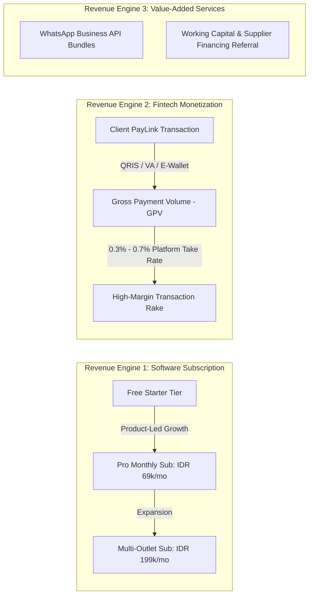
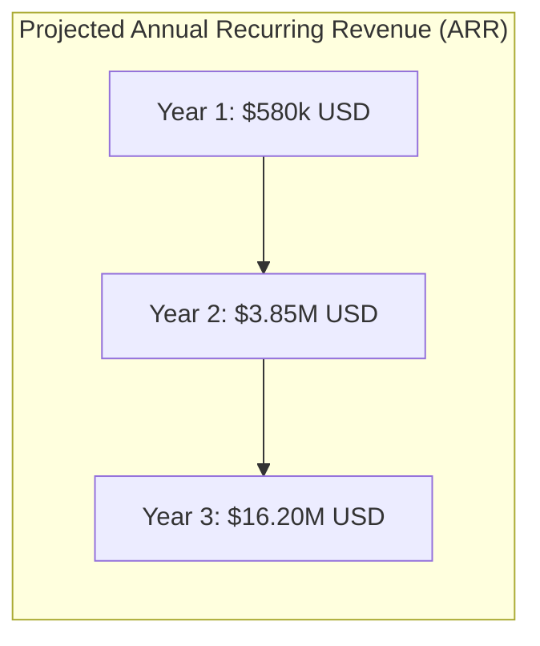

# Business Model, Pricing & SaaS Metrics
> **A High-Margin Dual Engine: Recurring SaaS Subscriptions Compounded by Payment Processing Take-Rates**

---

## 1. Monetization Strategy: The Dual Revenue Engine

Unlike pure software companies that struggle to monetize low-margin SMBs, or pure payment gateways that face margin compression, SiDaya (by Ashvin Labs) combines **software stickiness with transaction monetization**.

---

| Tier | Target Merchant | Price (Monthly / Annual) | Active Feature Entitlements (Dynamic Registry) |
| :--- | :--- | :--- | :--- |
| **🟢 Perintis (Supplier Mandiri)** | Solo suppliers, perorangan, warung keliling | **Rp 0 / Free forever** | 1 Owner Device, Quick POS, WhatsApp PDF & ESC/POS Bluetooth receipt, basic SKU catalog, simple kasbon/piutang ledger, **Managed PayLink** (QRIS & VA). |
| **🔵 Starter (Toko & Agen)** | Single-location retail & semi-grosir with cashiers | **Rp 149.000 / mo** *(Rp 1.490.000/yr)* | Everything in Perintis + **Up to 3 Staff Accounts (PIN Station isolated)**, **Multi-Tier Wholesale Pricing (Ecer/Grosir)**, **Multi-Unit Conversions (Dus/Pcs)**, Shift cash reconciliation, WhatsApp auto-reminders, Excel report export. |
| **🟣 Grosir Pro (Distributor & Gudang)** | Wholesalers, FMCG distributors, multi-depot | **Rp 399.000 / mo** *(Rp 3.990.000/yr)* | Everything in Starter + **Up to 3 Warehouses/Branches**, **Unlimited Staff (Cashier, Warehouse, Driver)**, **Inbound FIFO & Batch Lot Expiry Tracking**, **Driver Digital Surat Jalan & GPS Geotagged POD**, **Strict Piutang Credit Limits & Auto-Lock**, **Bebas Pilih: Managed PayLink ATAU BYOK Gateway Pribadi (Midtrans/iPaymu/Xendit)**, Subdomain + SSL. |
| **🟡 Enterprise Fleet** | Regional distribution chains, food principal manufacturers | **Rp 899.000 / mo** *(Rp 8.990.000/yr)* | Everything in Pro + **Unlimited Warehouses & Depots**, **Custom Own Domain (`pos.namatoko.com`)**, **Open API & Webhook ERP Integration (SAP, Accurate, Odoo)**, Custom RBAC Matrix, 99.9% SLA, Dedicated Account Manager. |

---

### Dual Gateway Policy: Managed Gateway vs BYOK
1. **Perintis (Free) & Starter Tiers**: Use **SiDaya Managed PayLink**. SiDaya manages the payment infrastructure, allowing micro-merchants to accept QRIS & VA instantly without needing corporate PT/CV registration. SiDaya monetizes via transaction convenience spreads.
2. **Grosir Pro & Enterprise Tiers**: Merchants have the option to enable **Bring Your Own Key (BYOK)** to connect their direct merchant gateway accounts (iPaymu, Midtrans, Xendit). When BYOK is enabled, funds settle directly to the merchant's bank account with 0% platform transaction cut, and SiDaya monetizes purely on the SaaS recurring subscription.

## 3. Transaction Take-Rate Economics (The PayLink Engine)

Every time an invoice is settled via SiDaya Managed PayLink, the platform earns from payment convenience and disbursement spreads:

### Payment Rail Economics (Per Transaction)

| Payment Method | Merchant/Customer Processing Fee | Wholesale Provider Cost (Midtrans/Xendit/Bank) | **SiDaya Net Margin (Take Rate)** |
| :--- | :--- | :--- | :--- |
| **QRIS (Instant QR)** | 0.70% (Standard BI MDR) | 0.35% (acquirer interchange) | **+0.35% Net Spread** |
| **Virtual Account (VA)** | Rp 4.000 flat fee | Rp 2.200 flat bank cost | **+Rp 1.800 Net Profit** per transaction |
| **Disbursement / Penarikan Saldo** | Rp 3.500 per payout | Rp 1.500 BI-FAST cost | **+Rp 2.000 Net Margin** per payout |
| **E-Wallets (GoPay, OVO, ShopeePay)** | 1.50% of transaction value | 1.00% | **+0.50% Net Spread** |

#### Why Micro-Merchants Happily Welcome This Model:
1. **Zero Financial Risk**: Micro-suppliers pay Rp 0 upfront when they have no sales. They only incur small transaction fees when revenue is already realized.
2. **Low Relative Cost**: A Rp 3.500 VA admin fee on a Rp 750.000 wholesale order is less than 0.5% — far cheaper than hiring an administrative assistant or losing money to manual transfer reconciliation errors.
3. **Instant Corporate-Grade Capabilities**: Sole suppliers without corporate legal entities gain instant access to dynamic multi-bank VAs and QRIS.

---

## 4. Ancillary High-Margin Revenue Streams

1. **Automated WhatsApp Business API Credits**:
   While merchants can use free device-based WhatsApp sharing, high-volume merchants upgrade to SiDaya's official WhatsApp Cloud API service to send automated branded invoices with interactive buttons directly from our verified green-tick service number.
   * *Pricing*: IDR 350 per outbound utility message (cost: IDR 260; **profit: 35% margin**).
2. **Merchant Working Capital Referral Fee**:
   By tracking real-time verified GMV and inventory turnover, SiDaya possesses pristine underwritable transaction data. Through partnership with licensed P2P lenders and fintech banks, SiDaya earns a **1.0% to 2.5% origination commission** on approved working capital loans, with zero credit balance-sheet risk.

---

## 5. Unit Economics & SaaS Metric Targets

| Metric | Target (Year 2 Benchmark) | Strategic Context |
| :--- | :--- | :--- |
| **Blended CAC (Customer Acquisition Cost)** | **$14.50 USD** (IDR 225,000) | Kept exceptionally low via the viral PayLink loop and merchant referral programs. |
| **ARPU (Monthly Average Revenue Per User)** | **$11.80 USD** (IDR 180,000) | Software subscription ($5.50 blended) + Fintech PayLink take-rate ($6.30 average across 120 transactions). |
| **Gross Margin (Software + Fintech)** | **78%** | Cloud infrastructure and API costs remain low due to lightweight mobile architecture. |
| **CAC Payback Period** | **1.8 Months** | Ultra-fast payback allows aggressive, non-dilutive reinvestment in customer acquisition. |
| **Average Customer Lifetime (LTV)** | **$310 USD** (IDR 4,800,000) | Based on an average 26-month operational lifetime for growing retail merchants. |
| **LTV / CAC Ratio** | **5.2x** | Well above the venture capital benchmark of 3.0x, indicating extraordinary capital efficiency. |
| **Net Dollar Retention (NDR)** | **118%** | Driven by organic transaction volume growth as merchants grow their monthly sales. |

---

## 6. Three-Year Pro Forma Financial Projections

| Line Item | Year 1 | Year 2 | Year 3 |
| :--- | :--- | :--- | :--- |
| **Registered Merchants** | 25,000 | 100,000 | 300,000 |
| **Active Paid Subscribers** | 4,500 | 28,000 | 105,000 |
| **Annualized PayLink GPV** | $30,000,000 | $220,000,000 | $850,000,000 |
| **SaaS Subscription Revenue** | $310,000 | $2,150,000 | $8,500,000 |
| **Fintech Transaction Net Revenue** | $210,000 | $1,400,000 | $6,400,000 |
| **Ancillary Revenue (WhatsApp / Loans)** | $60,000 | $300,000 | $1,300,000 |
| **Total Gross Revenue** | **$580,000** | **$3,850,000** | **$16,200,000** |
| **Operating Expenses (Hosting, Staff, R&D)** | $450,000 | $1,900,000 | $6,800,000 |
| **EBITDA** | **+$130,000** | **+$1,950,000** | **+$9,400,000** |
| **EBITDA Margin** | 22.4% | 50.6% | 58.0% |
