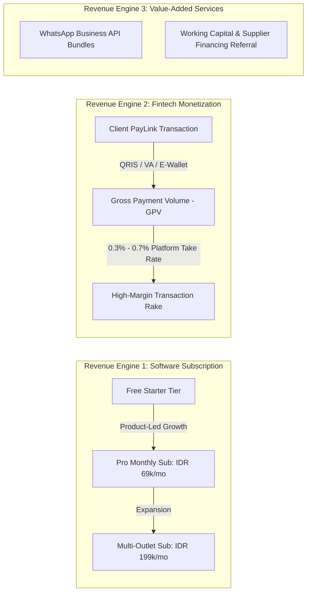
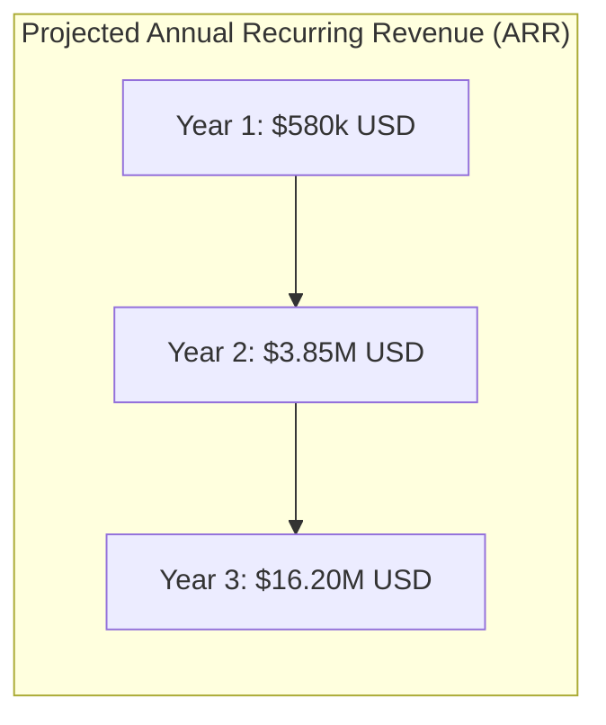

# Business Model, Pricing & SaaS Metrics
> **A High-Margin Dual Engine: Recurring SaaS Subscriptions Compounded by Payment Processing Take-Rates**

---

## 1. Monetization Strategy: The Dual Revenue Engine

Unlike pure software companies that struggle to monetize low-margin SMBs, or pure payment gateways that face margin compression, SiDaya (by Ashvin Labs) combines **software stickiness with transaction monetization**.

---

| Tier | Target Merchant | Price (Monthly / Annual) | Active Feature Entitlements (Dynamic Registry) |
| :--- | :--- | :--- | :--- |
| **Starter (Free)** | Micro stalls, solo warung, trial merchants | **Free forever** | 1 Device, 3-Tap Basic POS, Cash checkout, standard receipt generation (PDF/Image). |
| **Retail Starter** | Single-location retail, fashion kiosks, boutiques | **IDR 49,000 / mo** (~$3.20 USD) *(IDR 490,000/yr)* | Everything in Starter + **Client PayLink activation (QRIS/VA)**, Bluetooth thermal printer driver (58/80mm), real-time stock counts & low-stock alerts. |
| **Grosir & B2B Pro** | Wholesalers, commodity distributors (rice, FMCG), spare-parts | **IDR 99,000 / mo** (~$6.50 USD) *(IDR 990,000/yr)* | Everything in Retail + **Wholesale Multi-Tier Pricing (Eceran, Grosir, Salesman)**, **Compound Discounts (`5%+2%+Rp`)**, **Unit Conversions (PCS $\rightarrow$ Dus)**, **Inbound POs & Storage Bin Locations (Warehouse/Zone/Bin)**, **Automated FIFO / FEFO Batch Allocation**, **Price-Masked Driver Working Permits (*Surat Jalan*) linked to Invoices**, **Dot Matrix Continuous Form driver**, **Piutang & Kasbon Ledger**, **Supabase Realtime multi-device sync (up to 3 devices)**, **Staff PIN switch & Shift cash float balancing**. |
| **Omnichannel Enterprise**| Multi-station grosir, regional distributors, multi-outlet chains | **IDR 249,000 / mo** (~$16.00 USD) *(IDR 2.49M/yr)* | Everything in Pro + **Unlimited devices on Supabase Realtime**, **Multi-warehouse stock routing & inter-bin transfers**, **Supplier Return (RTV) & credit note accounting**, **Marketplace Order Sync (Tokopedia, Shopee, TikTok Shop)**, **Full RBAC with COGS/Modal privacy masking**, priority SLA. |

---

### Pluggable Add-On Modules (A La Carte Expansion)
Merchants on any paid tier can dynamically toggle modular add-ons directly from their dashboard without switching entire tiers:
* **Marketplace Sync Add-on**: IDR 39,000 / mo (Shopee, Tokopedia, TikTok Shop order & inventory sync).
* **Additional Device Stream (Supabase Realtime)**: IDR 15,000 / mo per additional simultaneous active device.
* **Extra Storage / Warehouse Location Pack**: IDR 25,000 / mo (for managing secondary warehouses or external logistics hubs).
*(Note: Cafe/Resto table management module is deferred to low-priority backlog).*

## 3. Transaction Take-Rate Economics (The PayLink Engine)

Every time a merchant's customer settles an invoice via a dynamic PayLink, SiDaya captures a payment processing margin between the wholesale acquirer cost and the merchant fee.

### Payment Rail Economics (Per Transaction)

| Payment Method | Merchant Processing Fee | Wholesale Provider Cost (Midtrans/Xendit/Bank) | **SiDaya Net Margin (Take Rate)** |
| :--- | :--- | :--- | :--- |
| **QRIS (Instant QR)** | 0.70% of transaction value | 0.35% (acquirer interchange) | **+0.35% Net Spread** |
| **Virtual Account (VA)** | IDR 4,000 flat fee | IDR 2,200 flat cost | **+IDR 1,800 Net Profit** per transaction |
| **E-Wallets (GoPay, OVO, ShopeePay)** | 1.50% of transaction value | 1.00% | **+0.50% Net Spread** |
| **Credit / Debit Cards** | 2.50% + IDR 2,000 | 1.90% + IDR 1,500 | **+0.60% + IDR 500 Net Spread** |

#### Why Merchants Happily Pay This Fee:
Small merchants frequently lose hours reconciling manual bank transfers or suffer from uncollected debt. Paying a small, standardized 0.7% QRIS fee or IDR 4,000 VA fee is vastly cheaper than hiring an administrative assistant or writing off 10% of uncollected credit.

---

## 4. Ancillary High-Margin Revenue Streams

1. **Automated WhatsApp Business API Credits**:
   While merchants can use free device-based WhatsApp sharing, high-volume merchants upgrade to SiDaya's official WhatsApp Cloud API service to send automated branded invoices with interactive buttons directly from our verified green-tick service number.
   * *Pricing*: IDR 350 per outbound utility message (cost: IDR 260; **profit: 35% margin**).
2. **Merchant Working Capital Referral Fee**:
   By tracking real-time verified GMV and inventory turnover, SiDaya possesses pristine underwritable transaction data. Through partnership with licensed P2P lenders and fintech banks, SiDaya earns a **1.0% to 2.5% origination commission** on approved working capital loans, with zero credit balance-sheet risk.

---

## 5. Unit Economics & SaaS Metric Targets

| Metric | Target (Year 2 Benchmark) | Strategic Context |
| :--- | :--- | :--- |
| **Blended CAC (Customer Acquisition Cost)** | **$14.50 USD** (IDR 225,000) | Kept exceptionally low via the viral PayLink loop and merchant referral programs. |
| **ARPU (Monthly Average Revenue Per User)** | **$11.80 USD** (IDR 180,000) | Software subscription ($5.50 blended) + Fintech PayLink take-rate ($6.30 average across 120 transactions). |
| **Gross Margin (Software + Fintech)** | **78%** | Cloud infrastructure and API costs remain low due to lightweight mobile architecture. |
| **CAC Payback Period** | **1.8 Months** | Ultra-fast payback allows aggressive, non-dilutive reinvestment in customer acquisition. |
| **Average Customer Lifetime (LTV)** | **$310 USD** (IDR 4,800,000) | Based on an average 26-month operational lifetime for growing retail merchants. |
| **LTV / CAC Ratio** | **5.2x** | Well above the venture capital benchmark of 3.0x, indicating extraordinary capital efficiency. |
| **Net Dollar Retention (NDR)** | **118%** | Driven by organic transaction volume growth as merchants grow their monthly sales. |

---

## 6. Three-Year Pro Forma Financial Projections

| Line Item | Year 1 | Year 2 | Year 3 |
| :--- | :--- | :--- | :--- |
| **Registered Merchants** | 25,000 | 100,000 | 300,000 |
| **Active Paid Subscribers** | 4,500 | 28,000 | 105,000 |
| **Annualized PayLink GPV** | $30,000,000 | $220,000,000 | $850,000,000 |
| **SaaS Subscription Revenue** | $310,000 | $2,150,000 | $8,500,000 |
| **Fintech Transaction Net Revenue** | $210,000 | $1,400,000 | $6,400,000 |
| **Ancillary Revenue (WhatsApp / Loans)** | $60,000 | $300,000 | $1,300,000 |
| **Total Gross Revenue** | **$580,000** | **$3,850,000** | **$16,200,000** |
| **Operating Expenses (Hosting, Staff, R&D)** | $450,000 | $1,900,000 | $6,800,000 |
| **EBITDA** | **+$130,000** | **+$1,950,000** | **+$9,400,000** |
| **EBITDA Margin** | 22.4% | 50.6% | 58.0% |
