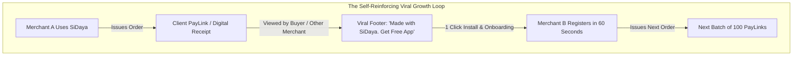
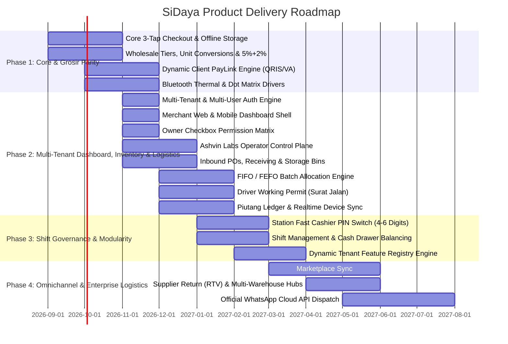

# Go-To-Market Strategy & Product Roadmap
> **Scaling to 300,000 Merchants Through Organic Product Loops and Phased Execution**

---

## 1. Go-To-Market (GTM) Strategy

Traditional B2B enterprise sales motions fail in the SMB sector because low customer contract values cannot support high-cost direct sales forces. SiDaya (by Ashvin Labs) executes a **Product-Led Growth (PLG)** model powered by three self-reinforcing acquisition engines.

---

## 2. The Three Customer Acquisition Channels

### Channel 1: The "Viral Invoice & PayLink Loop" (Zero-Cost Organic Engine)
* Every dynamic PayLink and digital receipt issued by a merchant contains an elegant, non-intrusive banner:
  > *"Received with SiDaya. Want automated receipts & instant QRIS for your store? [Start Free in 60s]"*
* In B2B wholesale and boutique retail, a single merchant issues between **200 and 1,500 invoices per month**. Up to **4% of recipients are themselves business owners** or sole proprietors who immediately experience the convenience of the product and download the app.
* **Result**: Achieves an organic K-factor of **0.32**, dramatically depressing blended CAC.

### Channel 2: Wholesale Market Density Clustering (Field Activation)
* Rather than scattering marketing budget across nationwide digital ads, initial sales pods target high-density wholesale trade hubs (e.g., *Pasar Tanah Abang, Mangga Dua, Pasar Baru, ITC Cempaka Mas, Pasar Induk Kramat Jati*).
* By onboarding 20 "anchor" wholesale textile, food commodity, or electronics distributors in a single market hall, all downstream regional retailers who buy from them are introduced to SiDaya's order confirmations, Surat Jalan, and PayLinks on day one.

### Channel 3: The "e-Nota Migration" Campaign (Targeting Legacy Incumbent Users)
* Thousands of Indonesian merchants using **Canggih Software's e-Nota** struggle with its chronic multi-device sync delays, ad clutter, and lack of digital payment collection.
* SiDaya offers a **1-Click e-Nota / TokoPro Catalog Importer**: merchants can upload their existing e-Nota exported CSV/Excel file and migrate their entire product catalog, wholesale tiers, and customer list in under 60 seconds.
* Direct positioning campaigns: *"Pusing e-Nota sering lambat sync antar kasir? Upgrade ke SiDaya: Realtime Sync, Otomatis QRIS & Bebas Iklan! Urusan Dagang? SiDaya Aja!"*

### Channel 4: Social Commerce Communities & Micro-Influencer Education
* Partnering with grassroots business educators, TikTok small-business creators, and local MSME associations (*Komunitas UMKM*).
* Positioning SiDaya not as "heavy accounting software", but as *"Urusan Dagang, Stok Gudang & Tagih Kasbon? SiDaya Aja!"*

---

## 3. Four-Phase Phased Product Delivery Roadmap

---

### Phase 1: The Core MVP & Wholesale Parity (Fast Checkout, Hardware & PayLink)
* **Target Horizon**: Months 1–3
* **Primary Objective**: Deliver the fastest mobile receipt generator on the market with wholesale trade logic, multi-hardware printer drivers, and an automated payment collection loop.
* **Key Deliverables**:
  * Native Mobile App (iOS & Android via React Native Expo).
  * 3-Tap instant order creation with offline-first local database (SQLite/WatermelonDB).
  * Wholesale Multi-Tier Pricing (*Eceran*, *Grosir*, *Tipe Pelanggan*, *Salesman*).
  * Compound trade discount calculator (`5% + 2% + Rp 1,000`).
  * Unit conversions (*PCS $\rightarrow$ Lusin $\rightarrow$ Karton*).
  * Multi-hardware printing: Bluetooth ESC/POS (58mm/80mm) and Dot Matrix Continuous Form (Epson ESC/P2).
  * **High-Speed Barcode & SKU Scanner (Phase 1 MVP)**: Instant O(1) barcode lookup (EAN-13, UPC, Code 128) via smartphone camera and wireless Bluetooth laser scanners for frictionless management of thousands of SKUs.
  * Dynamic Client PayLink web checkout portal (QRIS & Virtual Accounts via platform payment gateway).
  * Real-time payment webhook callback that marks orders as "PAID" and alerts the merchant.

### Phase 2: Multi-Tenant Web & Mobile Dashboard, Inbound Supply, FIFO Batch Logistics & Driver Working Permits (Surat Jalan)
* **Target Horizon**: Months 4–6
* **Primary Objective**: Empower multi-staff business operations with a universal mobile-first and desktop web backoffice, granular role customization via an Owner Checkbox Matrix, inbound supply tracking, automated FIFO stock rotation, and price-stripped delivery permits.
* **Key Deliverables**:
  * **Multi-Tenant & Multi-User Authentication Engine**: Universal login for mobile and web backoffice (`sidaya.id/login` / `app.sidaya.id`). Automatic single-tenant workspace routing, multi-store switcher for business owners, and session token enrichment.
  * **Merchant Backoffice Dashboard Shell (Responsive Web & Mobile)**: Dual-surface dashboard interface with branch selector, company branding, and core operational KPI widgets (daily turnover, cash drawer float, piutang aging, low-stock alerts).
  * **High-Volume Catalog & Barcode Engine**: Massive catalog support (scaling to 50,000+ items) with sub-5ms search, barcode batch assignment during Inbound Receiving, and handheld Stock Opname discrepancy scanning.
  * **Granular Checkbox Permission Matrix & Role-Adaptive UI**: Decouples rigid hardcoded roles into modular capability checkboxes (`pos:checkout`, `warehouse:inbound`, `logistics:dispatch`, `catalog:view_cogs`, `finance:reports`). Screens dynamically adapt on smartphones and desktops to only show tabs and actions the employee is authorized to use.
  * **Supabase Realtime CDC WebSocket Engine**: Sub-second synchronization between cashier registers, warehouse scanners, field drivers, and owner monitoring screens.
  * **Inbound Supply & Receiving Dock**: Track supplier POs, arrival dates, physical count checks, and multi-bin storage assignment (Warehouse $\rightarrow$ Zone $\rightarrow$ Rack $\rightarrow$ Bin).
  * **Automated Batch Allocation (FIFO / FEFO)**: Algorithmically assigns the oldest batch to outgoing sales orders to eliminate commodity aging and spoilage.
  * **Driver Working Permit (*Surat Jalan* / Delivery Order)**: Instantly generates a price-masked pick & delivery manifest linked to the sales invoice, with physical/digital proof of delivery signatures.
  * **Ashvin Labs Platform Operator & Super Admin Control Plane (`admin.sidaya.id`)**: Dedicated control plane portal for Ashvin Labs management (CEO, Devs, Support) featuring multi-tenant telemetry (global GMV, active stores, health score), subscription overrides, operator RBAC, and privacy-preserving PII redaction with break-glass audit logs.
  * **Piutang & Kasbon Ledger**: Track unpaid invoices with debt aging and PayLink partial settlements.

### Phase 3: Counter Shift Governance & Dynamic Feature Modularity
* **Target Horizon**: Months 7–9
* **Primary Objective**: Deepen point-of-sale operational control with high-speed counter station cashier switches and dynamic subscription plan toggling.
* **Key Deliverables**:
  * **Station Fast PIN Switch (4–6 Digits)**: High-speed cashier transitions on shared counter tablets/phones without logging out of the underlying station device session.
  * **Shift Cash Float Balancing**: Opening float, cash drops, and automated X-Report / Z-Report end-of-day reconciliation.
  * **PostgreSQL RLS Security Guard**: Strictly enforces COGS masking based on the active session's `catalog:view_cogs` permission.
  * **Pluggable Feature Registry Engine**: Runtime activation/deactivation of modules per tenant subscription tier without app rebuilds.

### Phase 4: Omnichannel & Enterprise Logistics
* **Target Horizon**: Months 10–12+
* **Primary Objective**: Expand to regional distributors and multi-warehouse hubs.
* **Key Deliverables**:
  * **Marketplace Connectors**: Synchronizes order queues and revenue from Tokopedia, Shopee, and TikTok Shop.
  * **Supplier Return (RTV) & Multi-Warehouse Routing**: Advanced supplier dispute workflows and inter-warehouse stock transfers.
  * **Deferred Backlog**: *Cafe & Resto Table Layouts* and *Minimarket Fast-Scan* remain in low-priority backlog.
  * **Official WhatsApp Cloud API**: Automated green-tick transactional messaging with interactive payment buttons.
  * **Embedded Working Capital Referral**: Data-driven working capital loans with licensed fintech lending partners.

---

## 4. Key Performance Indicators (KPIs) by Stage

| Stage | Primary North Star Metric | Secondary Health Metrics |
| :--- | :--- | :--- |
| **Phase 1 (MVP)** | **Weekly Active Transacting Merchants (WATM)** | 7-day retention > 40%; PayLink payment conversion > 75%. |
| **Phase 2 (Retention)** | **Monthly Processed Orders per Merchant** | Inventory variance < 1%; WhatsApp receipt open rate > 92%. |
| **Phase 3 (Monetization)** | **Paid SaaS Conversion Rate & Expansion ARR** | Free-to-Paid conversion > 15%; Monthly churn < 2.5%. |
| **Phase 4 (Scale)** | **Gross Payment Volume (GPV) & Net Take-Rate** | Blended GPV take rate > 0.45%; Net Dollar Retention > 115%. |
