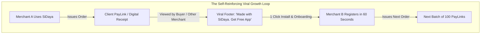
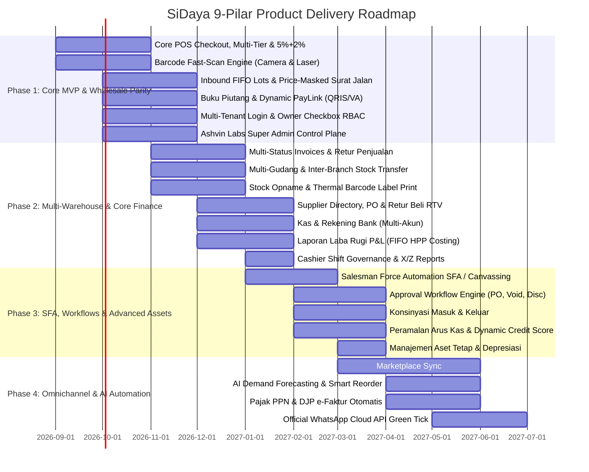

# Go-To-Market Strategy & Product Roadmap
> **Scaling to 300,000 Merchants Through Organic Product Loops and Phased Execution**

---

## 1. Go-To-Market (GTM) Strategy

Traditional B2B enterprise sales motions fail in the SMB sector because low customer contract values cannot support high-cost direct sales forces. SiDaya (by Ashvin Labs) executes a **Product-Led Growth (PLG)** model powered by three self-reinforcing acquisition engines.

---

## 2. The Three Customer Acquisition Channels

### Channel 1: The "Viral Invoice & PayLink Loop" (Zero-Cost Organic Engine)
* Every dynamic PayLink and digital receipt issued by a merchant contains an elegant, non-intrusive banner:
  > *"Received with SiDaya. Want automated receipts & instant QRIS for your store? [Start Free in 60s]"*
* In B2B wholesale and boutique retail, a single merchant issues between **200 and 1,500 invoices per month**. Up to **4% of recipients are themselves business owners** or sole proprietors who immediately experience the convenience of the product and download the app.
* **Result**: Achieves an organic K-factor of **0.32**, dramatically depressing blended CAC.

### Channel 2: Wholesale Market Density Clustering (Field Activation)
* Rather than scattering marketing budget across nationwide digital ads, initial sales pods target high-density wholesale trade hubs (e.g., *Pasar Tanah Abang, Mangga Dua, Pasar Baru, ITC Cempaka Mas, Pasar Induk Kramat Jati*).
* By onboarding 20 "anchor" wholesale textile, food commodity, or electronics distributors in a single market hall, all downstream regional retailers who buy from them are introduced to SiDaya's order confirmations, Surat Jalan, and PayLinks on day one.

### Channel 3: The "e-Nota Migration" Campaign (Targeting Legacy Incumbent Users)
* Thousands of Indonesian merchants using **Canggih Software's e-Nota** struggle with its chronic multi-device sync delays, ad clutter, and lack of digital payment collection.
* SiDaya offers a **1-Click e-Nota / TokoPro Catalog Importer**: merchants can upload their existing e-Nota exported CSV/Excel file and migrate their entire product catalog, wholesale tiers, and customer list in under 60 seconds.
* Direct positioning campaigns: *"Pusing e-Nota sering lambat sync antar kasir? Upgrade ke SiDaya: Realtime Sync, Otomatis QRIS & Bebas Iklan! Urusan Dagang? SiDaya Aja!"*

### Channel 4: Social Commerce Communities & Micro-Influencer Education
* Partnering with grassroots business educators, TikTok small-business creators, and local MSME associations (*Komunitas UMKM*).
* Positioning SiDaya not as "heavy accounting software", but as *"Urusan Dagang, Stok Gudang & Tagih Kasbon? SiDaya Aja!"*

---

## 3. Four-Phase Phased Product Delivery Roadmap

---

### Phase 1: The Core MVP & Wholesale Parity (Fast Checkout, Barcode, FIFO & PayLink)
* **Target Horizon**: Q3 2026 (Live & Active)
* **Primary Objective**: Deliver the fastest mobile receipt generator and wholesale trading terminal with offline-first storage, hardware printing, FIFO inventory, driver permits, and automated digital payments.
* **Key Deliverables**:
  * **Offline-First POS & 3-Tap Checkout**: React Native Expo mobile app and web backoffice with local SQLite/WatermelonDB caching.
  * **High-Speed Barcode Engine**: Instant sub-5ms scan-to-cart using smartphone cameras and wireless Bluetooth/USB laser scanners.
  * **Wholesale Trade Engine**: Multi-tier pricing (*Eceran*, *Grosir 1*, *Grosir 2*, *Distributor*), compound discounts (`5% + 2% + Rp`), and multi-unit conversions (*Pcs $\rightarrow$ Lusin $\rightarrow$ Karton*).
  * **Inbound Receiving & FIFO Batch Rotation**: Goods receiving dock with automated FIFO/FEFO batch depletion.
  * **Price-Masked Surat Jalan**: Delivery manifest with encrypted invoice QR codes and redacted cost/selling prices.
  * **Buku Piutang & Dynamic PayLink**: Debt aging tracking and instant WhatsApp PayLink (QRIS & Virtual Accounts).
  * **Universal Multi-Tenant Auth & Checkbox RBAC Matrix**: Owner self-registration, invitation-only staff onboarding, and fast 4–6 digit PIN switching.
  * **Ashvin Labs Operator Control Plane (`ops.sidaya.biz.id`)**: Fleet overview, subscription management, telemetry, and privacy break-glass audit log.

### Phase 2: Multi-Warehouse, Sales/Purchase Returns & Integrated Core Finance
* **Target Horizon**: Q4 2026
* **Primary Objective**: Scale operations to multi-warehouse distributors with complete sales/purchase return lifecycles, stock opname audits, multi-account cash/bank management, and automated FIFO P&L reports.
* **Key Deliverables**:
  * **Advanced Invoicing & Retur Penjualan**: Multi-status invoices (*Draft, Belum Lunas, Jatuh Tempo, Lunas*) and sales returns with automated FIFO lot restock and credit note generation.
  * **Multi-Warehouse & Inter-Branch Transfers**: Stock movements across central warehouses, retail outlets, and transit buffers.
  * **Stock Opname & Batch Barcode Printing**: Handheld shelf barcode audits with discrepancy adjustments and thermal barcode label printing (33x15mm, 40x30mm).
  * **Supplier Directory, PO & Retur Pembelian (RTV)**: Supplier SRM, digital Purchase Orders, and vendor returns with AP debit notes.
  * **Multi-Account Kas & Bank**: Ledgers for Cash Drawer, Petty Cash, BCA, Mandiri, and payment gateway escrow accounts.
  * **Realtime P&L (Laba Rugi FIFO)**: Automated gross margin and net profit reports calculated from exact FIFO inventory costs.
  * **Cashier Shift Governance**: Opening cash float, cash drops, and automated X-Report / Z-Report end-of-day balancing.

### Phase 3: Salesman Automation (SFA), Approval Workflows & Advanced Assets
* **Target Horizon**: Q1 2027
* **Primary Objective**: Empower field sales teams, multi-tier organizational governance, and enterprise asset management.
* **Key Deliverables**:
  * **Salesman Force Automation (SFA) & Canvassing**: Mobile canvasser order taking, GPS-verified customer visits, and automated commission calculations.
  * **Approval Workflow Engine**: Configurable authorization thresholds for high-value POs (> Rp 50M), discretionary discounts (> 10%), and voided invoices.
  * **Konsinyasi Masuk & Keluar**: Dedicated ledgers for supplier consignment stock and partner outlet distribution.
  * **Peramalan Arus Kas & Dynamic Credit Scoring**: 30–90 day cash forecast and automated customer credit limit scaling based on historical payment behavior.
  * **Aset Tetap & Depresiasi**: Fixed asset registry with automated monthly straight-line depreciation.

### Phase 4: Omnichannel Sync, AI Predictive Operations & Tax Compliance
* **Target Horizon**: Q2 2027
* **Primary Objective**: Enterprise scale, multi-channel marketplace integration, and predictive AI automation.
* **Key Deliverables**:
  * **Marketplace Connectors**: Realtime catalog and order synchronization across Tokopedia, Shopee, and TikTok Shop.
  * **AI Demand Forecasting & Smart Reorder**: Predictive purchasing algorithms optimizing stock levels and preventing stockouts.
  * **Pajak & DJP e-Faktur**: Automated PPN calculation, tax withholding, and direct e-Faktur integration.
  * **Official WhatsApp Cloud API**: Green-tick verified automated WhatsApp transactional messaging with interactive action buttons.

---

## 4. Key Performance Indicators (KPIs) by Stage

| Stage | Primary North Star Metric | Secondary Health Metrics |
| :--- | :--- | :--- |
| **Phase 1 (MVP)** | **Weekly Active Transacting Merchants (WATM)** | 7-day retention > 40%; PayLink payment conversion > 75%. |
| **Phase 2 (Retention)** | **Monthly Processed Orders per Merchant** | Inventory variance < 1%; WhatsApp receipt open rate > 92%. |
| **Phase 3 (Monetization)** | **Paid SaaS Conversion Rate & Expansion ARR** | Free-to-Paid conversion > 15%; Monthly churn < 2.5%. |
| **Phase 4 (Scale)** | **Gross Payment Volume (GPV) & Net Take-Rate** | Blended GPV take rate > 0.45%; Net Dollar Retention > 115%. |
