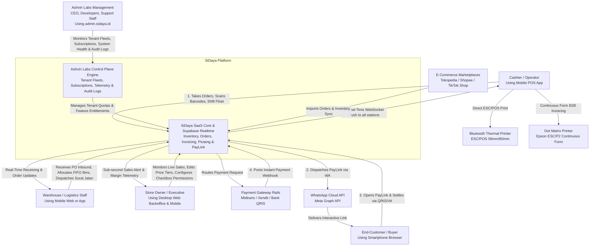
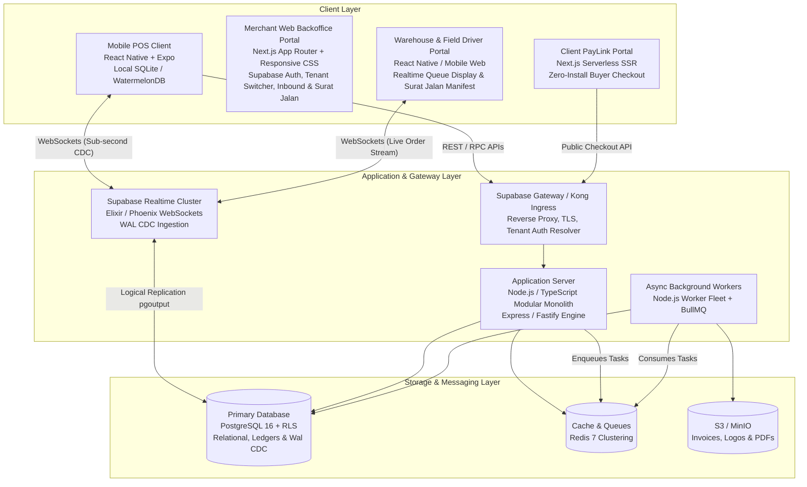
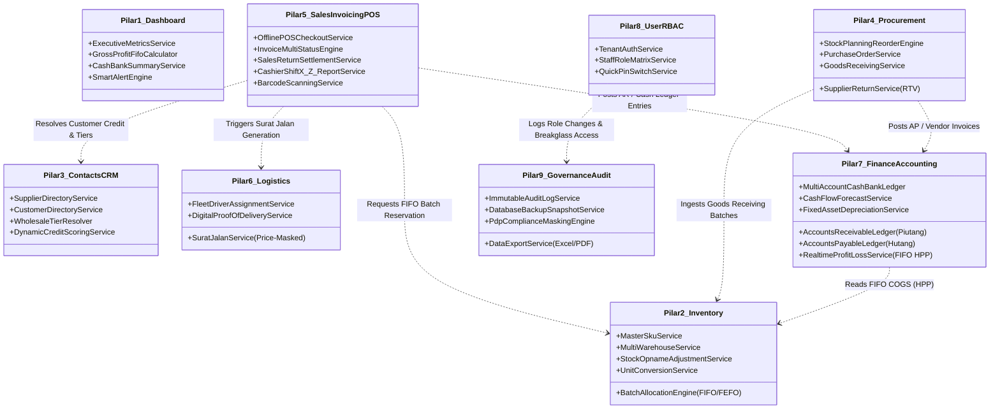
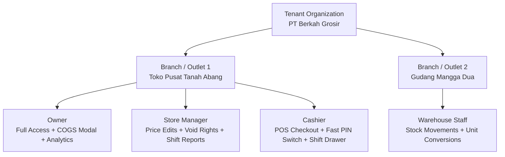
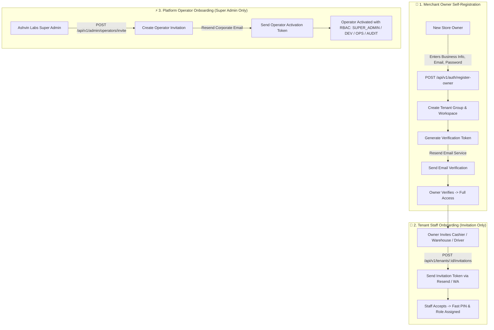
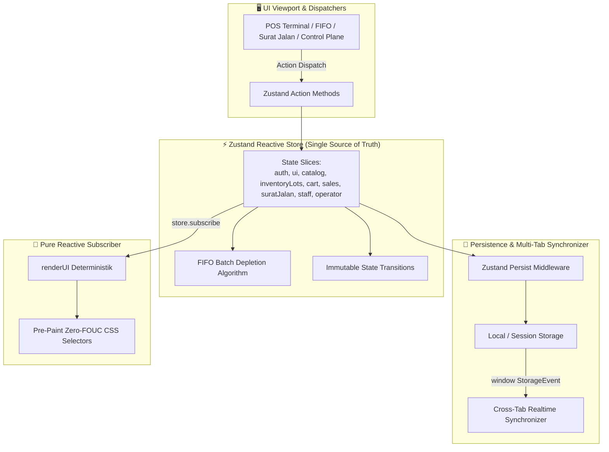
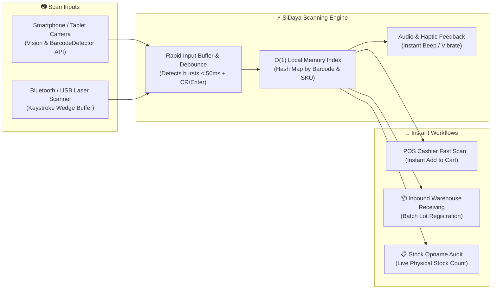
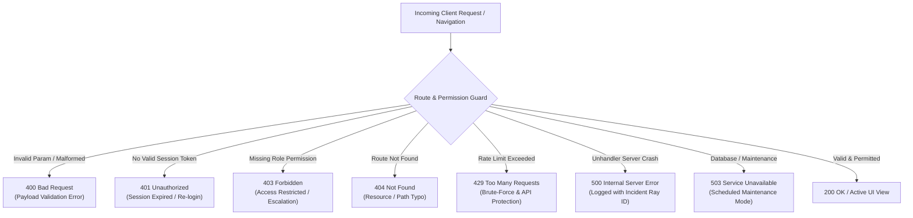
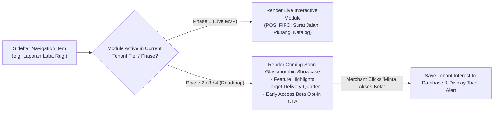

# System Architecture & Topology
> **Domain-Driven Modular Monolith, Supabase Realtime CDC Backbone & Dynamic Tenant Entitlement Engine**

---

## 1. Architectural Philosophy: The Modular Monolith & Real-Time Sync

To satisfy the core requirements of **extreme modularity** (where features can be toggled on/off dynamically based on tenant subscription plans without regressions) and **sub-second multi-device synchronization** (eliminating the notorious multi-station sync lag of legacy tools like Canggih Software's e-Nota), **SiDaya** (by **Ashvin Labs**) combines:
1. **Supabase Realtime / PostgreSQL Change Data Capture (CDC)** over persistent WebSockets for sub-second cross-device state propagation.
2. **Offline-First Client Architecture** (React Native Expo + Local SQLite/WatermelonDB) with deterministic conflict resolution.
3. **Pluggable Domain Modules with Dynamic Tenant Feature Entitlements**.
4. **Tenant User, Role & Shift Governance** (Fast cashier PIN switching, shift cash balancing, and COGS privacy protection).

```
+---------------------------------------------------------------------------------------------------------------+
|                                          SiDaya Ecosystem Topology                                            |
+---------------------------------------------------------------------------------------------------------------+
                                                        |
         +-----------------------------+----------------+-------------------------------+
         |                             |                                                |
         v                             v                                                v
+-------------------------------+ +-------------------------------+ +-------------------------------+ +-------------------------------+
|   Counter Cashier POS (App)   | | Warehouse / Driver Station    | | Merchant Web Backoffice Portal| |   Client PayLink Web Portal   |
|   (React Native Expo / FSD)   | | (React Native / Mobile Web)   | | (Next.js Responsive Desktop)  | |     (Next.js / Responsive)    |
|  - Offline-First Local SQLite | | - Barcode scanner / Receiving | | - Web Login & Tenant Switcher | |  - Zero install / Web Checkout|
|  - Bluetooth & Dot Matrix ESC | | - Storage Bins & FIFO Lots    | | - Inbound POs & Surat Jalan   | |  - QRIS, VA, E-Wallet UI      |
|  - Role-Adaptive UI & PIN     | | - Price-Stripped Surat Jalan  | | - Owner Checkbox Permissions  | |  - Auto-reconcile PayLink     |
+---------------+---------------+ +---------------+---------------+ +---------------+---------------+ +---------------+---------------+
                |                                 |                                 |                                 |
                | HTTPS (REST) / WebSocket (WSS)  | HTTPS / WSS                     | HTTPS (REST & WSS)              | HTTPS
                v                                 v                                 v                                 v
+---------------------------------------------------------------------------------------------------------------+
|                             Supabase Ingress Gateway / Kong Reverse Proxy & WSS                               |
|                    (Tenant Resolution, JWT Verification, Rate Limiting & SSL Termination)                     |
+-----------------------+-------------------------------------------------------+-------------------------------+
                        |                                                       |
                        | Supabase Realtime WebSocket Pub/Sub                   | REST / RPC Requests
                        v                                                       v
+-----------------------------------------------+ +-------------------------------------------------------------+
|       Supabase Realtime Engine (Elixir)       | |           SiDaya Backend Core (Modular Monolith)            |
| - postgres_changes (CDC logical replication)  | |  +---------------------------+ +--------------------------+ |
| - broadcast (low-latency ephemeral events)    | |  | Tenant & User Auth Engine | | Feature Registry &       | |
| - presence (active register & cashier status) | |  | - Checkbox Perm Matrix    | | Entitlement Guard        | |
+-----------------------+-----------------------+ |  +-------------+-------------+ +------------+-------------+ |
                        |                         |                |                            |               |
                        | Direct Realtime WAL     |  --------------+----------------------------+-------------  |
                        | Notifications           |            Domain Event Bus (Redis / In-Process)            |
                        |                         |  --------------+----------------------------+-------------  |
                        |                         |                |                            |               |
                        |                         |  +-------------+-------------+ +------------+-------------+ |
                        |                         |  | Wholesale, FIFO & Surat   | | PayLink & Webhook        | |
                        |                         |  | - Inbound PO Receiving    | | - QRIS/VA Engine         | |
                        |                         |  | - Compound Disc (5%+2%)   | | - Auto-Settlement        | |
                        |                         |  | - Piutang & Kasbon Ledger | | - WhatsApp Comms         | |
                        |                         |  +---------------------------+ +--------------------------+ |
                        |                         +------------------------------+------------------------------+
                        |                                                        |
                        v                                                        v
+---------------------------------------------------------------------------------------------------------------+
|                               PostgreSQL 16 Multi-Tenant Master (Supabase Stack)                              |
| - Row-Level Security (RLS) enforcing strict tenant data isolation and COGS masking per user permissions       |
| - Logical Replication (pgoutput) streaming CDC events into Supabase Realtime                                  |
| - Shift & Cash Float Ledgers, Product Batches, Compound Discounts, Piutang Records                            |
+-----------------------------------------------+---------------------------------------------------------------+
                                                |
                    +---------------------------+---------------------------+
                    |                                                       |
                    v                                                       v
        +------------------------+                             +------------------------+
        |   Redis 7 (In-Memory)  |                             | External Micro-Services|
        |  - BullMQ Async Queues │                             │ - WhatsApp Cloud API   │
        |  - Ephemeral Sessions  │                             │ - Payment Gateways     │
        |  - Hot Cache & Mutexes │                             │ - Marketplace Sync API │
        +------------------------+                             +------------------------+
```

---

## 2. C4 Model Specification

### Level 1: System Context Diagram (C4 - Context)
Defines how users, clients, stations, and external systems interact with SiDaya.



---

### Level 2: Container Diagram (C4 - Containers)
The high-level technical runtime blocks comprising the platform:



---

## 3. The 9 Pillars of Enterprise ERP Architecture & Domain Boundaries

To guarantee that any enterprise domain module can be added, updated, or toggled independently without regressions, all modules adhere to strict **Hexagonal / Clean Architecture boundaries**. Direct cross-module database querying is prohibited; all cross-domain operations must pass through explicit **Domain Interfaces** or the **Asynchronous Domain Event Bus**.



---

## 3.1. Canonical Tenant Dashboard Menu & Sub-Menu Navigation Map

The Tenant Dashboard provides a structured, role-adaptive navigation hierarchy categorized cleanly across the **9 Strategic Pillars**:

| Pilar | Menu Utama | Sub-Menu | Route Path | Deskripsi & Fungsi Bisnis | Role & Permission RBAC | Status |
| :--- | :--- | :--- | :--- | :--- | :--- | :--- |
| **Pilar 1: Dashboard** | **📊 Dashboard** | Overview Eksekutif | `/dashboard` | Ringkasan omset realtime, laba kotor FIFO, nilai total inventory, posisi piutang & hutang jatuh tempo, saldo kas & bank, serta quick launchpad. | `OWNER`, `MANAGER`, `FINANCE_ADMIN` | **Live (MVP)** |
| **Pilar 2: Inventori & Multi-Gudang** | **📦 Inventori** | Katalog & Master SKU | `/inventory/catalog` | Manajemen data master barang, barcode EAN-13/UPC, kategori, varian, dan multi-satuan (*Pcs/Lusin/Karton*). | `OWNER`, `MANAGER`, `WAREHOUSE` | **Live (MVP)** |
| | | Batch & Lot FIFO | `/inventory/fifo-batches` | Pelacakan lot masuk, tanggal expired, lokasi rak/bin, dan simulasi antrean pengeluaran FIFO/FEFO otomatis. | `OWNER`, `WAREHOUSE` | **Live (MVP)** |
| | | Multi-Gudang & Cabang | `/inventory/warehouses` | Daftar gudang (Pusat, Toko, Transit), alokasi stok per lokasi, dan transfer barang antar cabang (*Inter-Warehouse Transfer*). | `OWNER`, `MANAGER`, `WAREHOUSE` | **Roadmap (Phase 2)** |
| | | Stock Opname | `/inventory/stock-opname` | Audit fisik berkala menggunakan barcode scanner genggam, perbandingan sistem vs fisik, dan approval penyesuaian (*Adjustment*). | `OWNER`, `MANAGER`, `WAREHOUSE` | **Roadmap (Phase 2)** |
| | | Cetak Label Barcode | `/inventory/barcode-print` | Generator cetak batch stiker barcode/QR thermal (ukuran 33x15mm, 40x30mm) untuk ribuan SKU. | `OWNER`, `WAREHOUSE`, `CASHIER` | **Roadmap (Phase 2)** |
| **Pilar 3: Kontak CRM & SRM** | **👥 Kontak** | Direktori Pemasok (*Supplier*) | `/contacts/suppliers` | Database vendor, syarat pembayaran (*Term of Payment / TOP*), rekening bank, dan buku pembantu hutang. | `OWNER`, `PURCHASING`, `FINANCE_ADMIN` | **Roadmap (Phase 2)** |
| | | Direktori Pelanggan (*Customer*) | `/contacts/customers` | Database pembeli, tier harga grosir, batas plafon kredit (*Credit Limit*), riwayat transaksi, dan dynamic credit score. | `OWNER`, `MANAGER`, `SALESMAN`, `CASHIER` | **Live (MVP)** |
| **Pilar 4: Pengadaan (Procurement)** | **🛍️ Pengadaan** | Perencanaan Stok & Min/Max | `/procurement/planning` | Kalkulasi reorder point otomatis berdasarkan velocity penjualan dan estimasi lead-time supplier. | `OWNER`, `PURCHASING` | **Roadmap (Phase 3)** |
| | | Surat Pesanan (*Purchase Order / PO*) | `/procurement/po` | Pembuatan PO supplier, approval berjenjang, tracking status (Draft, Sent, Partial, Received, Canceled). | `OWNER`, `PURCHASING` | **Roadmap (Phase 2)** |
| | | Penerimaan Barang (*Goods Receipt*) | `/procurement/receiving` | Pencatatan barang tiba di dermaga gudang, inspeksi kuantitas/kondisi, dan pembuatan lot batch FIFO otomatis. | `OWNER`, `WAREHOUSE`, `PURCHASING` | **Live (MVP)** |
| | | Retur Pembelian (*RTV / Return to Vendor*) | `/procurement/returns` | Pengembalian barang rusak/kadaluarsa ke supplier, klaim garansi, dan pembuatan Nota Debet pengurang hutang. | `OWNER`, `PURCHASING`, `WAREHOUSE` | **Roadmap (Phase 2)** |
| **Pilar 5: Penjualan & POS** | **🛒 Kasir & Penjualan** | Kasir POS (Fast Scan) | `/pos` | Terminal kasir offline-first, scan barcode cepat, diskon bertingkat (*5%+2%*), multi-satuan, cetak struk thermal & PayLink QRIS. | `OWNER`, `CASHIER`, `SALESMAN` | **Live (MVP)** |
| | | Faktur Penjualan (*Sales Invoices*) | `/sales/invoices` | Manajemen nota dan faktur: Multi-status (Draft, Belum Lunas / Piutang, Jatuh Tempo, Lunas), filter tanggal, cetak Dot Matrix. | `OWNER`, `FINANCE_ADMIN`, `CASHIER` | **Live (MVP)** |
| | | Retur Penjualan (*Sales Returns*) | `/sales/returns` | Alur pengembalian nota penjualan: kembalikan barang ke batch FIFO, pengembalian dana tunai, atau potong saldo piutang. | `OWNER`, `MANAGER`, `CASHIER` | **Roadmap (Phase 2)** |
| | | Shift & Kas Kasir (*X/Z Reports*) | `/sales/shifts` | Modal kas awal (*Opening Float*), cash drops, penutupan kasir, selisih fisik vs sistem, dan cetak Laporan Z. | `OWNER`, `MANAGER`, `CASHIER` | **Roadmap (Phase 2)** |
| | | Skema Harga & Promo (*Dynamic Pricing*) | `/sales/pricing` | Konfigurasi tier grosir, diskon kuantitas minimum, aturan promo waktu terbatas, dan komisi salesman. | `OWNER`, `MANAGER` | **Roadmap (Phase 3)** |
| **Pilar 6: Logistik & Operasional** | **🚚 Logistik** | Surat Jalan (*Delivery Order*) | `/surat-jalan` | Penerbitan dokumen pengiriman bertanda-tangan digital, *Price-Masked* (tanpa harga/HPP untuk privasi sopir & pihak ketiga). | `OWNER`, `WAREHOUSE`, `DRIVER` | **Live (MVP)** |
| | | Pelacakan Pengiriman (*Tracking & POD*) | `/logistics/tracking` | Status armada driver (*In Transit, Delivered, Failed*), upload foto serah terima barang (*Proof of Delivery*) & tanda tangan digital penerima. | `OWNER`, `WAREHOUSE`, `DRIVER` | **Roadmap (Phase 2)** |
| **Pilar 7: Keuangan & Akuntansi** | **💰 Keuangan** | Buku Piutang (*Accounts Receivable*) | `/finance/piutang` | Ledger piutang pelanggan, debt aging (0-30, 31-60, 60+ hari), notifikasi tagihan WhatsApp PayLink, dan riwayat cicilan. | `OWNER`, `FINANCE_ADMIN` | **Live (MVP)** |
| | | Buku Hutang (*Accounts Payable*) | `/finance/hutang` | Jadwal jatuh tempo hutang supplier, rencana pelunasan kas, dan rekonsiliasi faktur pembelian. | `OWNER`, `FINANCE_ADMIN` | **Roadmap (Phase 2)** |
| | | Kas & Rekening Bank | `/finance/cash-bank` | Rekening multi-akun (Kas Kasir, Kas Kecil, BCA, Mandiri), mutasi transfer antar rekening, dan pencatatan biaya operasional. | `OWNER`, `FINANCE_ADMIN` | **Roadmap (Phase 2)** |
| | | Laporan Laba Rugi & Neraca | `/finance/reports` | Laporan P&L otomatis berbasis HPP FIFO, laporan arus kas, neraca keuangan, dan export format akuntan (Excel/PDF). | `OWNER`, `FINANCE_ADMIN` | **Roadmap (Phase 2)** |
| | | Peramalan Arus Kas (*Cash Forecast*) | `/finance/forecast` | Proyeksi likuiditas 30–90 hari ke depan berdasarkan jadwal jatuh tempo piutang vs hutang dagang. | `OWNER`, `FINANCE_ADMIN` | **Roadmap (Phase 3)** |
| | | Aset Tetap & Depresiasi | `/finance/assets` | Pencatatan aset toko/gudang (kendaraan, komputer, rak) dan perhitungan penyusutan otomatis garis lurus bulanan. | `OWNER`, `FINANCE_ADMIN` | **Roadmap (Phase 3)** |
| **Pilar 8: Pengguna & RBAC** | **👥 Manajemen Tim** | Daftar Pengguna & Karyawan | `/settings/users` | Undangan staf baru (Kasir, Gudang, Sopir, Purchasing), reset PIN cepat 4-6 digit, dan assignment outlet/gudang. | `OWNER`, `MANAGER` | **Live (MVP)** |
| | | Matriks Hak Akses (*Role Matrix*) | `/settings/roles` | Matriks checkbox izin detail (*Owner Checkbox Matrix*) untuk mengontrol akses modul, privasi HPP, hak void nota, dan diskon manual. | `OWNER` | **Live (MVP)** |
| **Pilar 9: Tata Kelola & Audit** | **🔒 Tata Kelola** | Audit Trail Aktivitas (*Audit Logs*) | `/settings/audit-logs` | Rekam jejak aktivitas tidak dapat diubah (*immutable*): siapa mengubah apa, kapan, alamat IP, dan Ray ID transaksi. | `OWNER` | **Live (MVP)** |
| | | Backup & Export Data | `/settings/backup` | Snapshot backup database harian, download arsip master data (CSV/Excel/JSON), dan kepatuhan UU PDP No. 27/2022. | `OWNER` | **Live (MVP)** |
| | | Pengaturan Profil & Hardware | `/pengaturan` | Konfigurasi identitas toko, logo struk, pairing printer thermal Bluetooth & Dot Matrix, dan pengaturan pajak PPN. | `OWNER`, `MANAGER` | **Live (MVP)** |

---

## 4. Pluggable Feature Registry & Dynamic Tenant Entitlements

To satisfy the core requirement of **extreme modularity**—where features can be enabled, disabled, or gated at runtime according to tenant subscription plans:

### 1. Unified Feature Registry & Keys
Every capability across the 9 Pillars is governed by a canonical `FeatureKey` enum:

```typescript
export enum FeatureKey {
  // Pilar 1: Dashboard & Analytics
  EXECUTIVE_DASHBOARD = 'dashboard:executive_kpis',
  LIVE_PROFIT_FIFO = 'dashboard:live_profit_fifo',

  // Pilar 2: Inventori & Multi-Gudang
  CORE_CATALOG = 'inventory:core_catalog',
  STORAGE_BINS = 'inventory:storage_bins',
  FIFO_BATCH_ALLOCATION = 'inventory:fifo_batch_allocation',
  MULTI_WAREHOUSE = 'inventory:multi_warehouse',
  STOCK_OPNAME_AUDIT = 'inventory:stock_opname_audit',
  BARCODE_BATCH_PRINTING = 'inventory:barcode_batch_printing',

  // Pilar 3: Kontak CRM & SRM
  SUPPLIER_DIRECTORY = 'contacts:suppliers',
  CUSTOMER_CREDIT_SCORING = 'contacts:customer_credit_scoring',

  // Pilar 4: Pengadaan (Procurement)
  INBOUND_PROCUREMENT = 'procurement:inbound_po',
  SUPPLIER_RETURNS_RTV = 'procurement:supplier_returns_rtv',
  SMART_REORDER_PLANNING = 'procurement:smart_reorder_planning',

  // Pilar 5: Penjualan & POS
  CORE_POS = 'pos:core_checkout',
  BARCODE_SCANNER_FAST_SCAN = 'pos:barcode_fast_scan',
  GROSIR_MULTI_TIER = 'sales:wholesale_multi_tier',
  COMPOUND_DISCOUNTS = 'sales:compound_discounts',
  UNIT_CONVERSIONS = 'sales:unit_conversions',
  INVOICE_MULTI_STATUS = 'sales:invoice_multi_status',
  SALES_RETURNS_MANAGEMENT = 'sales:returns_management',
  CASHIER_SHIFT_RECONCILIATION = 'sales:shift_reconciliation',

  // Pilar 6: Logistik & Operasional
  DRIVER_SURAT_JALAN = 'logistics:driver_surat_jalan',
  DIGITAL_PROOF_OF_DELIVERY = 'logistics:digital_pod',

  // Pilar 7: Keuangan & Akuntansi
  PIUTANG_LEDGER = 'finance:piutang_ledger',
  HUTANG_LEDGER = 'finance:hutang_ledger',
  CASH_BANK_MULTI_ACCOUNT = 'finance:cash_bank_accounts',
  PROFIT_LOSS_REPORTING = 'finance:profit_loss_reporting',
  CASH_FLOW_FORECASTING = 'finance:cash_flow_forecasting',
  FIXED_ASSETS_DEPRECIATION = 'finance:fixed_assets_depreciation',
  CLIENT_PAYLINK = 'fintech:paylink_qris_va',

  // Pilar 8: Pengguna & RBAC
  STAFF_RBAC_MATRIX = 'staff:rbac_matrix',
  FAST_PIN_SWITCHING = 'staff:fast_pin_switch',

  // Pilar 9: Tata Kelola & Keamanan
  IMMUTABLE_AUDIT_TRAIL = 'governance:immutable_audit_trail',
  AUTO_BACKUP_DATA_EXPORT = 'governance:auto_backup_export',
  APPROVAL_WORKFLOW_ENGINE = 'governance:approval_workflows',

  // Hardware & Omnichannel
  THERMAL_PRINTING = 'hardware:thermal_escpos',
  DOT_MATRIX_PRINTING = 'hardware:dot_matrix_escp2',
  MARKETPLACE_SYNC = 'omnichannel:marketplace_sync',
  SALESMAN_CANVASSING_SFA = 'sales:salesman_canvassing_sfa',
  CONSIGNMENT_MANAGEMENT = 'inventory:consignment_management',
}
```

### 2. Runtime Entitlement Enforcement
1. **Backend Middleware Guard**:
   API endpoints are protected by declarative decorators:
   ```typescript
   @Post('wholesale/price-tiers')
   @RequireEntitlement(FeatureKey.GROSIR_MULTI_TIER)
   async createPriceTier(@CurrentTenant() tenant: Tenant, @Body() dto: PriceTierDto) {
     return this.catalogService.createPriceTier(tenant.id, dto);
   }
   ```
2. **Mobile Client Runtime Adaptation**:
   The client application subscribes to its tenant entitlement state. When a plan changes, the mobile app dynamically reconfigures drawer menus, hides or reveals tabs, and adjusts input forms without requiring an app store update:
   ```tsx
   const { isEnabled } = useFeatureEntitlement(FeatureKey.GROSIR_MULTI_TIER);
   
   return (
     <View>
       <Text>Harga Jual</Text>
       {isEnabled && <WholesaleTierPicker product={product} />}
     </View>
   );
   ```

---

## 5. Tenant User, Role & Shift Governance

To ensure store owners can safely delegate operations to staff:



### Shift & Cash Drawer Reconciliation Lifecycle
1. **Shift Open**: Cashier enters 4-digit PIN -> records Opening Cash Float (e.g., IDR 200,000) -> Drawer is unlocked.
2. **Active Shift**: Cash transactions increment expected drawer cash; PayLink/QRIS transactions increment digital ledger.
3. **Cash Drop**: Manager can perform mid-shift cash drops (safe transfers) with dual-PIN authorization.
4. **Shift Close & X/Z Report**:
   * Cashier enters physically counted cash.
   * System calculates variance: `Difference = Actual Cash - (Opening Float + Cash Sales - Cash Drops)`.
   * An immutable **Z-Report** is generated and printed directly to thermal/dot-matrix printer and synced to Owner's dashboard.

---

## 6. Multi-Tenant Isolation & Security (Supabase PostgreSQL RLS)

SiDaya enforces bulletproof data isolation across all tenants and roles using PostgreSQL Row-Level Security:

```sql
-- Enforce tenant isolation on all queries
ALTER TABLE orders ENABLE ROW LEVEL SECURITY;

CREATE POLICY tenant_isolation_orders ON orders
  FOR ALL
  USING (tenant_id = NULLIF(current_setting('app.current_tenant_id', true), '')::uuid);

-- Enforce COGS / Harga Modal privacy: Cashiers cannot read cost_price
ALTER TABLE products ENABLE ROW LEVEL SECURITY;

CREATE POLICY cashier_hide_cogs ON products
  FOR SELECT
  TO authenticated
  USING (
    tenant_id = NULLIF(current_setting('app.current_tenant_id', true), '')::uuid
    AND (
      current_setting('app.current_user_role', true) != 'cashier' 
      OR cost_price IS NULL
    )
  );
```

---

## 7. Multi-Domain & Subdomain Isolation Topology

To provide strict boundaries between customer operations, platform telemetry, and customer payment rails, SiDaya splits traffic across distinct subdomains:

| Subdomain | Environment / Local | Audience & Scope | Responsibilities |
| :--- | :--- | :--- | :--- |
| **Merchant App** | `sidaya.biz.id`<br>`localhost:3333` | Store Owners, Cashiers, Warehouse, Drivers | POS Terminal, FIFO Inventory, Surat Jalan Manifests, Owner Backoffice |
| **Control Plane** | `ops.sidaya.biz.id`<br>`ops.localhost:3333` | Ashvin Labs Officers (Super Admin, Dev, Support) | Tenant Fleet Directory, Subscriptions, Platform Telemetry, Immutable Audit Trail |
| **PayLink Portal** | `pay.sidaya.biz.id`<br>`pay.localhost:3333` | End-Buyers & Wholesale Clients | Zero-install QRIS & Virtual Account Checkout, Invoice Status, Payment Receipts |

---

## 8. Authentication & Onboarding Lifecycle (Owner Self-Reg vs. Invitation-Only)



### Invariants:
1. **Global Email Uniqueness**: An email address can only exist once across all tables (`platform_operators`, `tenant_users`, and `auth.users`). Alias `+` addressing is supported (e.g. `owner+test@domain.com`).
2. **Owner Exclusivity**: Self-registration is restricted exclusively to Store Owners (Billing POC). All subordinate tenant staff (Cashiers, Warehouse, Drivers) and platform operators must enter through formal invitation tokens.
3. **Password Security**: Enforces industry-standard strength (minimum 8 characters, uppercase, lowercase, numbers, and special characters).

---

## 9. Client State Management Architecture (Zustand & Pre-Paint Zero-FOUC)

To prevent stateless rendering issues, multi-tab desynchronization, and visual flash-of-unauthenticated-content (FOUC), SiDaya implements a centralized **Zustand State Store Engine**:



### Core Architecture Components:
1. **Zustand Single Source of Truth (`useSiDayaStore`)**:
   - Manages all live client domain models in an immutable state tree.
   - Automatically handles FIFO batch calculations, deducting quantities from the oldest received lots first during POS checkouts.
2. **Automated State Persistence & Hydration**:
   - Integrated with Zustand `persist` middleware, ensuring shopping carts, active inventory lots, delivery manifests, and operator PII masking settings persist seamlessly across browser refreshes.
3. **Cross-Tab Real-Time Synchronization**:
   - Listens to `window.addEventListener('storage', ...)` to propagate state mutations (e.g. inventory decrements or staff invitations) across multiple open browser tabs in real-time.
4. **Pre-Paint Zero-FOUC (Flash of Unauthenticated Content) Architecture**:
   - Synchronous inline script in `<head>` resolves theme and authentication state before first paint.
   - Declarative CSS classes (`html.state-auth-*` vs `html.state-unauth-*`) ensure authenticated routes (`/dashboard`, `/pos`, `/fleet`) render without flickering the login screen on reload.
5. **Clean HTML5 Path-Based Routing**:
   - Full RESTful URL paths (`/dashboard`, `/pos`, `/fifo`, `/surat-jalan`, `/telemetry`, `/fleet`, `/operators`, `/audit`, `/login`) synchronized via HTML5 `history.pushState` and `popstate` listeners.

---

## 10. High-Speed Barcode & SKU Scanning Engine (Scale to 50,000+ Items)

To enable wholesale merchants and distributors to effortlessly manage and checkout catalogs containing **thousands to tens of thousands of SKUs**, SiDaya implements a multi-modal, zero-latency Barcode Scanning Subsystem:



### Supported Formats & Capabilities:
1. **Universal Barcode Symbologies**:
   - **Retail & FMCG**: EAN-13, EAN-8, UPC-A, UPC-E.
   - **Wholesale & Logistics**: Code 128, Code 39, ITF-14 (Case barcodes).
   - **2D & QR Codes**: QR Code, GS1 DataMatrix (with batch & expiry metadata).
2. **Dual-Mode Hardware Support**:
   - **Smartphone / Tablet Camera Scanner**: Built-in visual viewfinder with auto-focus, torch toggle, and bounding box targeting.
   - **Physical Laser / 2D Scanner Wedge**: Supports wireless Bluetooth handheld scanners and USB countertop gun scanners without extra drivers.
3. **Sub-5ms Local Index Resolution**:
   - Products are pre-indexed into an in-memory hash map (`Map<string, Product>`), allowing instant O(1) item retrieval even on budget Android hardware with 50,000+ items.

---

## 11. Standard Error Access & Fault-Tolerant Status Pages (400, 401, 403, 404, 429, 500, 503)

To ensure enterprise-grade resilience, transparent security boundaries, and graceful failure handling across both Tenant and Operator planes, SiDaya defines a unified HTTP & Access Error architecture:



### Standard Error Taxonomy & UX Behavior:

| Status Code | Error Title | Description & Context | Client Remediation & Primary Action |
| :--- | :--- | :--- | :--- |
| **400** | **Bad Request (Permintaan Tidak Valid)** | Parameter input, header, atau JSON body tidak sesuai schema / korup. | Perbaiki input form atau reset formulir ke nilai awal. |
| **401** | **Unauthorized (Sesi Kedaluwarsa)** | JWT / session cookie telah habis masa berlakunya atau tidak valid. | Tombol *"Masuk Kembali"* yang mengarahkan ke gateway login dengan return URL. |
| **403** | **Forbidden (Akses Terbatas)** | Staf (e.g. Kasir/Driver) mencoba mengakses modul finansial/COGS atau Operator mencoba break-glass tanpa justifikasi. | Tombol *"Kembali ke Dashboard Utama"* & banner *"Minta Izin ke Pemilik Toko"*. |
| **404** | **Not Found (Halaman Tidak Ditemukan)** | URL slug atau ID transaksi tidak terdaftar dalam routing table. | Tombol navigasi *"Kembali ke Beranda"* & search box cepat. |
| **429** | **Too Many Requests (Batas Permintaan Terlampaui)** | Proteksi rate limiting (maksimal 100 req/min untuk API publik, 10 login attempts/min). | Countdown timer otomatis (e.g. *"Tunggu 30 detik sebelum mencoba lagi"*). |
| **500** | **Internal Server Error (Gangguan Sistem)** | Exception tak tertangani di level API atau backend microservice. | Menampilkan **Ray ID / Trace ID** unik (e.g. `sidaya_err_8f91a2`), tombol *"Salin Kode Error"*, dan tombol *"Muat Ulang Halaman"*. |
| **503** | **Service Unavailable (Pemeliharaan Terjadwal)** | Database migration atau maintenance window infrastruktur sedang berlangsung. | Banner status pemeliharaan dengan estimasi waktu kembali online & tombol *"Cek Status Server"*. |

---

## 12. Modular Roadmap Feature-Gating & "Coming Soon" UX Paradigm

To balance rapid market transparency with phased enterprise engineering, SiDaya surfaces future roadmap modules directly within the sidebar navigation, gated by dynamic **Roadmap Feature Placeholders**:



### Navigation Module Matrix by Phase:

1. **Active Core Modules (Phase 1 MVP)**:
   - 🏢 **Dashboard & Hak Akses** (`/dashboard`): Realtime turnover, inventory overview, staff onboarding.
   - 🛒 **Kasir Grosir & Barcode Fast-Scan** (`/pos`): 3-tap order creation, barcode scan, dynamic QRIS PayLink.
   - 📦 **Inbound & Gudang FIFO** (`/fifo`): Batch receiving, lot expiration tracking, automated FIFO deduction.
   - 🚚 **Surat Jalan Driver** (`/surat-jalan`): Logistics manifest with price-masked driver working permits.
   - 📒 **Buku Piutang & Kasbon** (`/piutang`): Accounts receivable ledger, debt aging, and WhatsApp PayLink reminders.
   - 🏷️ **Katalog Master & SKU** (`/katalog`): Commodity master catalog, EAN-13 barcodes, COGS privacy protection.
   - ⚙️ **Pengaturan & Hardware** (`/pengaturan`): Business profile, custom subdomain, ESC/POS printer pairing.

2. **Roadmap Coming Soon Modules (Phased Delivery)**:
   - 📊 **Laporan Laba Rugi & Finansial** (`/finance/reports` - **Phase 2 / Q4 2026**): Comprehensive P&L calculation, daily gross margins, FIFO COGS analysis, and accountant export.
   - 🏬 **Multi-Gudang & Transfer Cabang** (`/inventory/warehouses` - **Phase 2 / Q4 2026**): Inter-branch stock transfers, multi-bin distribution, and in-transit tracking.
   - 🔌 **Integrasi Marketplace & Omnichannel** (`/integrasi` - **Phase 3 / Q1 2027**): Realtime stock sync across Shopee, Tokopedia, and TikTok Shop.
   - 🤖 **AI Demand Forecasting & Smart Reorder** (`/procurement/planning` - **Phase 3 / Q1 2027**): Predictive commodity purchasing algorithms based on historical sales velocity.
   - 🧾 **Pajak & e-Faktur Otomatis** (`/pajak` - **Phase 4 / Q2 2027**): Automated Indonesian tax compliance, PPN calculation, and DJP e-Faktur integration.

---

## 13. High-Value Extended Modules & Specialized Capabilities

To cater to mid-sized wholesalers, FMCG distributors, and multi-outlet trade networks, SiDaya specifies 5 specialized enterprise capabilities:

### 1. Approval Workflow Engine
* **Configurable Financial Thresholds**: Store Owners can configure automatic approval rules for sensitive operations:
  - *Purchase Order (PO)* exceeding a threshold (e.g. `> Rp 50.000.000` requires Owner/Director PIN).
  - *Discretionary Cashier Discount* exceeding maximum allowance (e.g. `> 10%` or `> Rp 250.000`).
  - *Transaction Void or Credit Limit Override*.
* **Real-time Mobile Push Approvals**: Push notifications with 1-tap Approve/Reject delivered to the Owner's smartphone.

### 2. Salesman Force Automation (SFA) & Field Canvassing
* **Mobile Canvasser Order Taking**: Field salesmen can record customer orders, take payments, or register new toko outlets directly on Android smartphones.
* **Geolocation & Route Optimization**: GPS-stamped check-in at customer shops (*Toko Retail*) to verify physical sales visits.
* **Commission Tracking**: Automated calculation of sales commissions per salesman based on target achievement and cash collections.

### 3. Consignment Management (Konsinyasi Masuk & Keluar)
* **Konsinyasi Masuk (Supplier Titip Jual)**: Goods received from vendor without upfront payment; stock is tracked in a dedicated consignment ledger and vendor billing is triggered only when goods are sold.
* **Konsinyasi Keluar (Titip Jual ke Toko Mitra)**: Stock dispatched to partner outlets; automated periodic stock settlement and margin calculation.

### 4. Barcode Batch Label Generator & Thermal Printing
* **Batch Print Engine**: Generate and print formatted barcode labels (EAN-13, Code 128, QR) on standard thermal label rolls (33x15mm, 40x30mm, 50x20mm).
* **Mass SKU Printing**: 1-click printing for newly received PO lots or re-tagging physical shelves.

### 5. Dynamic Credit Scoring & Automated Credit Limits
* **Customer Payment Behavior Index**: Tracks historical Days Beyond Terms (DBT) and on-time payment percentages.
* **Automated Credit Limit Scaling**: Automatically recommends or increases credit limits (e.g. from Rp 10M to Rp 25M) for verified reliable wholesale customers.


