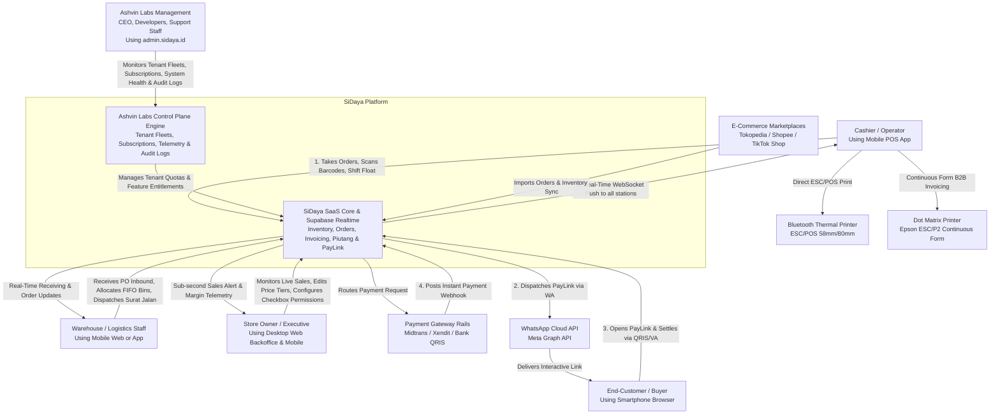
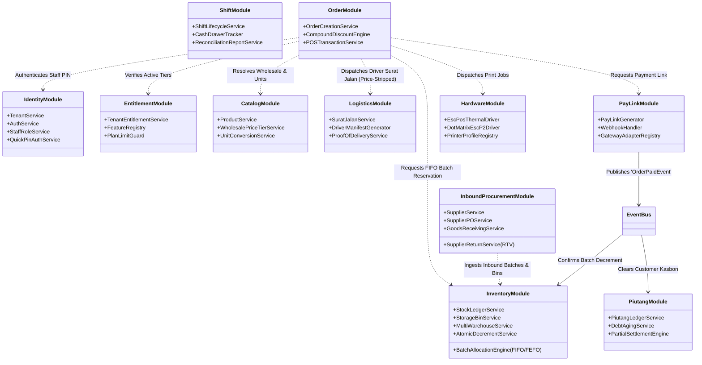
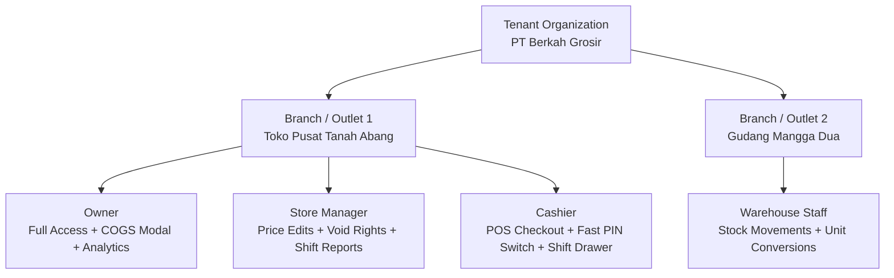

# System Architecture & Topology
> **Domain-Driven Modular Monolith, Supabase Realtime CDC Backbone & Dynamic Tenant Entitlement Engine**

---

## 1. Architectural Philosophy: The Modular Monolith & Real-Time Sync

To satisfy the core requirements of **extreme modularity** (where features can be toggled on/off dynamically based on tenant subscription plans without regressions) and **sub-second multi-device synchronization** (eliminating the notorious multi-station sync lag of legacy tools like Canggih Software's e-Nota), **SiDaya** (by **Ashvin Labs**) combines:
1. **Supabase Realtime / PostgreSQL Change Data Capture (CDC)** over persistent WebSockets for sub-second cross-device state propagation.
2. **Offline-First Client Architecture** (React Native Expo + Local SQLite/WatermelonDB) with deterministic conflict resolution.
3. **Pluggable Domain Modules with Dynamic Tenant Feature Entitlements**.
4. **Tenant User, Role & Shift Governance** (Fast cashier PIN switching, shift cash balancing, and COGS privacy protection).

```
+---------------------------------------------------------------------------------------------------------------+
|                                          SiDaya Ecosystem Topology                                            |
+---------------------------------------------------------------------------------------------------------------+
                                                        |
         +-----------------------------+----------------+-------------------------------+
         |                             |                                                |
         v                             v                                                v
+-------------------------------+ +-------------------------------+ +-------------------------------+ +-------------------------------+
|   Counter Cashier POS (App)   | | Warehouse / Driver Station    | | Merchant Web Backoffice Portal| |   Client PayLink Web Portal   |
|   (React Native Expo / FSD)   | | (React Native / Mobile Web)   | | (Next.js Responsive Desktop)  | |     (Next.js / Responsive)    |
|  - Offline-First Local SQLite | | - Barcode scanner / Receiving | | - Web Login & Tenant Switcher | |  - Zero install / Web Checkout|
|  - Bluetooth & Dot Matrix ESC | | - Storage Bins & FIFO Lots    | | - Inbound POs & Surat Jalan   | |  - QRIS, VA, E-Wallet UI      |
|  - Role-Adaptive UI & PIN     | | - Price-Stripped Surat Jalan  | | - Owner Checkbox Permissions  | |  - Auto-reconcile PayLink     |
+---------------+---------------+ +---------------+---------------+ +---------------+---------------+ +---------------+---------------+
                |                                 |                                 |                                 |
                | HTTPS (REST) / WebSocket (WSS)  | HTTPS / WSS                     | HTTPS (REST & WSS)              | HTTPS
                v                                 v                                 v                                 v
+---------------------------------------------------------------------------------------------------------------+
|                             Supabase Ingress Gateway / Kong Reverse Proxy & WSS                               |
|                    (Tenant Resolution, JWT Verification, Rate Limiting & SSL Termination)                     |
+-----------------------+-------------------------------------------------------+-------------------------------+
                        |                                                       |
                        | Supabase Realtime WebSocket Pub/Sub                   | REST / RPC Requests
                        v                                                       v
+-----------------------------------------------+ +-------------------------------------------------------------+
|       Supabase Realtime Engine (Elixir)       | |           SiDaya Backend Core (Modular Monolith)            |
| - postgres_changes (CDC logical replication)  | |  +---------------------------+ +--------------------------+ |
| - broadcast (low-latency ephemeral events)    | |  | Tenant & User Auth Engine | | Feature Registry &       | |
| - presence (active register & cashier status) | |  | - Checkbox Perm Matrix    | | Entitlement Guard        | |
+-----------------------+-----------------------+ |  +-------------+-------------+ +------------+-------------+ |
                        |                         |                |                            |               |
                        | Direct Realtime WAL     |  --------------+----------------------------+-------------  |
                        | Notifications           |            Domain Event Bus (Redis / In-Process)            |
                        |                         |  --------------+----------------------------+-------------  |
                        |                         |                |                            |               |
                        |                         |  +-------------+-------------+ +------------+-------------+ |
                        |                         |  | Wholesale, FIFO & Surat   | | PayLink & Webhook        | |
                        |                         |  | - Inbound PO Receiving    | | - QRIS/VA Engine         | |
                        |                         |  | - Compound Disc (5%+2%)   | | - Auto-Settlement        | |
                        |                         |  | - Piutang & Kasbon Ledger | | - WhatsApp Comms         | |
                        |                         |  +---------------------------+ +--------------------------+ |
                        |                         +------------------------------+------------------------------+
                        |                                                        |
                        v                                                        v
+---------------------------------------------------------------------------------------------------------------+
|                               PostgreSQL 16 Multi-Tenant Master (Supabase Stack)                              |
| - Row-Level Security (RLS) enforcing strict tenant data isolation and COGS masking per user permissions       |
| - Logical Replication (pgoutput) streaming CDC events into Supabase Realtime                                  |
| - Shift & Cash Float Ledgers, Product Batches, Compound Discounts, Piutang Records                            |
+-----------------------------------------------+---------------------------------------------------------------+
                                                |
                    +---------------------------+---------------------------+
                    |                                                       |
                    v                                                       v
        +------------------------+                             +------------------------+
        |   Redis 7 (In-Memory)  |                             | External Micro-Services|
        |  - BullMQ Async Queues │                             │ - WhatsApp Cloud API   │
        |  - Ephemeral Sessions  │                             │ - Payment Gateways     │
        |  - Hot Cache & Mutexes │                             │ - Marketplace Sync API │
        +------------------------+                             +------------------------+
```

---

## 2. C4 Model Specification

### Level 1: System Context Diagram (C4 - Context)
Defines how users, clients, stations, and external systems interact with SiDaya.



---

### Level 2: Container Diagram (C4 - Containers)
The high-level technical runtime blocks comprising the platform:

```mermaid
graph TB
    subgraph Client Layer
        App[Mobile POS Client\nReact Native + Expo\nLocal SQLite / WatermelonDB]
        MerchantPortal[Merchant Web Backoffice Portal\nNext.js App Router + Responsive CSS\nSupabase Auth, Tenant Switcher, Inbound & Surat Jalan]
        KDS[Warehouse & Field Driver Portal\nReact Native / Mobile Web\nRealtime Queue Display & Surat Jalan Manifest]
        WebPortal[Client PayLink Portal\nNext.js Serverless SSR\nZero-Install Buyer Checkout]
    end

    subgraph Application & Gateway Layer
        Gateway[Supabase Gateway / Kong Ingress\nReverse Proxy, TLS, Tenant Auth Resolver]
        AppServer[Application Server\nNode.js / TypeScript Modular Monolith\nExpress / Fastify Engine]
        RealtimeServer[Supabase Realtime Cluster\nElixir / Phoenix WebSockets\nWAL CDC Ingestion]
        Worker[Async Background Workers\nNode.js Worker Fleet + BullMQ]
    end

    subgraph Storage & Messaging Layer
        DB[(Primary Database\nPostgreSQL 16 + RLS\nRelational, Ledgers & Wal CDC)]
        Cache[(Cache & Queues\nRedis 7 Clustering)]
        ObjectStorage[(S3 / MinIO\nInvoices, Logos & PDFs)]
    end

    App -->|REST / RPC APIs| Gateway
    App <-->|WebSockets (Sub-second CDC)| RealtimeServer
    KDS <-->|WebSockets (Live Order Stream)| RealtimeServer
    WebPortal -->|Public Checkout API| Gateway
    Gateway --> AppServer
    RealtimeServer <-->|Logical Replication pgoutput| DB
    AppServer --> DB
    AppServer --> Cache
    AppServer -->|Enqueues Tasks| Cache
    Worker -->|Consumes Tasks| Cache
    Worker --> DB
    Worker --> ObjectStorage
```

---

## 3. The Modular Monolith & Domain Boundaries

To guarantee that any domain module can be added, updated, or removed independently without regressions, all modules adhere to strict **Hexagonal / Clean Architecture boundaries**. Direct cross-module database querying is prohibited; all cross-domain operations must pass through explicit **Domain Interfaces** or the **Asynchronous Domain Event Bus**.

### Core Bounded Contexts



### Domain Module Responsibilities

| Module | Core Responsibility | Public API / Interfaces |
| :--- | :--- | :--- |
| **`IdentityModule`** | Tenant accounts, multi-staff credentials, JWT claims, fast 4–6 digit cashier PIN switching, outlet assignment. | `verifyStaffPin()`, `switchStationCashier()`, `getTenantStaff()` |
| **`EntitlementModule`** | Plan definitions (Free, Retail, Grosir Pro, Enterprise), dynamic feature toggling, entitlement checks. | `isFeatureEnabled(tenantId, featureKey)`, `assertLimit()` |
| **`ShiftModule`** | Register shift lifecycle (`shifts`), opening cash float, cash in/out drops, X-Report & Z-Report reconciliation. | `openShift()`, `recordCashDrop()`, `closeShift()` |
| **`CatalogModule`** | Products, variants, barcodes, wholesale price tiers (*Eceran/Grosir*), unit conversions (*PCS/Lusin/Dus*). | `getProduct()`, `resolveTierPrice()`, `convertStockUnits()` |
| **`InboundProcurementModule`** | Suppliers, inbound POs, goods receiving, carrier logs, and supplier return policies (RTV terms). | `createSupplierPO()`, `receiveInboundShipment()`, `recordSupplierReturn()` |
| **`InventoryModule`** | Multi-bin storage locations (Warehouse $\rightarrow$ Zone $\rightarrow$ Rack $\rightarrow$ Bin), FIFO/FEFO batch allocation, atomic decrements. | `allocateBatchesFIFO()`, `recordStockMovement()`, `assignStorageBin()` |
| **`LogisticsModule`** | Driver Working Permits (*Surat Jalan* / Delivery Orders) with price-stripped manifests linked to invoices, proof of delivery. | `generateSuratJalan()`, `recordProofOfDelivery()`, `getDriverManifest()` |
| **`OrderModule`** | Order orchestration, shopping cart calculations, compound discounts (`5%+2%+Rp`), invoice numbering. | `createOrder()`, `calculateCompoundDiscount()`, `voidOrder()` |
| **`PayLinkModule`** | Hosted checkout tokens, QRIS/VA gateway adapters, idempotent webhook processing and auto-reconciliation. | `generatePayLink()`, `handleGatewayWebhook()` |
| **`PiutangModule`** | Accounts receivable ledger (`piutang_records`), customer debt aging, partial installment settlements via PayLink. | `recordPiutang()`, `settleInstallment()`, `getDebtSummary()` |
| **`HardwareModule`** | ESC/POS thermal printer byte formatting (58/80mm), Dot Matrix Continuous Form (ESC/P2) layout renderer. | `formatThermalReceipt()`, `formatDotMatrixInvoice()`, `formatSuratJalan()` |
| **`MarketplaceModule`**| Synchronizes orders, inventory, and settlement status with Tokopedia, Shopee, and TikTok Shop APIs. | `ingestMarketplaceOrder()`, `syncCatalogStock()` |
| **`NotificationModule`**| WhatsApp Cloud API messages, mobile push alerts (FCM/APNS), customer receipt delivery. | `sendWhatsAppPayLink()`, `sendPushNotification()` |

---

## 4. Pluggable Feature Registry & Dynamic Tenant Entitlements

To satisfy the user requirement of **extreme modularity**—where features can be enabled, disabled, or removed at runtime when a tenant changes their subscription plan:

### 1. Feature Registry & Keys
Every feature is governed by a canonical `FeatureKey` enum:
```typescript
export enum FeatureKey {
  CORE_POS = 'core:pos',
  CLIENT_PAYLINK = 'fintech:paylink',
  GROSIR_MULTI_TIER = 'wholesale:multi_tier',
  COMPOUND_DISCOUNTS = 'wholesale:compound_discounts',
  UNIT_CONVERSIONS = 'wholesale:unit_conversions',
  INBOUND_PROCUREMENT = 'inventory:inbound_procurement',
  STORAGE_BINS = 'inventory:storage_bins',
  FIFO_BATCH_ALLOCATION = 'inventory:fifo_batch_allocation',
  DRIVER_SURAT_JALAN = 'logistics:driver_surat_jalan',
  SUPPLIER_RETURNS = 'inventory:supplier_returns',
  DOT_MATRIX_PRINTING = 'hardware:dot_matrix',
  PIUTANG_LEDGER = 'finance:piutang',
  STAFF_RBAC_SHIFTS = 'staff:rbac_shifts',
  REALTIME_MULTI_DEVICE = 'sync:supabase_realtime',
  MARKETPLACE_SYNC = 'omnichannel:marketplace_sync',
  RESTAURANT_MODE = 'hospitality:restaurant_mode', // Deferred backlog
}
```

### 2. Runtime Entitlement Enforcement
1. **Backend Middleware Guard**:
   API endpoints are protected by declarative decorators:
   ```typescript
   @Post('wholesale/price-tiers')
   @RequireEntitlement(FeatureKey.GROSIR_MULTI_TIER)
   async createPriceTier(@CurrentTenant() tenant: Tenant, @Body() dto: PriceTierDto) {
     return this.catalogService.createPriceTier(tenant.id, dto);
   }
   ```
2. **Mobile Client Runtime Adaptation**:
   The client application subscribes to its tenant entitlement state. When a plan changes, the mobile app dynamically reconfigures drawer menus, hides or reveals tabs, and adjusts input forms without requiring an app store update:
   ```tsx
   const { isEnabled } = useFeatureEntitlement(FeatureKey.GROSIR_MULTI_TIER);
   
   return (
     <View>
       <Text>Harga Jual</Text>
       {isEnabled && <WholesaleTierPicker product={product} />}
     </View>
   );
   ```

---

## 5. Tenant User, Role & Shift Governance

To ensure store owners can safely delegate operations to staff:



### Shift & Cash Drawer Reconciliation Lifecycle
1. **Shift Open**: Cashier enters 4-digit PIN -> records Opening Cash Float (e.g., IDR 200,000) -> Drawer is unlocked.
2. **Active Shift**: Cash transactions increment expected drawer cash; PayLink/QRIS transactions increment digital ledger.
3. **Cash Drop**: Manager can perform mid-shift cash drops (safe transfers) with dual-PIN authorization.
4. **Shift Close & X/Z Report**:
   * Cashier enters physically counted cash.
   * System calculates variance: `Difference = Actual Cash - (Opening Float + Cash Sales - Cash Drops)`.
   * An immutable **Z-Report** is generated and printed directly to thermal/dot-matrix printer and synced to Owner's dashboard.

---

## 6. Multi-Tenant Isolation & Security (Supabase PostgreSQL RLS)

SiDaya enforces bulletproof data isolation across all tenants and roles using PostgreSQL Row-Level Security:

```sql
-- Enforce tenant isolation on all queries
ALTER TABLE orders ENABLE ROW LEVEL SECURITY;

CREATE POLICY tenant_isolation_orders ON orders
  FOR ALL
  USING (tenant_id = NULLIF(current_setting('app.current_tenant_id', true), '')::uuid);

-- Enforce COGS / Harga Modal privacy: Cashiers cannot read cost_price
ALTER TABLE products ENABLE ROW LEVEL SECURITY;

CREATE POLICY cashier_hide_cogs ON products
  FOR SELECT
  TO authenticated
  USING (
    tenant_id = NULLIF(current_setting('app.current_tenant_id', true), '')::uuid
    AND (
      current_setting('app.current_user_role', true) != 'cashier' 
      OR cost_price IS NULL
    )
  );
```
