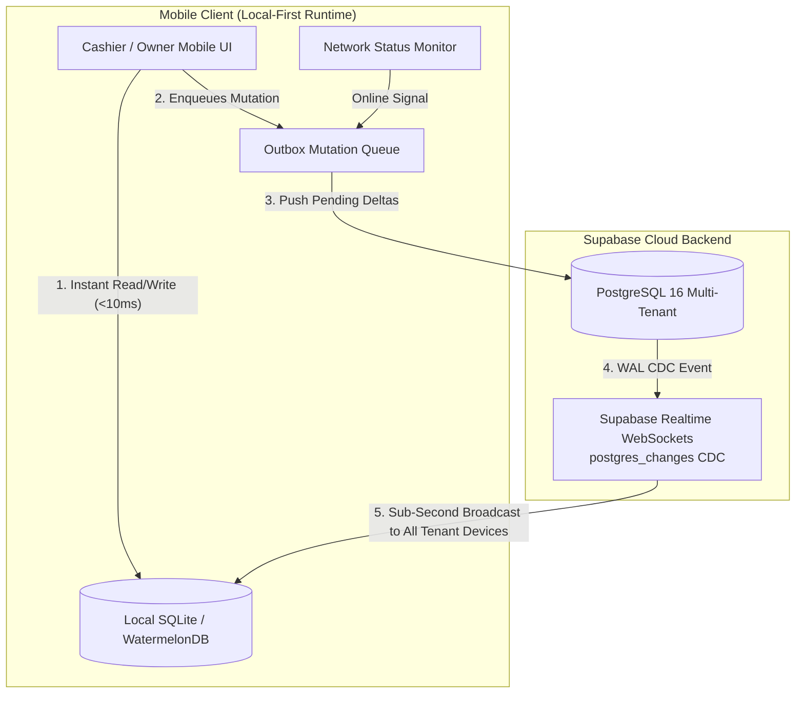

# Offline-First Architecture & Supabase Realtime Sync Engine
> **Sub-Second Multi-Device Synchronization Paired with 100% Mobile Operational Continuity**

---

## 1. The Offline-First Imperative + Real-Time Sync

Small-to-medium business owners in emerging markets operate under unpredictable network conditions:
* Concrete traditional market halls (*pasar*) with poor cellular reception.
* Intermittent 3G/4G connectivity drops during thunderstorms or peak cellular congestion.
* Prepaid mobile data exhaustion in the middle of a business day.

**Core Rule**: If a cashier presses "Checkout" or "Add Item" and sees a spinning loading spinner, the application has failed. In SiDaya, **all reading, writing, searching, and receipt generation executes against the local smartphone database first**, while **Supabase Realtime WebSockets** stream sub-second updates across devices when connected.



---

## 2. Synchronization Architecture: The Dual-Engine Model

To completely outperform incumbent tools (like Canggih Software's e-Nota where multi-device synchronization is notoriously delayed):

1. **Continuous Real-Time Channel (When Online)**:
   Connected mobile registers, kitchen displays, and owner monitoring devices maintain an active WebSocket connection to Supabase Realtime. As soon as PostgreSQL commits a transaction (e.g., an order is created on Register 1 or paid via PayLink), a `postgres_changes` event fires directly into all other registers in `< 200ms`.
2. **Deterministic Delta Sync (When Reconnecting from Offline)**:
   If a device loses signal, local mutations accumulate in an immutable outbox queue. Upon signal restoration, the client performs an atomic pull-and-push delta synchronization.

---

## 3. The Synchronization Protocol

### Step 1: Real-Time CDC Subscription (Supabase Realtime)
```typescript
// apps/mobile/src/services/realtimeSync.ts
import { supabase } from './supabaseClient';
import { database } from '../database';

export function subscribeToTenantRealtime(tenantId: string) {
  const channel = supabase
    .channel(`tenant:${tenantId}:sync`)
    .on(
      'postgres_changes',
      {
        event: '*',
        schema: 'public',
        table: 'orders',
        filter: `tenant_id=eq.${tenantId}`,
      },
      async (payload) => {
        await handleIncomingServerChange('orders', payload);
      }
    )
    .on(
      'postgres_changes',
      {
        event: '*',
        schema: 'public',
        table: 'stock_movements',
        filter: `tenant_id=eq.${tenantId}`,
      },
      async (payload) => {
        await handleIncomingStockChange(payload);
      }
    )
    .subscribe();

  return () => {
    supabase.removeChannel(channel);
  };
}
```

---

### Step 2: Offline Delta Sync Protocol (WatermelonDB Sync)

#### A. The Pull Phase (`GET /api/v1/sync/pull`)
The client sends the timestamp of its last successful sync (`last_pulled_at`). The server returns all changes that occurred across all entities belonging to the tenant since that timestamp.

```json
{
  "timestamp": 1773133200000,
  "changes": {
    "products": {
      "created": [],
      "updated": [
        {
          "id": "prod_01JA98Z",
          "name": "Beras Rojolele 5kg",
          "sku": "SMR-001",
          "price_retail": 75000,
          "price_grosir": 71000,
          "updated_at": 1773130100000
        }
      ],
      "deleted": []
    },
    "orders": {
      "created": [],
      "updated": [
        {
          "id": "ord_881920",
          "status": "PAID",
          "payment_method": "PAYLINK_QRIS",
          "paid_at": 1773132000000
        }
      ],
      "deleted": []
    },
    "piutang_records": {
      "created": [],
      "updated": [
        {
          "id": "piu_019",
          "remaining_amount": 150000,
          "status": "PARTIAL"
        }
      ],
      "deleted": []
    }
  }
}
```

#### B. The Push Phase (`POST /api/v1/sync/push`)
The client sends all local mutations (records created, updated, or deleted while offline).

---

## 4. Conflict Resolution Strategies

In a multi-device or offline-to-online synchronization environment, concurrent updates can collide. SiDaya implements domain-specific conflict resolution rules:

| Entity Type | Resolution Strategy | Algorithmic Mechanism |
| :--- | :--- | :--- |
| **Catalog / Products** | **Server Wins / Last-Write-Wins (LWW)** | Product metadata uses timestamp comparison. In a collision between owner phone and cashier phone, the server timestamp takes precedence. |
| **Product Batches & Storage Bins** | **Optimistic FIFO Reservation / Server Auth** | Inbound shipments assign storage locations locally; sales FIFO batch reservations are validated on the server with deterministic tie-breaking. |
| **Driver Surat Jalan (Delivery Orders)** | **Append-Only Immutable Permit** | Delivery permits are uniquely tied to order UUIDs without prices; physical/digital signature confirmations queue in local outbox and sync upon reconnection. |
| **Sales Orders** | **Append-Only Immutable Creation** | Orders are uniquely generated using client-side **UUIDv4**. Multiple offline devices cannot collide because order IDs are globally unique. |
| **Inventory Counts** | **Event-Sourced Delta Movements** *(CRITICAL)* | **Never mutate an absolute stock integer directly.** Offline devices log delta changes (`quantity_change: -2`). The server sums deltas sequentially. |
| **Customer Piutang / Kasbon** | **Immutable Double-Entry Ledger** | Debt increases and repayments are recorded as immutable transaction entries rather than overwriting a single `total_debt` balance. |
| **Cashier Shifts** | **Station-Bound Append-Only** | Each shift belongs to a unique register station and staff user; collisions are physically isolated by device UUID. |

---

## 5. Avoiding Inventory Race Conditions: The Delta Ledger

### The Fatal Flaw of Traditional Systems (Absolute Value Overwrite):
```
1. Server Stock of Beras Rojolele: 10
2. Device 1 goes offline, sells 2 bags. Local calculation: 10 - 2 = 8.
3. Device 2 goes offline, sells 3 bags. Local calculation: 10 - 3 = 7.
4. Device 1 comes online -> writes "Stock = 8".
5. Device 2 comes online -> writes "Stock = 7".
Result: 5 bags were sold, but final stock is recorded as 7 (Lost 2 bags of inventory!).
```

### The SiDaya Event-Sourced Delta Solution:
```
1. Server Stock of Beras Rojolele: 10
2. Device 1 goes offline, records event: { delta: -2, order: "ord_1" }
3. Device 2 goes offline, records event: { delta: -3, order: "ord_2" }
4. Device 1 syncs -> Server applies delta: 10 + (-2) = 8.
5. Device 2 syncs -> Server applies delta: 8 + (-3) = 5.
Result: Accurate inventory count of 5 bags maintained with zero discrepancies!
```

---

## 6. Client-Side WatermelonDB Schema Specification

```typescript
// apps/mobile/src/database/schema.ts
import { appSchema, tableSchema } from '@nozbe/watermelondb';

export const mySchema = appSchema({
  version: 2,
  tables: [
    tableSchema({
      name: 'products',
      columns: [
        { name: 'server_id', type: 'string', isIndexed: true },
        { name: 'name', type: 'string' },
        { name: 'sku', type: 'string', isIndexed: true },
        { name: 'barcode', type: 'string', isIndexed: true, isOptional: true },
        { name: 'price_retail', type: 'number' },
        { name: 'price_grosir', type: 'number', isOptional: true },
        { name: 'cost_price', type: 'number', isOptional: true }, // masked for cashier
        { name: 'current_stock', type: 'number' },
        { name: 'base_unit', type: 'string' }, // e.g. 'PCS'
        { name: 'category_id', type: 'string', isIndexed: true },
        { name: 'updated_at', type: 'number' },
      ],
    }),
    tableSchema({
      name: 'orders',
      columns: [
        { name: 'server_id', type: 'string', isIndexed: true, isOptional: true },
        { name: 'customer_id', type: 'string', isIndexed: true, isOptional: true },
        { name: 'cashier_user_id', type: 'string', isIndexed: true },
        { name: 'shift_id', type: 'string', isIndexed: true },
        { name: 'subtotal', type: 'number' },
        { name: 'discount_total', type: 'number' },
        { name: 'total_amount', type: 'number' },
        { name: 'status', type: 'string', isIndexed: true },
        { name: 'payment_method', type: 'string' },
        { name: 'sync_status', type: 'string', isIndexed: true }, // 'synced' | 'pending'
        { name: 'created_at', type: 'number' },
      ],
    }),
    tableSchema({
      name: 'piutang_records',
      columns: [
        { name: 'server_id', type: 'string', isIndexed: true, isOptional: true },
        { name: 'customer_id', type: 'string', isIndexed: true },
        { name: 'order_id', type: 'string', isIndexed: true },
        { name: 'total_debt', type: 'number' },
        { name: 'remaining_amount', type: 'number' },
        { name: 'due_date', type: 'number', isOptional: true },
        { name: 'status', type: 'string', isIndexed: true },
        { name: 'sync_status', type: 'string', isIndexed: true },
      ],
    }),
  ],
});
```
