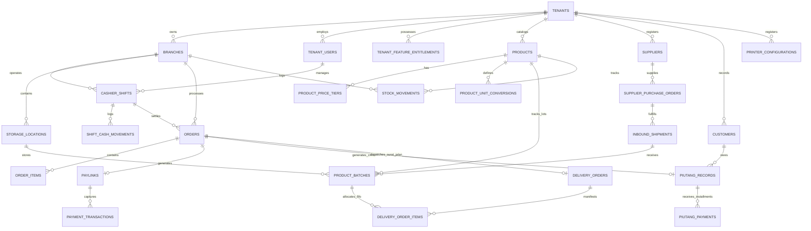

# Database Schema & Data Model
> **Relational Data Architecture, Entity Relationships, Constraints, and Multi-Tenant Row-Level Security**

---

## 1. Entity-Relationship Diagram (ERD)



---

## 2. Canonical Table Definitions & Constraints

### A. Tenancy, Subscriptions & Feature Entitlements

```sql
-- 1. Tenants Table
CREATE TABLE tenants (
    id UUID PRIMARY KEY DEFAULT gen_random_uuid(),
    business_name VARCHAR(255) NOT NULL,
    subdomain VARCHAR(63) UNIQUE,
    current_plan_tier VARCHAR(32) NOT NULL DEFAULT 'FREE_STARTER', -- 'FREE_STARTER', 'RETAIL_STARTER', 'GROSIR_PRO', 'ENTERPRISE'
    subscription_status VARCHAR(32) NOT NULL DEFAULT 'ACTIVE', -- 'ACTIVE', 'PAST_DUE', 'CANCELED'
    created_at TIMESTAMPTZ NOT NULL DEFAULT NOW(),
    updated_at TIMESTAMPTZ NOT NULL DEFAULT NOW()
);

-- 2. Pluggable Feature Entitlements (Dynamic Registry per Tenant)
CREATE TABLE tenant_feature_entitlements (
    id UUID PRIMARY KEY DEFAULT gen_random_uuid(),
    tenant_id UUID NOT NULL REFERENCES tenants(id) ON DELETE CASCADE,
    feature_key VARCHAR(64) NOT NULL, -- e.g., 'wholesale:multi_tier', 'hardware:dot_matrix', 'finance:piutang'
    is_enabled BOOLEAN NOT NULL DEFAULT FALSE,
    custom_limit JSONB DEFAULT '{}'::JSONB, -- e.g., {"max_devices": 3, "max_staff": 5}
    activated_at TIMESTAMPTZ NOT NULL DEFAULT NOW(),
    expires_at TIMESTAMPTZ,
    CONSTRAINT uq_tenant_feature UNIQUE (tenant_id, feature_key)
);
CREATE INDEX idx_entitlements_tenant ON tenant_feature_entitlements(tenant_id, is_enabled);
```

---

### B. Staff User Management & Shift Reconciliation

```sql
-- 3. Tenant Users (Staff Accounts with Supabase Auth & Checkbox Permissions)
CREATE TABLE tenant_users (
    id UUID PRIMARY KEY DEFAULT gen_random_uuid(),
    tenant_id UUID NOT NULL REFERENCES tenants(id) ON DELETE CASCADE,
    default_branch_id UUID,
    auth_user_id UUID, -- References auth.users(id) in Supabase Auth context
    full_name VARCHAR(128) NOT NULL,
    phone_number VARCHAR(32) NOT NULL,
    email VARCHAR(255),
    role VARCHAR(32) NOT NULL DEFAULT 'CASHIER', -- Starter archetype: 'OWNER', 'MANAGER', 'CASHIER', 'WAREHOUSE', 'SALESMAN', 'DRIVER'
    permissions JSONB NOT NULL DEFAULT '[]'::JSONB, -- Array of granted PermissionKey strings (e.g., ["pos:checkout", "warehouse:inbound"])
    pin_hash VARCHAR(255) NOT NULL, -- Argon2 / bcrypt hash of 4-6 digit numeric PIN for fast station switch
    is_active BOOLEAN NOT NULL DEFAULT TRUE,
    created_at TIMESTAMPTZ NOT NULL DEFAULT NOW(),
    updated_at TIMESTAMPTZ NOT NULL DEFAULT NOW(),
    CONSTRAINT uq_tenant_user_phone UNIQUE (tenant_id, phone_number)
);
CREATE INDEX idx_tenant_users_tenant ON tenant_users(tenant_id);
CREATE INDEX idx_tenant_users_auth ON tenant_users(auth_user_id);
CREATE INDEX idx_tenant_users_email ON tenant_users(email);

-- 4. Cashier Shifts (Drawer Float Balancing, X-Report & Z-Report)
CREATE TABLE cashier_shifts (
    id UUID PRIMARY KEY DEFAULT gen_random_uuid(),
    tenant_id UUID NOT NULL REFERENCES tenants(id) ON DELETE CASCADE,
    branch_id UUID NOT NULL,
    cashier_user_id UUID NOT NULL REFERENCES tenant_users(id),
    device_uuid VARCHAR(128) NOT NULL,
    opened_at TIMESTAMPTZ NOT NULL DEFAULT NOW(),
    closed_at TIMESTAMPTZ,
    opening_float NUMERIC(14,2) NOT NULL DEFAULT 0.00, -- Cash in drawer at start
    cash_sales_total NUMERIC(14,2) NOT NULL DEFAULT 0.00,
    digital_sales_total NUMERIC(14,2) NOT NULL DEFAULT 0.00, -- QRIS, PayLink, Card
    cash_drops_total NUMERIC(14,2) NOT NULL DEFAULT 0.00, -- Safe transfers during shift
    expected_drawer_cash NUMERIC(14,2) NOT NULL DEFAULT 0.00,
    actual_drawer_cash NUMERIC(14,2), -- Counted physically at close
    cash_variance NUMERIC(14,2), -- actual - expected
    status VARCHAR(16) NOT NULL DEFAULT 'OPEN', -- 'OPEN', 'CLOSED'
    notes TEXT
);
CREATE INDEX idx_shifts_tenant_branch ON cashier_shifts(tenant_id, branch_id, status);

-- 5. Shift Cash Movements (Mid-Shift Drops / Expenses)
CREATE TABLE shift_cash_movements (
    id UUID PRIMARY KEY DEFAULT gen_random_uuid(),
    shift_id UUID NOT NULL REFERENCES cashier_shifts(id) ON DELETE CASCADE,
    tenant_id UUID NOT NULL REFERENCES tenants(id) ON DELETE CASCADE,
    movement_type VARCHAR(16) NOT NULL, -- 'CASH_DROP', 'PETTY_CASH_EXPENSE', 'FLOAT_ADJUSTMENT'
    amount NUMERIC(14,2) NOT NULL,
    reason VARCHAR(255) NOT NULL,
    authorized_by_user_id UUID REFERENCES tenant_users(id),
    created_at TIMESTAMPTZ NOT NULL DEFAULT NOW()
);
```

---

### C. Wholesale Catalog, Multi-Tier Pricing & Unit Conversions

```sql
-- 6. Master Products Table
CREATE TABLE products (
    id UUID PRIMARY KEY DEFAULT gen_random_uuid(),
    tenant_id UUID NOT NULL REFERENCES tenants(id) ON DELETE CASCADE,
    name VARCHAR(255) NOT NULL,
    sku VARCHAR(64) NOT NULL,
    barcode VARCHAR(64),
    price_retail NUMERIC(14,2) NOT NULL, -- Default Eceran Price
    cost_price NUMERIC(14,2), -- Modal / COGS (Hidden from cashier via RLS)
    base_unit VARCHAR(16) NOT NULL DEFAULT 'PCS', -- 'PCS', 'KG', 'LITER'
    current_stock INTEGER NOT NULL DEFAULT 0,
    low_stock_threshold INTEGER NOT NULL DEFAULT 5,
    is_active BOOLEAN NOT NULL DEFAULT TRUE,
    created_at TIMESTAMPTZ NOT NULL DEFAULT NOW(),
    updated_at TIMESTAMPTZ NOT NULL DEFAULT NOW(),
    CONSTRAINT uq_tenant_sku UNIQUE (tenant_id, sku)
);
CREATE INDEX idx_products_tenant_barcode ON products(tenant_id, barcode);

-- 7. Wholesale Price Tiers (Parity with e-Nota Grosir)
CREATE TABLE product_price_tiers (
    id UUID PRIMARY KEY DEFAULT gen_random_uuid(),
    tenant_id UUID NOT NULL REFERENCES tenants(id) ON DELETE CASCADE,
    product_id UUID NOT NULL REFERENCES products(id) ON DELETE CASCADE,
    tier_name VARCHAR(64) NOT NULL, -- e.g., 'Grosir 1', 'Grosir 2', 'Member VIP', 'Salesman'
    customer_type VARCHAR(32), -- Optional filter: 'RETAIL', 'WHOLESALE', 'AGENT'
    min_quantity INTEGER NOT NULL DEFAULT 1,
    tier_price NUMERIC(14,2) NOT NULL,
    created_at TIMESTAMPTZ NOT NULL DEFAULT NOW(),
    CONSTRAINT uq_product_tier UNIQUE (product_id, tier_name, min_quantity)
);
CREATE INDEX idx_price_tiers_lookup ON product_price_tiers(product_id, min_quantity);

-- 8. Product Unit Conversions (e.g., PCS -> Lusin -> Dus)
CREATE TABLE product_unit_conversions (
    id UUID PRIMARY KEY DEFAULT gen_random_uuid(),
    tenant_id UUID NOT NULL REFERENCES tenants(id) ON DELETE CASCADE,
    product_id UUID NOT NULL REFERENCES products(id) ON DELETE CASCADE,
    unit_name VARCHAR(32) NOT NULL, -- 'LUSIN', 'DUS', 'KARTON', 'PACK'
    conversion_factor INTEGER NOT NULL, -- e.g., 12 for Lusin, 144 for Dus
    barcode VARCHAR(64), -- Dedicated barcode for wholesale box
    unit_price NUMERIC(14,2), -- Optional pre-computed price for that unit
    created_at TIMESTAMPTZ NOT NULL DEFAULT NOW(),
    CONSTRAINT uq_product_unit UNIQUE (product_id, unit_name)
);
```

---

### D. Orders, Compound Discounts & Invoicing

```sql
-- 9. Sales Orders Table
CREATE TABLE orders (
    id UUID PRIMARY KEY DEFAULT gen_random_uuid(),
    tenant_id UUID NOT NULL REFERENCES tenants(id) ON DELETE CASCADE,
    branch_id UUID NOT NULL,
    shift_id UUID REFERENCES cashier_shifts(id),
    cashier_user_id UUID REFERENCES tenant_users(id),
    customer_id UUID REFERENCES customers(id),
    order_number VARCHAR(64) NOT NULL, -- e.g., 'INV/20260908/0001'
    order_type VARCHAR(32) NOT NULL DEFAULT 'RETAIL', -- 'RETAIL', 'GROSIR', 'CAFE_TABLE'
    subtotal NUMERIC(14,2) NOT NULL,
    discount_compound_formula VARCHAR(64), -- e.g., '5%+2%+1000'
    discount_total NUMERIC(14,2) NOT NULL DEFAULT 0.00,
    tax_amount NUMERIC(14,2) NOT NULL DEFAULT 0.00,
    total_amount NUMERIC(14,2) NOT NULL,
    payment_status VARCHAR(32) NOT NULL DEFAULT 'UNPAID', -- 'PAID', 'PARTIAL', 'UNPAID'
    payment_method VARCHAR(32), -- 'CASH', 'PAYLINK_QRIS', 'PAYLINK_VA', 'PIUTANG_TEMPO'
    notes TEXT,
    created_at TIMESTAMPTZ NOT NULL DEFAULT NOW(),
    updated_at TIMESTAMPTZ NOT NULL DEFAULT NOW(),
    CONSTRAINT uq_tenant_order_number UNIQUE (tenant_id, order_number)
);
CREATE INDEX idx_orders_tenant_status ON orders(tenant_id, payment_status);

-- 10. Order Items Table
CREATE TABLE order_items (
    id UUID PRIMARY KEY DEFAULT gen_random_uuid(),
    order_id UUID NOT NULL REFERENCES orders(id) ON DELETE CASCADE,
    product_id UUID NOT NULL REFERENCES products(id),
    selected_unit VARCHAR(32) NOT NULL DEFAULT 'PCS',
    unit_conversion_factor INTEGER NOT NULL DEFAULT 1,
    quantity INTEGER NOT NULL,
    base_unit_quantity INTEGER NOT NULL, -- quantity * conversion_factor (for stock decrement)
    unit_price NUMERIC(14,2) NOT NULL,
    subtotal NUMERIC(14,2) NOT NULL
);
```

---

### E. Accounts Receivable (Piutang & Kasbon Ledger)

```sql
-- 11. Piutang Records (Unpaid Bills Tracking)
CREATE TABLE piutang_records (
    id UUID PRIMARY KEY DEFAULT gen_random_uuid(),
    tenant_id UUID NOT NULL REFERENCES tenants(id) ON DELETE CASCADE,
    customer_id UUID NOT NULL REFERENCES customers(id),
    order_id UUID NOT NULL REFERENCES orders(id),
    total_debt NUMERIC(14,2) NOT NULL,
    amount_settled NUMERIC(14,2) NOT NULL DEFAULT 0.00,
    remaining_balance NUMERIC(14,2) NOT NULL,
    due_date DATE,
    status VARCHAR(16) NOT NULL DEFAULT 'UNPAID', -- 'UNPAID', 'PARTIAL', 'SETTLED'
    created_at TIMESTAMPTZ NOT NULL DEFAULT NOW(),
    updated_at TIMESTAMPTZ NOT NULL DEFAULT NOW()
);
CREATE INDEX idx_piutang_customer ON piutang_records(tenant_id, customer_id, status);

-- 12. Piutang Installment Payments
CREATE TABLE piutang_payments (
    id UUID PRIMARY KEY DEFAULT gen_random_uuid(),
    piutang_id UUID NOT NULL REFERENCES piutang_records(id) ON DELETE CASCADE,
    tenant_id UUID NOT NULL REFERENCES tenants(id) ON DELETE CASCADE,
    amount_paid NUMERIC(14,2) NOT NULL,
    payment_method VARCHAR(32) NOT NULL, -- 'CASH', 'PAYLINK_QRIS', 'BANK_TRANSFER'
    paylink_id UUID REFERENCES paylinks(id),
    recorded_by_user_id UUID REFERENCES tenant_users(id),
    created_at TIMESTAMPTZ NOT NULL DEFAULT NOW()
);
```

---

### F. Hardware Printer Configurations

```sql
-- 13. Hardware Printer Profiles
CREATE TABLE printer_configurations (
    id UUID PRIMARY KEY DEFAULT gen_random_uuid(),
    tenant_id UUID NOT NULL REFERENCES tenants(id) ON DELETE CASCADE,
    branch_id UUID NOT NULL,
    printer_name VARCHAR(64) NOT NULL,
    driver_type VARCHAR(32) NOT NULL, -- 'ESC_POS_THERMAL', 'DOT_MATRIX_ESC_P2', 'WIFI_A4'
    connection_type VARCHAR(32) NOT NULL, -- 'BLUETOOTH', 'NETWORK_WIFI', 'USB'
    mac_address VARCHAR(32),
    ip_address VARCHAR(45),
    paper_width_mm INTEGER NOT NULL DEFAULT 58, -- 58, 80, 210 (Continuous A4)
    auto_cut BOOLEAN NOT NULL DEFAULT FALSE,
    is_default BOOLEAN NOT NULL DEFAULT FALSE
);
```

---

### G. Suppliers & Inbound Procurement (Supplier Purchase Orders)

```sql
-- 14. Suppliers Directory
CREATE TABLE suppliers (
    id UUID PRIMARY KEY DEFAULT gen_random_uuid(),
    tenant_id UUID NOT NULL REFERENCES tenants(id) ON DELETE CASCADE,
    supplier_name VARCHAR(255) NOT NULL,
    contact_person VARCHAR(128),
    phone_number VARCHAR(32) NOT NULL,
    email VARCHAR(255),
    address TEXT,
    bank_account_info TEXT, -- e.g., 'BCA 883019231 a/n PT Beras Makmur'
    default_return_policy_days INTEGER DEFAULT 7,
    notes TEXT,
    is_active BOOLEAN NOT NULL DEFAULT TRUE,
    created_at TIMESTAMPTZ NOT NULL DEFAULT NOW(),
    updated_at TIMESTAMPTZ NOT NULL DEFAULT NOW()
);
CREATE INDEX idx_suppliers_tenant ON suppliers(tenant_id);

-- 15. Supplier Purchase Orders (Inbound PO)
CREATE TABLE supplier_purchase_orders (
    id UUID PRIMARY KEY DEFAULT gen_random_uuid(),
    tenant_id UUID NOT NULL REFERENCES tenants(id) ON DELETE CASCADE,
    branch_id UUID NOT NULL,
    supplier_id UUID NOT NULL REFERENCES suppliers(id),
    po_number VARCHAR(64) NOT NULL, -- e.g., 'PO-IN/20260901/001'
    order_date DATE NOT NULL DEFAULT CURRENT_DATE,
    expected_delivery_date DATE,
    total_amount NUMERIC(14,2) NOT NULL DEFAULT 0.00,
    status VARCHAR(32) NOT NULL DEFAULT 'ORDERED', -- 'DRAFT', 'ORDERED', 'PARTIALLY_RECEIVED', 'COMPLETED', 'CANCELLED'
    notes TEXT,
    created_by_user_id UUID REFERENCES tenant_users(id),
    created_at TIMESTAMPTZ NOT NULL DEFAULT NOW(),
    updated_at TIMESTAMPTZ NOT NULL DEFAULT NOW(),
    CONSTRAINT uq_tenant_supplier_po UNIQUE (tenant_id, po_number)
);

-- 16. Supplier PO Items
CREATE TABLE supplier_po_items (
    id UUID PRIMARY KEY DEFAULT gen_random_uuid(),
    supplier_po_id UUID NOT NULL REFERENCES supplier_purchase_orders(id) ON DELETE CASCADE,
    product_id UUID NOT NULL REFERENCES products(id),
    ordered_unit VARCHAR(32) NOT NULL DEFAULT 'PCS',
    conversion_factor INTEGER NOT NULL DEFAULT 1,
    quantity_ordered INTEGER NOT NULL,
    quantity_received INTEGER NOT NULL DEFAULT 0,
    unit_cost_price NUMERIC(14,2) NOT NULL,
    subtotal NUMERIC(14,2) NOT NULL
);
```

---

### H. Storage Bins, Inbound Receiving & FIFO Batches

```sql
-- 17. Storage Locations (Warehouse Bin Hierarchy)
CREATE TABLE storage_locations (
    id UUID PRIMARY KEY DEFAULT gen_random_uuid(),
    tenant_id UUID NOT NULL REFERENCES tenants(id) ON DELETE CASCADE,
    branch_id UUID NOT NULL,
    warehouse_name VARCHAR(64) NOT NULL, -- e.g., 'Gudang Induk', 'Gudang Belakang'
    zone_name VARCHAR(64) NOT NULL, -- e.g., 'Zona Beras', 'Cold Storage', 'Rak Depan'
    aisle VARCHAR(32), -- e.g., 'Lorong 2'
    rack_bin VARCHAR(32) NOT NULL, -- e.g., 'Rak B-04', 'Pallet P-12'
    is_active BOOLEAN NOT NULL DEFAULT TRUE,
    created_at TIMESTAMPTZ NOT NULL DEFAULT NOW(),
    CONSTRAINT uq_tenant_bin_location UNIQUE (tenant_id, branch_id, warehouse_name, zone_name, rack_bin)
);

-- 18. Inbound Shipments (Goods Receiving Logs & Supplier Return Terms)
CREATE TABLE inbound_shipments (
    id UUID PRIMARY KEY DEFAULT gen_random_uuid(),
    tenant_id UUID NOT NULL REFERENCES tenants(id) ON DELETE CASCADE,
    branch_id UUID NOT NULL,
    supplier_po_id UUID REFERENCES supplier_purchase_orders(id),
    supplier_id UUID NOT NULL REFERENCES suppliers(id),
    shipment_number VARCHAR(64) NOT NULL, -- e.g., 'RCV/20260905/012'
    received_at TIMESTAMPTZ NOT NULL DEFAULT NOW(),
    carrier_name VARCHAR(128), -- e.g., 'Truk Ekspedisi Jawa Logistik'
    delivery_vehicle_plate VARCHAR(32), -- e.g., 'B 9123 TX'
    delivery_note_ref VARCHAR(64), -- Supplier's delivery slip / Surat Jalan Pabrik number
    return_policy_days INTEGER NOT NULL DEFAULT 7, -- Window to claim damaged/spoiled stock
    return_policy_terms TEXT, -- e.g., 'Retur maksimal 7 hari untuk karung beras sobek atau kutu'
    received_by_user_id UUID REFERENCES tenant_users(id),
    notes TEXT,
    created_at TIMESTAMPTZ NOT NULL DEFAULT NOW(),
    CONSTRAINT uq_tenant_shipment UNIQUE (tenant_id, shipment_number)
);

-- 19. Product Batches / Lots (FIFO / FEFO Tracking)
CREATE TABLE product_batches (
    id UUID PRIMARY KEY DEFAULT gen_random_uuid(),
    tenant_id UUID NOT NULL REFERENCES tenants(id) ON DELETE CASCADE,
    product_id UUID NOT NULL REFERENCES products(id) ON DELETE CASCADE,
    inbound_shipment_id UUID REFERENCES inbound_shipments(id),
    storage_location_id UUID REFERENCES storage_locations(id),
    batch_lot_number VARCHAR(64) NOT NULL, -- e.g., 'LOT-ROJO-20260901-01'
    harvest_or_milling_date DATE, -- Critical for commodities like rice
    expiry_date DATE, -- Critical for perishables / FEFO
    inbound_cost_per_base_unit NUMERIC(14,2) NOT NULL,
    initial_base_quantity INTEGER NOT NULL,
    remaining_base_quantity INTEGER NOT NULL,
    status VARCHAR(16) NOT NULL DEFAULT 'ACTIVE', -- 'ACTIVE', 'DEPLETED', 'EXPIRED', 'RETURNED_TO_VENDOR'
    received_at TIMESTAMPTZ NOT NULL DEFAULT NOW(),
    created_at TIMESTAMPTZ NOT NULL DEFAULT NOW(),
    updated_at TIMESTAMPTZ NOT NULL DEFAULT NOW(),
    CONSTRAINT uq_product_batch UNIQUE (tenant_id, product_id, batch_lot_number)
);
CREATE INDEX idx_batches_fifo_lookup ON product_batches(tenant_id, product_id, received_at) WHERE remaining_base_quantity > 0;
```

---

### I. Outbound Logistics: Driver Working Permits (*Surat Jalan*) & Supplier Returns

```sql
-- 20. Delivery Orders (Driver Working Permits / Surat Jalan - STRICTLY OMITTING PRICES)
CREATE TABLE delivery_orders (
    id UUID PRIMARY KEY DEFAULT gen_random_uuid(),
    tenant_id UUID NOT NULL REFERENCES tenants(id) ON DELETE CASCADE,
    order_id UUID NOT NULL REFERENCES orders(id) ON DELETE CASCADE,
    do_number VARCHAR(64) NOT NULL, -- e.g., 'SJ/20260908/0042'
    branch_id UUID NOT NULL,
    driver_name VARCHAR(128) NOT NULL,
    driver_phone VARCHAR(32),
    vehicle_plate_number VARCHAR(32) NOT NULL, -- e.g., 'B 1234 KAA'
    destination_address TEXT NOT NULL,
    recipient_name VARCHAR(128) NOT NULL,
    recipient_phone VARCHAR(32) NOT NULL,
    delivery_instructions TEXT, -- e.g., 'Kirim pintu samping, jangan tumpuk lebih dari 8 karung'
    dispatched_at TIMESTAMPTZ,
    delivered_at TIMESTAMPTZ,
    warehouse_dispatcher_id UUID REFERENCES tenant_users(id), -- Who approved pickup
    qr_verification_token VARCHAR(128) UNIQUE NOT NULL, -- QR code linked to master order
    status VARCHAR(32) NOT NULL DEFAULT 'PENDING_PICKUP', -- 'PENDING_PICKUP', 'IN_TRANSIT', 'DELIVERED', 'FAILED_RETURNED'
    proof_of_delivery_signature TEXT, -- Base64 digital signature or signed paper photo URL
    recipient_notes TEXT,
    created_at TIMESTAMPTZ NOT NULL DEFAULT NOW(),
    updated_at TIMESTAMPTZ NOT NULL DEFAULT NOW(),
    CONSTRAINT uq_tenant_do UNIQUE (tenant_id, do_number)
);

-- 21. Delivery Order Items (Manifest items - NO MONETARY VALUES FOR DRIVER PRIVACY)
CREATE TABLE delivery_order_items (
    id UUID PRIMARY KEY DEFAULT gen_random_uuid(),
    delivery_order_id UUID NOT NULL REFERENCES delivery_orders(id) ON DELETE CASCADE,
    product_id UUID NOT NULL REFERENCES products(id),
    batch_id UUID REFERENCES product_batches(id),
    storage_location_id UUID REFERENCES storage_locations(id),
    product_name VARCHAR(255) NOT NULL,
    selected_unit VARCHAR(32) NOT NULL, -- e.g., 'KARUNG 50KG', 'DUS'
    unit_conversion_factor INTEGER NOT NULL DEFAULT 1,
    quantity INTEGER NOT NULL, -- Quantity to pick and deliver
    storage_bin_display VARCHAR(128), -- e.g., 'Gudang Utama -> Rak B-04'
    is_picked BOOLEAN NOT NULL DEFAULT FALSE,
    notes TEXT
    -- NOTE: Intentionally NO price, subtotal, discount, or invoice total columns!
);

-- 22. Supplier Returns (Return to Vendor / RTV Records)
CREATE TABLE supplier_returns (
    id UUID PRIMARY KEY DEFAULT gen_random_uuid(),
    tenant_id UUID NOT NULL REFERENCES tenants(id) ON DELETE CASCADE,
    inbound_shipment_id UUID REFERENCES inbound_shipments(id),
    supplier_id UUID NOT NULL REFERENCES suppliers(id),
    batch_id UUID REFERENCES product_batches(id),
    product_id UUID NOT NULL REFERENCES products(id),
    quantity_returned INTEGER NOT NULL,
    return_unit VARCHAR(32) NOT NULL DEFAULT 'PCS',
    reason VARCHAR(255) NOT NULL, -- e.g., 'Karung sobek, beras lembab / kutu air'
    return_policy_clause VARCHAR(255), -- Reference to supplier return policy
    status VARCHAR(32) NOT NULL DEFAULT 'REQUESTED', -- 'REQUESTED', 'APPROVED_BY_SUPPLIER', 'REPLACED', 'REFUNDED_CREDIT_NOTE'
    credit_note_amount NUMERIC(14,2),
    created_by_user_id UUID REFERENCES tenant_users(id),
    created_at TIMESTAMPTZ NOT NULL DEFAULT NOW()
);
```

---

## 3. Row-Level Security (RLS) Policies

SiDaya leverages PostgreSQL RLS to enforce complete isolation across tenants and staff roles:

```sql
-- Enable RLS across all business tables
ALTER TABLE products ENABLE ROW LEVEL SECURITY;
ALTER TABLE orders ENABLE ROW LEVEL SECURITY;
ALTER TABLE cashier_shifts ENABLE ROW LEVEL SECURITY;
ALTER TABLE piutang_records ENABLE ROW LEVEL SECURITY;
ALTER TABLE suppliers ENABLE ROW LEVEL SECURITY;
ALTER TABLE supplier_purchase_orders ENABLE ROW LEVEL SECURITY;
ALTER TABLE product_batches ENABLE ROW LEVEL SECURITY;
ALTER TABLE delivery_orders ENABLE ROW LEVEL SECURITY;
ALTER TABLE delivery_order_items ENABLE ROW LEVEL SECURITY;

-- 1. Tenant Data Isolation Policy (Global rule)
CREATE POLICY tenant_isolation_policy ON orders
  FOR ALL
  USING (tenant_id = NULLIF(current_setting('app.current_tenant_id', true), '')::UUID);

-- 2. Role-Based Privacy: Cashier cannot read cost_price (Modal)
CREATE POLICY cashier_hide_cogs_policy ON products
  FOR SELECT
  TO authenticated
  USING (
    tenant_id = NULLIF(current_setting('app.current_tenant_id', true), '')::UUID
    AND (
      NULLIF(current_setting('app.current_user_role', true), '') != 'CASHIER'
      OR cost_price IS NULL
    )
  );

-- 3. Delivery / Driver Privacy: Drivers can only view delivery_orders manifests (NEVER orders table)
CREATE POLICY driver_delivery_order_policy ON delivery_orders
  FOR SELECT
  TO authenticated
  USING (
    tenant_id = NULLIF(current_setting('app.current_tenant_id', true), '')::UUID
    AND (
      NULLIF(current_setting('app.current_user_role', true), '') IN ('OWNER', 'MANAGER', 'WAREHOUSE')
      OR vehicle_plate_number = NULLIF(current_setting('app.current_user_vehicle_plate', true), '')
      OR driver_name = NULLIF(current_setting('app.current_user_full_name', true), '')
    )
  );

-- 4. Shifts Isolation: Cashiers can only update their own open shift
CREATE POLICY cashier_shift_policy ON cashier_shifts
  FOR ALL
  TO authenticated
  USING (
    tenant_id = NULLIF(current_setting('app.current_tenant_id', true), '')::UUID
    AND (
      NULLIF(current_setting('app.current_user_role', true), '') IN ('OWNER', 'MANAGER')
      OR cashier_user_id = NULLIF(current_setting('app.current_user_id', true), '')::UUID
    )
  );
```

---

### J. Control Plane Schema: Platform Operators & Audit Trails

```sql
-- 18. Platform Operators (Ashvin Labs Management & Technical Personnel)
CREATE TABLE platform_operators (
    id UUID PRIMARY KEY DEFAULT gen_random_uuid(),
    auth_user_id UUID NOT NULL REFERENCES auth.users(id),
    full_name VARCHAR(100) NOT NULL,
    email VARCHAR(255) UNIQUE NOT NULL,
    role VARCHAR(50) NOT NULL, -- 'SUPER_ADMIN', 'DEV_ENGINEER', 'OPS_SUPPORT', 'AUDIT_COMPLIANCE'
    permissions JSONB NOT NULL DEFAULT '[]', -- Granular operator capability keys
    is_active BOOLEAN NOT NULL DEFAULT true,
    created_at TIMESTAMPTZ NOT NULL DEFAULT NOW(),
    updated_at TIMESTAMPTZ NOT NULL DEFAULT NOW()
);
CREATE INDEX idx_platform_operators_email ON platform_operators(email);

-- 19. Platform Operator Audit Logs (Tamper-Evident Access & Modification Trail)
CREATE TABLE platform_operator_audit_logs (
    id UUID PRIMARY KEY DEFAULT gen_random_uuid(),
    operator_id UUID NOT NULL REFERENCES platform_operators(id),
    operator_email VARCHAR(255) NOT NULL,
    operator_role VARCHAR(50) NOT NULL,
    action VARCHAR(100) NOT NULL, -- 'TENANT_SUBSCRIPTION_UPDATE', 'BREAKGLASS_DIAGNOSTIC_SESSION', 'USER_PIN_RESET'
    target_tenant_id UUID REFERENCES tenants(id),
    ticket_reference VARCHAR(64), -- Required for break-glass actions (e.g. 'INC-9482')
    metadata JSONB NOT NULL DEFAULT '{}',
    ip_address VARCHAR(45),
    created_at TIMESTAMPTZ NOT NULL DEFAULT NOW()
);
CREATE INDEX idx_operator_audit_target ON platform_operator_audit_logs(target_tenant_id, created_at DESC);
CREATE INDEX idx_operator_audit_operator ON platform_operator_audit_logs(operator_id, created_at DESC);
```
