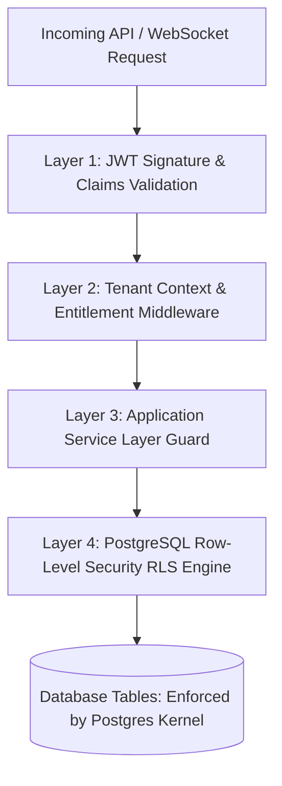
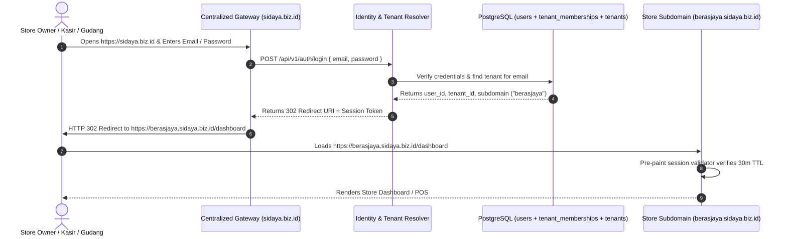
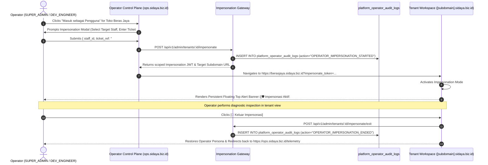

# Security, Compliance & Multi-Tenancy Architecture
> **Zero-Trust Tenant Isolation, Supabase RLS Privacy Policies, Station PIN Switching, and UU PDP Compliance**

---

## 1. Multi-Tenant Isolation: The Zero-Cross-Talk Architecture

In a multi-tenant SaaS serving hundreds of thousands of independent businesses, preventing tenant cross-talk (e.g., Merchant A accidentally seeing Merchant B's sales or customer database) is the highest security priority.

SiDaya employs **Defense-in-Depth Multi-Tenancy Isolation**:



### Layer 1: Cryptographic JWT Claims & Session Context
Access tokens are signed using asymmetric **RS256** (or HMAC-SHA256 with rotating secrets). The claims payload contains:
```json
{
  "sub": "u0000001-0000-0000-0000-000000000001",
  "tenant_id": "a0000001-0000-0000-0000-000000000001",
  "branch_id": "b0000001-0000-0000-0000-000000000001",
  "role": "CASHIER",
  "permissions": ["pos:checkout", "shifts:operate", "catalog:view", "warehouse:inbound"],
  "exp": 1773136800
}
```

### Layer 2: Fastify & Supabase Context Middleware
The incoming `X-Tenant-ID` header must strictly match the `tenant_id` claim in the verified JWT. Mismatches instantly return `403 Forbidden`.

### Layer 3: Two-Tier Application & Entitlement Guards
Before any service executes business logic, two programmatic assertions run:
1. **Tier 1 (Tenant Plan Entitlement)**: `@RequireEntitlement(FeatureKey)` asserts that the business's active subscription tier permits this module.
2. **Tier 2 (Staff Checkbox Permission)**: `@RequirePermission(PermissionKey)` asserts that the authenticated user's `permissions` array contains the required capability checkbox.

### Layer 4: PostgreSQL Kernel-Level Row-Level Security (RLS)
PostgreSQL RLS ensures that queries are sandboxed at the database kernel level:
```sql
SET LOCAL app.current_tenant_id = 'a0000001-0000-0000-0000-000000000001';
SET LOCAL app.current_user_role = 'CASHIER';
SET LOCAL app.current_user_permissions = 'pos:checkout,shifts:operate,catalog:view,warehouse:inbound';
```

---

---

## 1.1 Subdomain-Aware Centralized Authentication & Routing Architecture

SiDaya operates across defined environment base domains:
* **Production**: `sidaya.biz.id` (Tenants: `https://[subdomain].sidaya.biz.id`, Operator: `https://ops.sidaya.biz.id`)
* **Staging**: `sidaya.my.id` (Tenants: `https://[subdomain].sidaya.my.id`, Operator: `https://ops.sidaya.my.id`)
* **Local Development / Preview**: `localhost:3333` (Operator: `ops.localhost:3333`)

### 1. Centralized Gateway Authentication (Base Domain)
When a user accesses the root domain (`https://sidaya.biz.id` / `https://sidaya.my.id`), they are presented with the Centralized Universal Login:



### 2. Direct Subdomain Access
When a user navigates directly to their bookmarked store URL (`https://berasjaya.sidaya.biz.id`):
1. **Active Session Check**: Client-side synchronous pre-paint script checks `localStorage` session token and verifies that `(currentTime - lastActivityTimestamp) < 30 minutes`.
2. **If Valid**: Enters Dashboard or POS instantly without flashing a login screen.
3. **If Expired or Missing**: Displays the store-branded login form for `berasjaya` or redirects with an intended path parameter (`/login?returnUrl=/pos`).

---

## 1.2 Subdomain Self-Service, 30-Day Alias Protection & Reserved Keywords

To protect merchants during store rebranding without breaking existing links:
1. **Solution A (30-Day Subdomain Alias)**:
   * When an Owner updates their subdomain in `/settings` (e.g. from `berasjaya` to `berasjayagrosir`), the database records `berasjaya` in `tenant_subdomain_aliases` with an `expires_at = NOW() + INTERVAL '30 days'`.
   * Edge reverse proxy issues an **HTTP 301 (Permanent Redirect)** for all traffic hitting `berasjaya.sidaya.biz.id`, preserving paths and query strings (e.g. `https://berasjaya.sidaya.biz.id/p/INV-9021` $\rightarrow$ `https://berasjayagrosir.sidaya.biz.id/p/INV-9021`).
   * This guarantees that existing WhatsApp PayLinks, printed paper receipts, and bookmarked cashier tablets never fail.
2. **Solution B (Custom Domain Support - PRO Tier)**:
   * Pro/Enterprise merchants can bind custom hostnames (e.g., `pos.berasjaya.com`) via Cloudflare for SaaS CNAME routing.
3. **Reserved Subdomain Keywords Blacklist**:
   * The system strictly blocks tenant registration or renaming for reserved operational keywords:
     `ops`, `admin`, `api`, `auth`, `app`, `www`, `billing`, `support`, `status`, `mail`, `gateway`, `portal`, `staging`, `prod`, `dev`, `static`, `assets`.

---

## 2. Granular Checkbox Permission Matrix & COGS Shielding

Store owners demand strict privacy regarding their financial profit margins and cost-of-goods-sold (*harga modal*), while needing flexibility to delegate tasks (e.g., letting a cashier receive goods at the dock).

### 1. Database-Enforced COGS Shielding via RLS
Cashiers and drivers can view product catalog names and retail/wholesale selling prices, but PostgreSQL RLS physically forbids them from querying `cost_price` unless granted the `catalog:view_cogs` permission:
```sql
CREATE POLICY mask_cost_price ON products
  FOR SELECT
  TO authenticated
  USING (
    tenant_id = NULLIF(current_setting('app.current_tenant_id', true), '')::UUID
    AND (
      NULLIF(current_setting('app.current_user_role', true), '') = 'OWNER'
      OR current_setting('app.current_user_permissions', true) LIKE '%catalog:view_cogs%'
      OR cost_price IS NULL
    )
  );
```

### 2. High-Speed Station PIN Security
* On shared counter devices, cashiers switch active operators using a 4-to-6 digit numeric PIN.
* PINs are never stored in plaintext; they are hashed using **Argon2id** (or bcrypt with salt).
* A station switch emits an audit log event (`STAFF_PIN_SWITCHED`) recording the timestamp, register device UUID, and cashier user ID.

---

## 3. Payment Security & Webhook Tamper Protection

Because payment webhooks trigger financial state transitions (marking invoices as PAID and decrementing stock), the webhook endpoint is hardened against tampering, replay attacks, and man-in-the-middle forging.

### Webhook Verification Workflow:
1. **Cryptographic Signature Verification**:
   Every incoming webhook is verified against the payment provider's shared webhook secret:
   ```typescript
   const rawSignature = crypto
     .createHash('sha512')
     .update(`${payload.order_id}${payload.status_code}${payload.gross_amount}${SERVER_KEY}`)
     .digest('hex');

   if (rawSignature !== headers['x-callback-signature']) {
     throw new UnauthorizedException('Invalid webhook signature');
   }
   ```
2. **Idempotency Key Deduplication**:
   To prevent duplicate processing from network retries, every webhook is recorded in the `payment_transactions` table using a unique `idempotency_key` (derived from `provider_transaction_id`).

### PCI-DSS Compliance Scope Minimization:
SiDaya is **100% out of scope for PCI-DSS Level 1**:
* Neither the mobile app nor the backend servers ever touch, store, or transmit raw credit card numbers.
* Payment forms are rendered inside hosted payment gateway sessions or server-side tokenized micro-widgets provided by licensed payment acquirers.

---

## 4. Mobile POS Application Security

* **Encrypted Key Storage**: Refresh tokens and sensitive merchant configurations are stored using `expo-secure-store`, backed by **Keychain on iOS** and **Keystore / EncryptedSharedPreferences on Android**.
* **Inactivity Lock**: If the app is idle for 3 minutes, it locks to a numeric keypad screen requiring the cashier's PIN.
* **Audit Logging**: All sensitive operations (voiding a paid receipt, manual price overrides, deleting debt records, cash drops) require manager PIN authorization and are permanently appended to an immutable audit trail.

---

## 5. Privacy & Regulatory Compliance (Indonesian UU PDP)

SiDaya complies with Indonesia's Personal Data Protection Law (*Undang-Undang Perlindungan Data Pribadi* / UU PDP):
1. **Data Minimization**: Only necessary customer data (Customer Name, WhatsApp Phone Number) is requested for invoice dispatch.
2. **Encryption at Rest & in Transit**:
   * All REST and WebSocket communication enforces **TLS 1.3**.
   * Database storage is encrypted at rest using AES-256.
3. **Data Residency**: Customer data is hosted within Indonesian cloud regions (AWS Jakarta / Google Cloud Jakarta) to comply with local financial data sovereignty regulations.

---

## 6. Logistics & Driver Commercial Margin Protection (Surat Jalan Security)

In Indonesian B2B wholesale trade (e.g. bulk rice and FMCG distribution), merchants face critical commercial risks if third-party delivery drivers or logistics couriers know the financial terms of a sale:
* **The Risk**: Drivers seeing invoice amounts may demand extortion fees, leak merchant margins to competing wholesalers, or incite price disputes with recipient shopkeepers.
* **The Enforcement**:
  1. **Database-Level Table Segregation**: Drivers are given accounts with the `DRIVER` role. PostgreSQL RLS strictly blocks this role from reading `orders`, `order_items`, `products.cost_price`, or `piutang_records`.
  2. **Price-Stripped Manifest Views**: Drivers query exclusively against `delivery_orders` and `delivery_order_items`, tables that omit any columns for `unit_price`, `discount`, `subtotal`, `tax`, or `grand_total`.
  3. **Cryptographic Invoice Linkage**: Each Driver Working Permit (*Surat Jalan*) embeds an opaque, signed token (`qr_verification_token`). When scanned by the warehouse keeper or client, it verifies authenticity and manifests the line items for sign-off without ever rendering financial amounts on the driver's screen or paper printout.

---

## 7. Control Plane Security: Operator RBAC, Subdomain Isolation & Impersonation Protocol

To ensure absolute separation between tenant operations and platform administration:

### 7.1 Subdomain-Strict Control Plane Isolation (`ops.*`)
* The Operator Control Plane is hosted strictly on dedicated administrative subdomains:
  * **Production**: `https://ops.sidaya.biz.id`
  * **Staging**: `https://ops.sidaya.my.id`
  * **Local Dev**: `http://ops.localhost:3333`
* **Zero Merchant Footprint**: Regular merchant tenant domains (`[tenant].sidaya.biz.id`) contain **zero operator routes, zero operator login links, and zero operator UI widgets**. Navigation attempts to `/telemetry` or `/fleet` from a merchant domain are blocked at the edge router and return a `404 Not Found`.

### 7.2 Role-Governed Operator Impersonation ("Act as Tenant User")
When an authorized operator must reproduce a reported tenant issue (e.g., investigating inventory variance or invoice formatting in an active support ticket):



1. **Mandatory Ticket Binding**: Impersonation requires a valid Ticket ID (e.g. `#TICKET-8492`) and a mandatory justification string (min 10 characters).
2. **Immutable Audit Trail**: An un-deletable record is written to `platform_operator_audit_logs` capturing the operator ID, target tenant ID, target user ID, ticket reference, client IP, user agent, and timestamp.
3. **High-Visibility Persistent Top Banner**: While in impersonation mode, a persistent warning banner is docked at the top of the viewport:
   `[🛡️ Mode Impersonasi Operator Aktif: #TICKET-8492 - Target: joni@berasjaya.com] [🚪 Keluar Impersonasi]`
4. **1-Click Return Hook**: Clicking `[Keluar Impersonasi]` instantly purges the impersonated token, restores the original operator token, and redirects back to the Operator Command Center.

---

## 8. Session Security, Rolling Inactivity TTL & Pre-Paint Guard

To prevent unauthorized access on shared POS cash registers and warehouse tablets:
1. **Rolling Session Inactivity Expiry (30 Minutes)**:
   * Constant: `SESSION_TTL_MS = 30 * 60 * 1000` (1,800,000 ms).
   * Any client-side interaction (page route change, barcode scan, clicking buttons, submitting forms) updates `lastActivityTimestamp` in local storage.
   * If `(Date.now() - lastActivityTimestamp) > SESSION_TTL_MS`, the session is expired.
2. **Synchronous Zero-FOUC Pre-Paint Validation**:
   * Before the browser renders HTML components, a synchronous JavaScript guard executes in `<head>`:
     ```javascript
     const session = getSession();
     if (session && (Date.now() - session.lastActivityTimestamp > SESSION_TTL_MS)) {
       sessionStorage.setItem('intendedRoute', window.location.pathname);
       clearSession();
       window.location.replace('/login?reason=session_expired');
     }
     ```
3. **Intended Target Route Redirection**:
   * When session expiration forces a logout, the current URL pathname (e.g., `/pos` or `/fifo`) is persisted to `sessionStorage.getItem('intendedRoute')`.
   * Upon successful re-authentication, the user is immediately restored to their intended route rather than dropped at the default dashboard.

---

## 10. Security-by-Design Governance & Automated VAPT Framework

For detailed operational guidance and technical specifications, refer to:
* **Dual-Path & Pluggable Payment Architecture**: [09_DUAL_PATH_AND_PLUGGABLE_PAYMENT_ENGINE.md](file:///k:/Personal/bikin%20duit/ashvin-book/docs/technical/09_DUAL_PATH_AND_PLUGGABLE_PAYMENT_ENGINE.md)
* **Security-by-Design Workflow & 7 Golden Invariants**: [10_SECURITY_BY_DESIGN_WORKFLOW.md](file:///k:/Personal/bikin%20duit/ashvin-book/docs/technical/10_SECURITY_BY_DESIGN_WORKFLOW.md)
* **Continuous Security Assessment Framework (CSAF)**: [11_SECURITY_ASSESSMENT_FRAMEWORK.md](file:///k:/Personal/bikin%20duit/ashvin-book/docs/technical/11_SECURITY_ASSESSMENT_FRAMEWORK.md)

### Automated VAPT Execution & Persistent Audit Reports:
Run the comprehensive automated security audit at any time:
```bash
pnpm run test:security
```
All runs automatically generate timestamped, persistent audit reports in:
`reports/security/vapt-report-YYYY-MM-DD_HH-mm-ss.md` and `reports/security/latest.md`.


