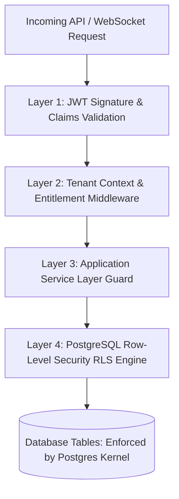
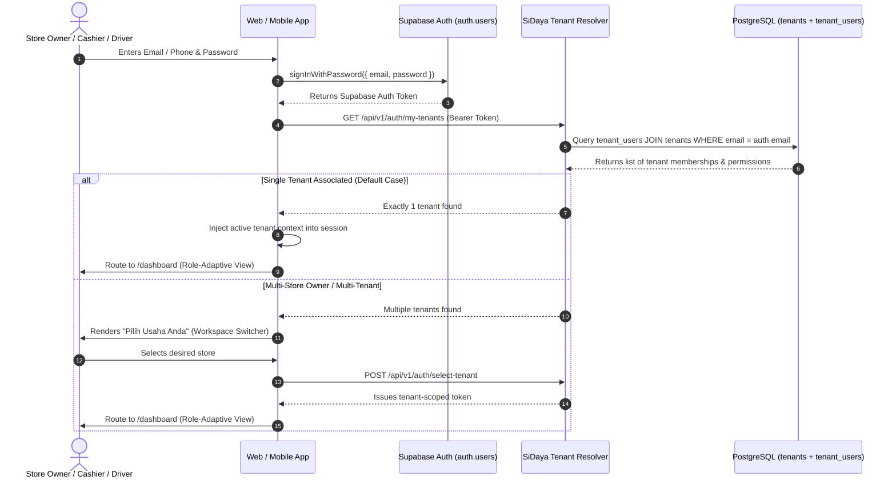
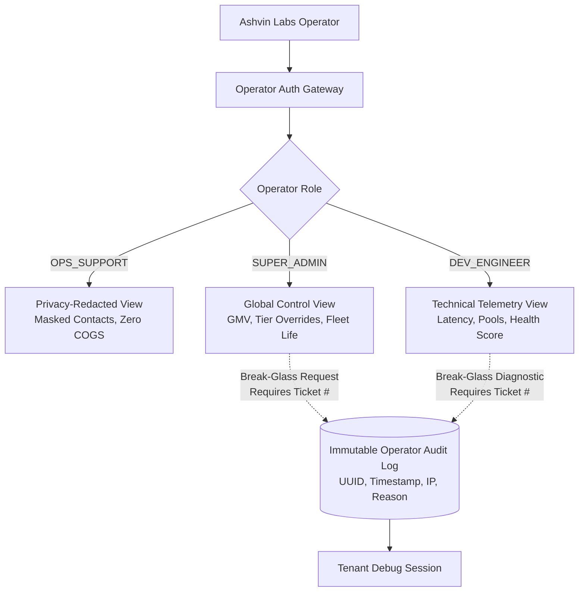

# Security, Compliance & Multi-Tenancy Architecture
> **Zero-Trust Tenant Isolation, Supabase RLS Privacy Policies, Station PIN Switching, and UU PDP Compliance**

---

## 1. Multi-Tenant Isolation: The Zero-Cross-Talk Architecture

In a multi-tenant SaaS serving hundreds of thousands of independent businesses, preventing tenant cross-talk (e.g., Merchant A accidentally seeing Merchant B's sales or customer database) is the highest security priority.

SiDaya employs **Defense-in-Depth Multi-Tenancy Isolation**:



### Layer 1: Cryptographic JWT Claims & Session Context
Access tokens are signed using asymmetric **RS256** (or HMAC-SHA256 with rotating secrets). The claims payload contains:
```json
{
  "sub": "u0000001-0000-0000-0000-000000000001",
  "tenant_id": "a0000001-0000-0000-0000-000000000001",
  "branch_id": "b0000001-0000-0000-0000-000000000001",
  "role": "CASHIER",
  "permissions": ["pos:checkout", "shifts:operate", "catalog:view", "warehouse:inbound"],
  "exp": 1773136800
}
```

### Layer 2: Fastify & Supabase Context Middleware
The incoming `X-Tenant-ID` header must strictly match the `tenant_id` claim in the verified JWT. Mismatches instantly return `403 Forbidden`.

### Layer 3: Two-Tier Application & Entitlement Guards
Before any service executes business logic, two programmatic assertions run:
1. **Tier 1 (Tenant Plan Entitlement)**: `@RequireEntitlement(FeatureKey)` asserts that the business's active subscription tier permits this module.
2. **Tier 2 (Staff Checkbox Permission)**: `@RequirePermission(PermissionKey)` asserts that the authenticated user's `permissions` array contains the required capability checkbox.

### Layer 4: PostgreSQL Kernel-Level Row-Level Security (RLS)
PostgreSQL RLS ensures that queries are sandboxed at the database kernel level:
```sql
SET LOCAL app.current_tenant_id = 'a0000001-0000-0000-0000-000000000001';
SET LOCAL app.current_user_role = 'CASHIER';
SET LOCAL app.current_user_permissions = 'pos:checkout,shifts:operate,catalog:view,warehouse:inbound';
```

---

## 1.1 Web & Mobile Universal Login and Tenant Routing Flow

When a user opens `sidaya.id/login` (or the mobile app) and signs in:



---

## 2. Granular Checkbox Permission Matrix & COGS Shielding

Store owners demand strict privacy regarding their financial profit margins and cost-of-goods-sold (*harga modal*), while needing flexibility to delegate tasks (e.g., letting a cashier receive goods at the dock).

### 1. Database-Enforced COGS Shielding via RLS
Cashiers and drivers can view product catalog names and retail/wholesale selling prices, but PostgreSQL RLS physically forbids them from querying `cost_price` unless granted the `catalog:view_cogs` permission:
```sql
CREATE POLICY mask_cost_price ON products
  FOR SELECT
  TO authenticated
  USING (
    tenant_id = NULLIF(current_setting('app.current_tenant_id', true), '')::UUID
    AND (
      NULLIF(current_setting('app.current_user_role', true), '') = 'OWNER'
      OR current_setting('app.current_user_permissions', true) LIKE '%catalog:view_cogs%'
      OR cost_price IS NULL
    )
  );
```

### 2. High-Speed Station PIN Security
* On shared counter devices, cashiers switch active operators using a 4-to-6 digit numeric PIN.
* PINs are never stored in plaintext; they are hashed using **Argon2id** (or bcrypt with salt).
* A station switch emits an audit log event (`STAFF_PIN_SWITCHED`) recording the timestamp, register device UUID, and cashier user ID.

---

## 3. Payment Security & Webhook Tamper Protection

Because payment webhooks trigger financial state transitions (marking invoices as PAID and decrementing stock), the webhook endpoint is hardened against tampering, replay attacks, and man-in-the-middle forging.

### Webhook Verification Workflow:
1. **Cryptographic Signature Verification**:
   Every incoming webhook is verified against the payment provider's shared webhook secret:
   ```typescript
   const rawSignature = crypto
     .createHash('sha512')
     .update(`${payload.order_id}${payload.status_code}${payload.gross_amount}${SERVER_KEY}`)
     .digest('hex');

   if (rawSignature !== headers['x-callback-signature']) {
     throw new UnauthorizedException('Invalid webhook signature');
   }
   ```
2. **Idempotency Key Deduplication**:
   To prevent duplicate processing from network retries, every webhook is recorded in the `payment_transactions` table using a unique `idempotency_key` (derived from `provider_transaction_id`).

### PCI-DSS Compliance Scope Minimization:
SiDaya is **100% out of scope for PCI-DSS Level 1**:
* Neither the mobile app nor the backend servers ever touch, store, or transmit raw credit card numbers.
* Payment forms are rendered inside hosted payment gateway sessions or server-side tokenized micro-widgets provided by licensed payment acquirers.

---

## 4. Mobile POS Application Security

* **Encrypted Key Storage**: Refresh tokens and sensitive merchant configurations are stored using `expo-secure-store`, backed by **Keychain on iOS** and **Keystore / EncryptedSharedPreferences on Android**.
* **Inactivity Lock**: If the app is idle for 3 minutes, it locks to a numeric keypad screen requiring the cashier's PIN.
* **Audit Logging**: All sensitive operations (voiding a paid receipt, manual price overrides, deleting debt records, cash drops) require manager PIN authorization and are permanently appended to an immutable audit trail.

---

## 5. Privacy & Regulatory Compliance (Indonesian UU PDP)

SiDaya complies with Indonesia's Personal Data Protection Law (*Undang-Undang Perlindungan Data Pribadi* / UU PDP):
1. **Data Minimization**: Only necessary customer data (Customer Name, WhatsApp Phone Number) is requested for invoice dispatch.
2. **Encryption at Rest & in Transit**:
   * All REST and WebSocket communication enforces **TLS 1.3**.
   * Database storage is encrypted at rest using AES-256.
3. **Data Residency**: Customer data is hosted within Indonesian cloud regions (AWS Jakarta / Google Cloud Jakarta) to comply with local financial data sovereignty regulations.

---

## 6. Logistics & Driver Commercial Margin Protection (Surat Jalan Security)

In Indonesian B2B wholesale trade (e.g. bulk rice and FMCG distribution), merchants face critical commercial risks if third-party delivery drivers or logistics couriers know the financial terms of a sale:
* **The Risk**: Drivers seeing invoice amounts may demand extortion fees, leak merchant margins to competing wholesalers, or incite price disputes with recipient shopkeepers.
* **The Enforcement**:
  1. **Database-Level Table Segregation**: Drivers are given accounts with the `DRIVER` role. PostgreSQL RLS strictly blocks this role from reading `orders`, `order_items`, `products.cost_price`, or `piutang_records`.
  2. **Price-Stripped Manifest Views**: Drivers query exclusively against `delivery_orders` and `delivery_order_items`, tables that omit any columns for `unit_price`, `discount`, `subtotal`, `tax`, or `grand_total`.
  3. **Cryptographic Invoice Linkage**: Each Driver Working Permit (*Surat Jalan*) embeds an opaque, signed token (`qr_verification_token`). When scanned by the warehouse keeper or client, it verifies authenticity and manifests the line items for sign-off without ever rendering financial amounts on the driver's screen or paper printout.

---

## 7. Control Plane Security: Operator RBAC & Privacy-Preserving Break-Glass Protocol

To provide Ashvin Labs management (CEO, developers, support staff) with system oversight without compromising tenant trust or violating UU PDP:



1. **Dual-Plane Separation**:
   * **Merchant Data Plane**: Strictly partitioned by `tenant_id` via PostgreSQL RLS.
   * **Control Plane**: Governed by `platform_operators` with four specialized roles:
     - `SUPER_ADMIN`: CEO / Founders / CTO (Global GMV/MRR, tenant lifecycle, plan overrides).
     - `DEV_ENGINEER`: Developers / Tech Leads (Telemetry, latency, error rates, read-only diagnostic).
     - `OPS_SUPPORT`: Support Officers (Tenant directory, reset PINs/passwords, quota monitoring). **Proprietary commercial secrets (COGS, customer phone numbers, sales margins) are strictly masked.**
     - `AUDIT_COMPLIANCE`: Compliance officers (Auditing operator actions under UU PDP).
2. **Privacy-Preserving Masking**:
   * Support agents querying tenant customer lists receive hashed or redacted representations: `Pak H*** R*** (0812-****-5432)`.
   * Raw supplier purchase invoices and margin calculations are physically withheld from operational support roles.
3. **Mandatory Break-Glass Diagnostic Protocol**:
   * If a developer or super-admin must inspect a specific tenant's data to resolve an active system defect:
     - They must provide an active **Ticket Reference** (e.g., `INC-9482`) and a justified **Reason**.
     - The system issues a short-lived diagnostic session and appends an immutable entry to `platform_operator_audit_logs`.
     - Deleting or tampering with operator audit logs is physically prevented by database row-level triggers.

