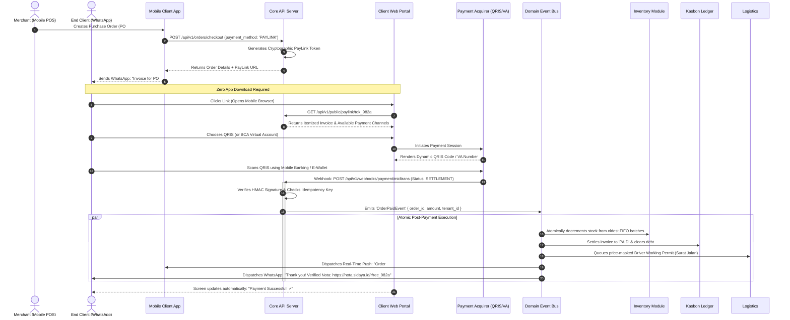
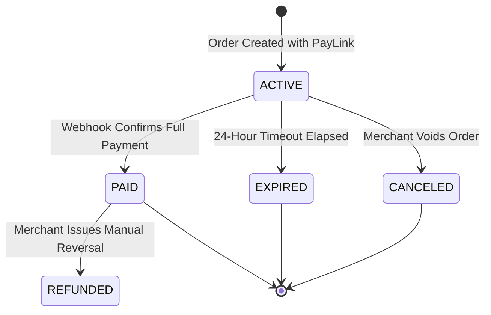

# Modular PayLink & Client Checkout Engine
> **Deep Dive: The End-to-End Client Payment Backend, Hosted Web Portal & Atomic Post-Payment Pipeline**

---

## 1. Overview: The Core Product Differentiator

The central differentiation between SiDaya and traditional mobile invoicing tools (such as **Canggih Software's e-Nota**) is the **interactive, closed-loop Client Payment Backend**. 

Instead of generating a static image/PDF and forcing the merchant to manually verify bank transfer screenshots on WhatsApp, SiDaya issues a **secure, hosted dynamic web portal** for each purchase order. When the buyer completes payment online (supporting wholesale orders with compound discounts and unit conversions, or partial *piutang* settlements), the system orchestrates real-time verification, decrements inventory atomically, settles the debt ledger, and broadcasts sub-second WebSocket updates to all tenant devices via **Supabase Realtime**.



---

## 2. PayLink Lifecycle & State Machine



### State Definitions:
* **`ACTIVE`**: PayLink is open and accepting payment. Line items are temporarily reserved (soft-hold) or tracked.
* **`PAID`**: Payment verified by gateway webhook. Inventory permanently decremented from physical stock.
* **`EXPIRED`**: The customer did not complete payment before `expires_at` (default 24 hours). Soft-holds are released.
* **`CANCELED`**: The merchant updated or canceled the order before payment was finalized.

---

## 3. The Modular Payment Gateway Interface (`IPaymentGatewayProvider`)

To ensure **extreme modularity**, all payment rails (Midtrans, Xendit, Doku, or direct bank integrations) are wrapped behind a common interface. The core order engine has zero provider-specific code.

```typescript
// packages/payment-core/src/interfaces/payment-provider.interface.ts

export interface CreatePaymentSessionDTO {
  tenantId: string;
  orderId: string;
  orderNumber: string;
  amount: number;
  customer: {
    name: string;
    phone: string;
    email?: string;
  };
  items: Array<{
    id: string;
    name: string;
    price: number;
    quantity: number;
  }>;
  expiresInMinutes: number;
}

export interface PaymentSessionResult {
  gatewayReferenceId: string;
  checkoutUrl: string;
  paymentToken: string;
  qrString?: string;
  vaNumber?: string;
}

export interface NormalizedWebhookResult {
  isValid: boolean;
  orderId: string;
  gatewayTransactionId: string;
  status: 'SETTLED' | 'PENDING' | 'EXPIRED' | 'FAILED';
  amountPaid: number;
  paymentChannel: string;
  paidAt: Date;
  rawPayload: Record<string, any>;
}

export interface IPaymentGatewayProvider {
  readonly providerId: string; // 'MIDTRANS' | 'XENDIT'
  createPaymentSession(dto: CreatePaymentSessionDTO): Promise<PaymentSessionResult>;
  verifyWebhookSignature(headers: Record<string, string>, body: any): boolean;
  parseWebhook(body: any): NormalizedWebhookResult;
}
```

---

## 4. The Client Web Checkout Portal (Zero-Install Architecture)

The customer experiences a frictionless web checkout built with **Next.js Serverless SSR**:

### Key Architectural Characteristics:
1. **Lightweight Bundle**: < 60KB first load JS; runs smoothly on entry-level Android browsers (Chrome, UC Browser).
2. **Instant QRIS Generation**:
   * Displays the standardized Indonesian National QRIS code immediately.
   * On mobile devices, includes a **"Download QRIS / Open E-Wallet"** button allowing buyers to pay directly in GoPay, OVO, ShopeePay, or BCA Mobile with 1 tap.
3. **Real-Time Polling / WebSocket**:
   * The web page listens to a lightweight Server-Sent Event (SSE) stream: `GET /api/v1/public/paylink/:token/stream`.
   * As soon as the webhook arrives on the server, the SSE pushes `{ status: "PAID" }`, instantly transitioning the buyer's screen to a celebration checkmark and digital receipt.

---

## 5. Post-Payment Atomic Orchestration Pipeline

When the payment webhook arrives, multiple systems must be adjusted simultaneously. To prevent partial database states, the post-payment handler executes inside a **PostgreSQL ACID transaction** or dispatches to the **Domain Event Bus**:

```typescript
// packages/order-engine/src/handlers/order-paid.handler.ts
import { DomainEventHandler } from '@sidaya/event-bus';
import { OrderPaidEvent } from '@sidaya/events';

export class OrderPaidEventHandler implements DomainEventHandler<OrderPaidEvent> {
  constructor(
    private readonly db: DatabaseClient,
    private readonly pushService: PushNotificationService,
    private readonly waService: WhatsAppService,
  ) {}

  async handle(event: OrderPaidEvent): Promise<void> {
    const { orderId, tenantId, amountPaid, paymentChannel, idempotencyKey } = event;

    await this.db.transaction(async (trx) => {
      // 1. Mark Order as PAID
      const order = await trx('orders')
        .where({ id: orderId, tenant_id: tenantId })
        .update({
          payment_status: 'PAID',
          paid_at: new Date(),
          payment_method: `PAYLINK_${paymentChannel}`,
        })
        .returning('*');

      // 2. Fetch line items and execute atomic stock movements
      const items = await trx('order_items').where({ order_id: orderId, tenant_id: tenantId });
      
      for (const item of items) {
        // Record immutable stock movement ledger entry
        await trx('stock_movements').insert({
          tenant_id: tenantId,
          store_id: order.store_id,
          product_id: item.product_id,
          quantity_delta: -item.quantity,
          movement_type: 'SALE',
          reference_id: orderId,
        });

        // Decrement cached current_stock on product
        await trx('products')
          .where({ id: item.product_id, tenant_id: tenantId })
          .decrement('current_stock', item.quantity);
      }

      // 3. Clear Customer Kasbon Ledger if order was credit settlement
      if (order.customer_id) {
        await trx('customers')
          .where({ id: order.customer_id, tenant_id: tenantId })
          .decrement('total_receivable', amountPaid);
      }
    });

    // 4. Asynchronous Out-of-Band Notifications (Non-blocking)
    await Promise.allSettled([
      // Notify Merchant Mobile App
      this.pushService.sendToMerchant(tenantId, {
        title: 'Pembayaran Diterima! 💰',
        body: `Pesanan #${order.order_number} senilai Rp${amountPaid.toLocaleString('id-ID')} telah dibayar via ${paymentChannel}.`,
        sound: 'kaching.mp3',
      }),

      // Deliver Verified Digital Receipt to Customer via WhatsApp
      this.waService.sendVerifiedReceipt(order.customer_phone, {
        orderNumber: order.order_number,
        totalAmount: amountPaid,
        receiptUrl: `https://nota.sidaya.id/r/${order.id}`,
      }),
    ]);
  }
}
```

---

## 6. Edge Cases & Resilience Strategy

| Edge Case Scenario | System Behavior & Mitigation |
| :--- | :--- |
| **Customer pays via QRIS 1 minute after PayLink expired** | Gateway webhook is still accepted. System checks if stock is available: if yes, marks order as PAID and honors transaction; if stock was taken by counter sale, creates a store credit / pending refund flag. |
| **Merchant cancels order on mobile while buyer is paying** | Webhook verification checks order state. If canceled, an automated refund is initiated via gateway API or marked for cashier reversal. |
| **Gateway sends duplicate webhooks (Network retry)** | Handled via `payment_transactions.idempotency_key` unique constraint. Second callback returns `200 OK` immediately without re-decrementing inventory. |
| **Merchant smartphone is offline when payment arrives** | Cloud updates central PostgreSQL ledger. When merchant phone reconnects, delta sync downloads the updated order status and plays audio confirmation. |
