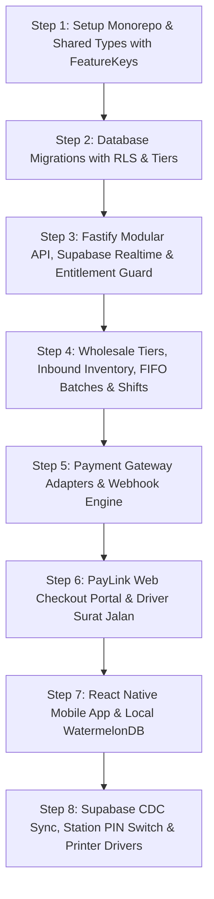

  # AI Agent & Engineering Implementation Guide
> **Standardized Blueprint, Coding Conventions, and Architectural Guardrails for Autonomous AI Agents and Developers**

---

## 1. Mission & Purpose of this Document

This document is the **primary instruction manual for AI coding agents and software engineers** who will generate, modify, and maintain the SiDaya codebase. 

When an AI agent is tasked with building a feature (e.g., adding wholesale price tiers, integrating dot matrix printing, building shift reconciliation, or adding Supabase Realtime listeners), the agent **MUST** follow the architectural rules, directory structures, and design patterns specified herein.

---

## 2. Monorepo Repository Structure

SiDaya is organized as a lightweight, modular monorepo (managed via **pnpm workspaces** or **Turborepo**):

```
sidaya/
├── .github/                     # CI/CD Workflows (Lint, Test, EAS Build, Vercel & Supabase Deploy)
├── docs/                        # Complete project documentation suite
├── apps/
│   ├── mobile/                  # React Native (Expo SDK 51+) POS & Field Merchant App
│   │   ├── src/
│   │   │   ├── app/             # Expo Router screens / navigation routes
│   │   │   ├── modules/         # Feature-Sliced modules (pos, wholesale, piutang, shifts)
│   │   │   ├── database/        # WatermelonDB schema, models, and sync engine
│   │   │   ├── services/        # Supabase Realtime, Bluetooth ESC/POS, Dot Matrix ESC/P2
│   │   │   └── shared/          # Reusable UI primitives, theme, entitlement hooks
│   │   ├── app.json             # Expo configuration (plugins, EAS updates)
│   │   └── package.json
│   ├── paylink-web/             # Next.js Serverless Client Web Checkout Portal (/p/[token])
│   │   ├── src/
│   │   │   ├── app/             # Hosted buyer checkout page (/p/[token])
│   │   │   ├── components/      # QRIS renderer, channel selector, receipt view
│   │   │   └── lib/             # Supabase Realtime SSE listener, API client
│   │   └── package.json
│   └── web-portal/              # Next.js Responsive Merchant Backoffice Portal (app.sidaya.id)
│       ├── src/
│       │   ├── app/             # App Router (/login, /select-tenant, /dashboard, /inventory, /logistics)
│       │   ├── components/      # Checkbox matrix, KPI cards, Inbound PO dock, Surat Jalan viewer
│       │   └── lib/             # Supabase Auth client, tenant session context
│       └── package.json
├── packages/
│   ├── api-core/                # Node.js + Fastify Modular Monolith
│   │   ├── src/
│   │   │   ├── modules/         # Domain modules (identity, entitlement, catalog, order, shift)
│   │   │   ├── infrastructure/  # Supabase client, Redis BullMQ, PostgreSQL RLS middleware
│   │   │   ├── events/          # Domain Event Bus definitions & handlers
│   │   │   └── server.ts        # Fastify server bootstrap
│   │   └── package.json
│   ├── database/                # Database migrations, seeds, and DDL
│   │   ├── migrations/          # SQL migrations with RLS policies
│   │   └── schema.sql           # Canonical PostgreSQL schema
│   ├── payment-core/            # Unified Payment Gateway Adapters
│   │   ├── src/
│   │   │   ├── interfaces/      # IPaymentGatewayProvider interface
│   │   │   └── providers/       # MidtransAdapter, XenditAdapter, MockAdapter
│   │   └── package.json
│   └── shared-types/            # Shared TypeScript DTOs, FeatureKey Enums, Zod Schemas
│       └── src/
└── package.json
```

---

## 3. Strict Coding Conventions & Quality Guardrails

### A. TypeScript Strictness & Zero `any`
* All code must compile with `"strict": true` in `tsconfig.json`.
* **Zero `any`**: Explicitly type all function signatures, parameters, and return types. Use `unknown` with Zod type guards when dealing with untyped external inputs.

### B. Dynamic Modularity & Feature Entitlement Guardrails
1. **Declare Feature Keys**: Any feature that can be toggled by subscription tier must be registered in `FeatureKey` enum in `@sidaya/shared-types`.
2. **Backend Protection**: Every controller endpoint belonging to a gated feature MUST declare `@RequireEntitlement(FeatureKey)`.
3. **Frontend Gating**: Every UI element belonging to a gated feature MUST use `const { isEnabled } = useFeatureEntitlement(FeatureKey)`. If disabled, either hide the component or render a subtle upgrade badge.

### C. Domain Boundaries & Clean Isolation
1. **Never perform cross-module direct table queries**:
   * *Bad*: `OrderModule` querying `SELECT * FROM inventory_batches WHERE ...`
   * *Good*: `OrderModule` calling `inventoryService.reserveStock(...)` or publishing `OrderPlacedEvent`.
2. **Feature-Sliced Design (FSD) in Mobile**:
   * Every feature slice (`modules/pos`, `modules/wholesale`, `modules/shifts`, `modules/piutang`) must expose an `index.ts` public interface.
   * Internal components inside `modules/pos/ui/` cannot be directly imported by other modules.

### D. Wholesale Trade Calculation Standards
1. **Compound Discounts**:
   Always calculate sequential trade discounts in exact order:
   ```typescript
   export function calculateCompoundDiscount(
     subtotal: number, 
     p1: number, 
     p2: number, 
     fixed: number
   ): number {
     const step1 = subtotal * (p1 / 100);
     const rem1 = subtotal - step1;
     const step2 = rem1 * (p2 / 100);
     return Math.round(step1 + step2 + fixed);
   }
   ```
2. **Multi-Unit Conversions**:
   Stock decrements must ALWAYS resolve to `base_unit_quantity = quantity * conversion_factor`.

### E. FIFO Batch Allocation & Surat Jalan Manifest Privacy Guardrails
1. **Batch Allocation Protocol**:
   When fulfilling sales orders with batch tracking enabled, NEVER decrement blindly from master stock. Always invoke `inventoryService.allocateBatchesFIFO(productId, requestedQuantity)` to reserve units from the oldest active batch first (FIFO). If multiple batches have the same inbound date, break ties using earliest `expiry_date` or lowest batch UUID.
2. **Driver Surat Jalan Serialization**:
   Serializers for `DeliveryOrderDTO` or `SuratJalanManifest` MUST NEVER expose `unit_price`, `subtotal`, `discount`, or `total_amount`. Use dedicated Zod schema `SuratJalanManifestSchema` that strictly omits financial fields to prevent commercial margin leaks to drivers or third parties.

### F. Multi-Tenant Role-Adaptive UI & Checkbox Permission Standards
1. **Never Branch on Hardcoded Role Strings**:
   * *Bad*: `if (user.role === 'CASHIER') { hideWarehouseButton(); }`
   * *Good*: `if (hasPermission(PermissionKey.WAREHOUSE_INBOUND)) { renderInboundDock(); }`
2. **Dynamic Navigation Pruning for Field Minimalism**:
   On smartphones, screens must remain uncluttered for field workers. If an employee lacks `finance:reports` or `warehouse:inbound`, those tabs/cards must be completely omitted from their bottom navigation and home drawer.
3. **The Two-Tier Capability Gate**:
   Always evaluate capabilities using:
   `canAccess = tenantHasFeature(requiredFeature) && (isOwner || userHasPermission(requiredPermission))`

---

## 4. Mobile Engineering & Expo Lifecycle Constraints

> [!IMPORTANT]
> **Expo OTA Updates vs. Fast Refresh Lifecycle Constraint**:
> * When diagnosing unexpected double-mounts, app restarts, or animation loops in the Expo mobile app, **ALWAYS verify whether testing a standalone build (EAS) vs. Expo Go**.
> * If testing a standalone build, consider `expo-updates` background downloads. Applying an OTA update reboots the JavaScript context and remounts the root layout.
> * Do not dismiss restarts as mere "dev environment quirks" if `expo-updates` is active in `app.json`.

### Hardware Driver Guidelines:
* **Thermal Printing**: Use raw ESC/POS byte commands via Bluetooth Low Energy. Do not render canvas screenshots to print text—send native bitmap and ESC/POS character streams for instant 1-second receipt printing.
* **Dot Matrix Printing**: Use Epson ESC/P2 text stream format with continuous form page break escapes (`0x0C` Form Feed).
* **Barcode Scanning**: Use `expo-camera` with `onBarcodeScanned` throttling (minimum 1,500ms debounce to prevent multi-scans).

---

## 5. Step-by-Step Implementation Sequence for AI Agents



### Pre-Commit Checklist for AI Agents:
* [ ] Are all new gated features registered in `FeatureKey` and protected by `@RequireEntitlement`?
* [ ] Does the database query strictly respect PostgreSQL RLS and hide `cost_price` from Cashiers?
* [ ] Are sales orders allocated from batches using FIFO (`allocateBatchesFIFO`)?
* [ ] Do driver manifests / Surat Jalan responses strictly strip all monetary amounts (`unit_price`, `subtotal`, `total`)?
* [ ] Are offline mutations recorded as event deltas rather than absolute overwrites?
* [ ] Are wholesale unit conversions mapped accurately to base quantities?
* [ ] Is Supabase Realtime WebSocket subscription filtered by `tenant_id`?
