# Dual-Path & Pluggable Multi-Rail Payment Architecture
> **Architectural Specification: Platform Subscription Billing (Path 1) vs. Pluggable Merchant Commercial Rails (Path 2: BYOK, Custom OPAP, Manual/EDC, Platform Escrow)**

---

## 1. Overview & Dual-Topology Separation

In a multi-tenant B2B wholesale platform like SiDaya, payment flows operate along **two completely segregated paths**:

```mermaid
flowchart TD
    subgraph Path1 ["Path 1: Platform SaaS Subscription Billing (Tenant -> Developer)"]
        TenantOwner["Store Owner / Tenant"] -->|"Subscribes (Starter / Pro / Enterprise)"| PlatGateway["Platform Gateway (Ashvin Labs)"]
        PlatGateway -->|"Webhook"| PlatEndpoint["/api/v1/webhooks/billing/platform"]
        PlatEndpoint --> PlatVerifier["Platform HMAC-SHA512 Verifier"]
        PlatVerifier --> SubManager["Subscription & Entitlement Manager"]
        SubManager --> EntitlementDB[("tenant_feature_entitlements")]
    end

    subgraph Path2 ["Path 2: Pluggable Merchant Commercial Rails (Customer -> Tenant)"]
        Customer["End-Buyer / Wholesale Client"] -->|"Purchases Goods / Settles Kasbon"| Router["Merchant Payment Router"]
        
        Router -->|"Tier 1: Manual / EDC"| ManualPay["Cash / Direct Transfer / Physical EDC"]
        Router -->|"Tier 2: BYOK Gateway"| BYOK["Tenant Gateway (Midtrans / Xendit / Duitku)"]
        Router -->|"Tier 3: Custom Adapter"| CustomOPAP["Open Payment Adapter Protocol (OPAP)"]
        Router -->|"Tier 4: Platform Rails"| PlatEscrow["Platform Split-Payment / QRIS"]
        
        BYOK -->|"Signed Webhook"| MerchEndpoint["/api/v1/webhooks/payment/checkout/:provider"]
        CustomOPAP -->|"Signed HMAC Webhook"| CustomEndpoint["/api/v1/webhooks/payment/custom/:tenantId"]
        PlatEscrow -->|"Settlement Webhook"| MerchEndpoint
        ManualPay -->|"Cashier Approval"| MerchEndpoint

        MerchEndpoint --> MerchVerifier["Tenant-Scoped Signature Verifier"]
        CustomEndpoint --> MerchVerifier
        MerchVerifier --> AtomicEngine["Atomic Post-Payment Engine"]
        AtomicEngine --> ACID["ACID DB Tx: FIFO Stock Decrement + Debt Settlement"]
        ACID --> SuratJalan["Surat Jalan Generator (Price-Masked Manifest)"]
    end
```

---

## 2. Path 1: Platform SaaS Subscription Billing Engine

### 2.1 Core Purpose & Gateway Ownership
* **Payee**: Ashvin Labs / SiDaya Platform Developer.
* **Payer**: Store Owner (Tenant).
* **Scope**: Subscription tier renewals (Starter, Pro, Enterprise), add-on features (custom domains, SMS/WA packs, multi-branch add-ons).
* **Gateway Account**: Platform's central master payment credentials (Midtrans / Xendit master account).

### 2.2 Subscription Plans & Entitlements

| Plan Tier | Price Monthly | Price Annual | Max Branches | Max Users | Key Capabilities |
| :--- | :--- | :--- | :--- | :--- | :--- |
| **STARTER_FREE** | Rp0 | Rp0 | 1 | 2 | POS Checkout, Cashier Shifts, Basic Catalog |
| **RETAIL_STARTER** | Rp99.000 | Rp990.000 | 1 | 5 | Inbound Warehouse, FIFO, Basic Reports |
| **GROSIR_PRO** | Rp299.000 | Rp2.990.000 | 3 | 15 | COGS Shielding, Surat Jalan, Piutang Ledger, Custom Domains |
| **OMNICHANNEL_ENTERPRISE** | Rp999.000 | Rp9.990.000 | Unlimited | Unlimited | Central Hub Multi-Store, Webhook API, Unlimited Audit Logs |

### 2.3 Cryptographic Webhook Endpoint
* **Endpoint**: `POST /api/v1/webhooks/billing/platform`
* **Verification**: SHA512 signature verified against `MIDTRANS_SERVER_KEY` (Platform Master Secret).
* **State Transition**: Activates subscription in `tenant_subscriptions` and synchronizes `tenant_feature_entitlements`.

---

## 3. Path 2: Pluggable Merchant Commercial Rails (Customer $\rightarrow$ Tenant)

Merchants have varying payment setups. SiDaya provides a **4-Tier Pluggable Connectivity Model**:

### 3.1 Tier 1: Manual / Standalone EDC / Direct Bank Transfer
* **Requirement**: Zero payment gateway API required.
* **Mechanism**: Cashier receives cash, direct BCA/Mandiri transfer screenshot, or card swipe on a physical EDC terminal.
* **Action**: Cashier enters transaction reference in POS and clicks "Konfirmasi Pembayaran". Triggers atomic FIFO stock movements and ledger updates with an immutable cashier audit entry.

### 3.2 Tier 2: BYOK (Bring Your Own Key / Direct Acquirer Account)
* **Requirement**: Merchant has their own contract with Midtrans, Xendit, Duitku, or BCA API.
* **Mechanism**: Merchant enters their Client Key, Server Key, and Webhook Secret in Store Settings (`/settings/payments`).
* **Security & Encryption**: Merchant credentials are encrypted at rest using **AES-256-GCM** via `crypto-utils.ts` and decrypted only in ephemeral execution memory.
* **Settlement**: 100% of customer funds settle directly into the Merchant’s own bank account via their payment gateway agreement.

### 3.3 Tier 3: Open Payment Adapter Protocol (OPAP / Custom Webhook)
* **Requirement**: For merchants running external legacy ERPs, custom payment aggregators, or proprietary POS hardware.
* **Protocol**:
  - SiDaya issues a unique `tenant_shared_hmac_secret`.
  - External system posts payment confirmation to `POST /api/v1/webhooks/payment/custom/:tenantId`.
  - Header `x-custom-signature` contains:
    $$\text{HMAC-SHA256}(\text{JSON.stringify(payload)}, \text{tenant\_shared\_hmac\_secret})$$
  - Signature is validated using `crypto.timingSafeEqual`.
  - Automatically triggers post-payment order settlement, FIFO stock decrement, and customer kasbon clearance.

### 3.4 Tier 4: Platform-Managed Instant Rails (Optional Split-Disbursement)
* **Requirement**: Small merchants without existing payment gateway accounts.
* **Mechanism**: Generates instant QRIS / Virtual Account numbers under platform umbrella. Automated split-payouts disburse net proceeds to the merchant's verified bank account via XenPlatform / Midtrans Iris.

---

## 4. Cryptographic Wall Between Path 1 and Path 2

To ensure financial integrity:
1. **Secret Isolation**: Platform billing secrets are never exposed to merchant routing, and tenant BYOK keys are encrypted per-tenant.
2. **Table Segregation**: Platform billing transactions are tracked separately from merchant sales orders.
3. **Idempotency Deduplication**: Every webhook execution records an `idempotencyKey = ${providerId}_${transactionId}_${orderId}` in memory/database to eliminate duplicate inventory decrements during network retries.

---

## 5. Summary Matrix

| Feature | Path 1 (Platform SaaS Billing) | Path 2 (Merchant Commercial Checkout) |
| :--- | :--- | :--- |
| **Recipient** | Platform Developer (Ashvin Labs) | Merchant / Store Owner |
| **Payer** | Store Owner | End-Customer / Wholesale Buyer |
| **Webhook Route** | `/api/v1/webhooks/billing/platform` | `/api/v1/webhooks/payment/checkout/:provider` or `/api/v1/webhooks/payment/custom/:tenantId` |
| **Secret Key** | Platform Master Secret Key | Tenant BYOK Key (AES-256-GCM encrypted) or OPAP Shared HMAC |
| **Post-Payment Action** | Unlocks feature entitlements, updates subscription dates | Decrements FIFO stock batches, settles debt, queues Surat Jalan |
