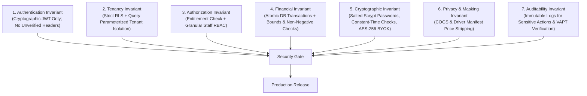

# Security-by-Design Governance & Engineering Workflow
> **Standard Operating Procedure (SOP) & Engineering Checklist for Current and Future Module Development**

---

## 1. Core Philosophy: Security as a First-Class Invariant

In SiDaya, security is not a post-launch audit task; it is built into the definition of every module from day one. Because the system handles wholesale money, credit (*piutang*) balances, and confidential cost margins (*harga modal*), **zero security compromises are accepted**.

Every developer, AI agent, or collaborator adding or modifying code MUST adhere strictly to the **7 Golden Security Invariants**.

---

## 2. The 7 Golden Security Invariants

### Invariant 1: Authentication Invariant
* **Rule**: All user identity and tenancy claims MUST be extracted from cryptographically verified JWT tokens (`Authorization: Bearer <token>`).
* **Forbidden**: Never trust client-injected `X-User-Role`, `X-User-Permissions`, or `X-Tenant-ID` headers unless they strictly match the verified JWT claims.

### Invariant 2: Tenancy Invariant (Zero-Cross-Talk)
* **Rule**: Every database query must be sandboxed by `tenant_id` at both the application query level and PostgreSQL Row-Level Security (`SET LOCAL app.current_tenant_id`).
* **Validation**: All tenant and user IDs must pass strict UUIDv4 regex validation before query execution.

### Invariant 3: Authorization Invariant
* **Rule**: Protected endpoints must pass two-tier authorization guards:
  1. `@RequireEntitlement(FeatureKey)`: Verifies active tenant subscription tier permits the feature.
  2. `@RequirePermission(PermissionKey)`: Verifies user's granular role capabilities.

### Invariant 4: Financial & Transactional Invariant
* **Rule**: All state transitions involving money, payments, debt ledgers (*piutang*), or FIFO inventory decrements MUST execute inside a **PostgreSQL ACID transaction** with row-level locks (`SELECT FOR UPDATE`).
* **Bounds**: Financial payload fields must strictly enforce positive integer quantities (`qty > 0`) and non-negative amounts (`unitPrice >= 0`, `discount >= 0`).

### Invariant 5: Cryptography & Timing-Safe Invariant
* **Rule**:
  - Passwords: Stored using salted **scrypt** (`crypto.scrypt`).
  - Station PINs: Stored using salted **PBKDF2** (`crypto.pbkdf2Sync`).
  - Secret Comparison: All tokens, signatures, and hashes MUST use `crypto.timingSafeEqual` to eliminate timing side-channels.
  - Merchant BYOK Keys: Encrypted at rest using **AES-256-GCM**.

### Invariant 6: Privacy & Commercial Margin Masking Invariant
* **Rule**:
  - Cashiers/warehouse staff cannot query `cost_price` without explicit `catalog:view_cogs` permission.
  - Delivery drivers (`DRIVER` role) querying manifests (*Surat Jalan*) receive payloads that are **100% physically stripped** of `unit_price`, `subtotal`, and `grand_total`.

### Invariant 7: Auditability & Continuous VAPT Invariant
* **Rule**: Any module introducing or modifying endpoints must pass the Continuous Security Assessment Framework (`pnpm run test:security`) with **Grade A+ (100% Pass Rate)** before merging.

---

## 3. Definition of Done (DoD) Security Checklist for New Features

Before any PR or module is approved for merge:

- [ ] **Endpoint Authentication**: Is the route protected by verified JWT middleware or public by explicit design?
- [ ] **Tenant Isolation**: Does the query filter by `tenant_id` and set RLS context?
- [ ] **Input Validation**: Are numeric values checked for `NaN`, negative numbers, and string bounds?
- [ ] **Cryptographic Verification**: If receiving webhooks, is the HMAC signature verified with constant-time equality?
- [ ] **Idempotency**: Can duplicate webhook or checkout submissions cause duplicate stock drops or double payments?
- [ ] **Data Masking**: Does the response payload expose sensitive COGS margins or personal customer data?
- [ ] **Automated VAPT**: Has `pnpm run test:security` been executed and confirmed Grade A+?
