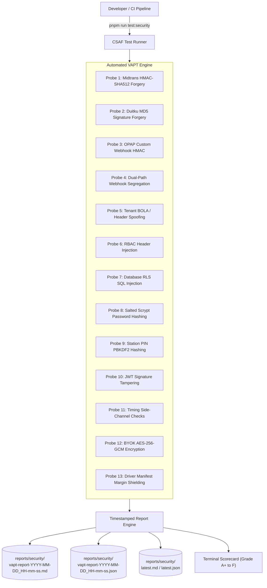

# Continuous Security Assessment Framework (CSAF) & Automated VAPT
> **Guide to Automated Penetration Testing, Real-Time Invariant Auditing, and Timestamped Compliance Reporting**

---

## 1. Overview & Architecture

The **Continuous Security Assessment Framework (CSAF)** is SiDaya's built-in, automated Vulnerability Assessment & Penetration Testing engine. It executes both **Static Application Security Testing (SAST)** and **Dynamic Adversarial Penetration Probing (DAST)** on demand.



---

## 2. Invocation & Usage

To trigger the full security assessment suite at any time during development or in CI/CD:

```bash
pnpm run test:security
```
*(or equivalent alias: `pnpm run audit:security`)*

### Exit Codes:
* **`0` (Success)**: All security invariants verified (Grade A+). Safe to merge and deploy.
* **`1` (Failure)**: One or more invariants violated. The test output pinpoints the exact failure reason, adversarial payload, and step-by-step remediation instructions.

---

## 3. Persistent Timestamped Reports Directory (`reports/security/`)

Every run automatically writes timestamped audit artifacts to `reports/security/`:

1. **`vapt-report-YYYY-MM-DD_HH-mm-ss.md`**:
   - Comprehensive executive audit report formatted in GitHub Flavored Markdown.
   - Contains executive summary, compliance status table (OWASP, UU PDP, PCI-DSS), audit trail, and adversarial payload results.
2. **`vapt-report-YYYY-MM-DD_HH-mm-ss.json`**:
   - Structured machine-readable JSON artifact for CI dashboards, compliance archiving, and vulnerability tracking over time.
3. **`latest.md` & `latest.json`**:
   - Pointers to the most recent run for instant developer reference.

---

## 4. Standards & Regulatory Mapping

| Standard | Requirements Covered in CSAF | Probes |
| :--- | :--- | :--- |
| **OWASP API Security Top 10 (2023)** | Broken Object Level Authorization (API1), Broken Authentication (API2), Property Level Authorization (API3), Broken Function Level Authorization (API5), Security Misconfiguration & SQLi (API8) | `SEC-TENANT-01`, `SEC-AUTH-01/02/03`, `SEC-PAY-01/02/03`, `SEC-RBAC-01`, `SEC-DB-01` |
| **Indonesian UU PDP (*UU No. 27/2022*)** | Article 35 (Technical Security Safeguards), Data Minimization, Driver Manifest Commercial Margin Shielding | `SEC-PRIVACY-01`, `SEC-CRYPTO-01`, `SEC-TENANT-01` |
| **PCI-DSS Scope Minimization** | Level 1 Scope Minimization (Hosted/Tokenized), Inbound Webhook Cryptography (Req 6.5), Merchant Key Encryption (Req 3.4) | `SEC-PAY-01/02/03`, `SEC-CRYPTO-01` |

---

## 5. Adding New Security Probes

As global security landscapes evolve or new payment rails are integrated:
1. Open `packages/api-core/test/security-assessment-framework.ts`.
2. Add a new private probe method (e.g. `probeNewPaymentGateway()` or `probeRateLimiting()`).
3. Push the result to `this.results.push({ id, category, standardMapping, title, description, status, severity, adversarialPayload, observedResult, remediation })`.
4. Re-run `pnpm run test:security` to ensure compliance.
