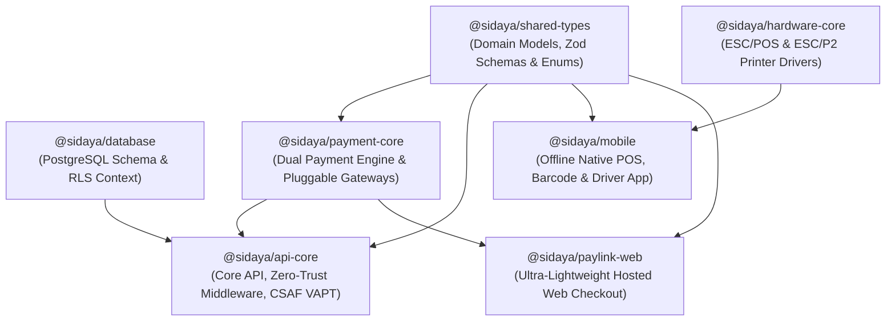

# @sidaya/* Monorepo Package & Module Manifest
> **Complete Inventory, Architecture Mapping, Exports, Dependency Graph, and Security Profiles for all SiDaya Packages & Applications**

---

## 1. Monorepo Architecture & Dependency Graph

SiDaya is engineered as a strict, high-performance TypeScript monorepo managed via **pnpm workspaces**:



---

## 2. Package Manifest Inventory

| Package Name | Workspace Location | Package Type | Core Purpose | Key Dependents |
| :--- | :--- | :--- | :--- | :--- |
| **`@sidaya/shared-types`** | `packages/shared-types` | Shared Library | Canonical domain types, Zod schemas, business enums, and permission presets. | All packages and apps |
| **`@sidaya/database`** | `packages/database` | Database Library | PostgreSQL migrations, RLS session constants, and UUID-sanitized context builders. | `@sidaya/api-core` |
| **`@sidaya/payment-core`** | `packages/payment-core` | Payment Library | Dual-path payment architecture, gateway providers (Midtrans, Xendit, Duitku, OPAP), and merchant router. | `@sidaya/api-core`, `@sidaya/paylink-web` |
| **`@sidaya/hardware-core`** | `packages/hardware-core` | Hardware Library | ESC/POS thermal printing, Epson ESC/P2 dot matrix commands, and cash drawer kickers. | `@sidaya/mobile` |
| **`@sidaya/api-core`** | `packages/api-core` | Backend Service | REST API server, cryptographic auth, zero-trust RBAC, domain services, controllers, and CSAF VAPT runner. | External clients, Mobile, Web |
| **`@sidaya/mobile`** | `apps/mobile` | Native Mobile App | Offline-first React Native / Expo POS, Inbound barcode scanner, and Surat Jalan driver portal. | End-users (Cashiers, Drivers, Gudang) |
| **`@sidaya/paylink-web`** | `apps/paylink-web` | Web Application | Ultra-lightweight (<60KB) client checkout web portal with instant QRIS and SSE realtime payment listener. | End-buyers (WhatsApp PayLink) |

---

## 3. Deep-Dive Package Specifications

---

### 📦 1. `@sidaya/shared-types`
* **Path**: [`packages/shared-types`](file:///k:/Personal/bikin%20duit/ashvin-book/packages/shared-types)
* **Description**: The single source of truth for all domain entities, validation contracts, enums, and data models across the entire monorepo.
* **Key Exports**:
  - **Enums** (`src/enums/`):
    - `FeatureKey`: Granular capability flags (e.g. `pos:checkout`, `catalog:view_cogs`, `warehouse:inbound`, `delivery:dispatch`, `piutang:manage`).
    - `UserRole`: `OWNER`, `MANAGER`, `CASHIER`, `WAREHOUSE`, `DRIVER`, `ACCOUNTANT`.
    - `SubscriptionTier`: `STARTER_FREE`, `RETAIL_STARTER`, `GROSIR_PRO`, `OMNICHANNEL_ENTERPRISE`.
    - `OrderPaymentStatus`: `UNPAID`, `PARTIALLY_PAID`, `PAID`, `EXPIRED`, `REFUNDED`.
    - `OrderFulfillmentStatus`: `PENDING_ALLOCATION`, `ALLOCATED`, `PACKED`, `IN_TRANSIT`, `DELIVERED`, `CANCELLED`.
    - `PaymentMethodType`: `CASH`, `PAYLINK_QRIS`, `PAYLINK_VA`, `BANK_TRANSFER_MANUAL`, `EDC_CARD`, `TEMPO_KASBON`.
  - **Models & Schemas** (`src/models/`):
    - `ProductSchema` & `CompoundDiscountSchema`: Wholesale tier schemas (*5%+2%*), unit conversion factors (*Pcs/Dus/Lusin*).
    - `CheckoutOrderPayloadSchema` & `SalesOrderSchema`: Order line items, totals, payment details, and idempotency keys.
    - `DeliveryOrderSchema` & `DeliveryManifestItemSchema`: Price-masked driver working permits (*Surat Jalan*).
    - `InboundBatchSchema`: FIFO batch lot tracking, supplier metadata, arrival dates, and expiry dates.
    - `CashierShiftSchema`: Shift cash float, cash drop logs, and X/Z settlement reports.
    - `AuthTenantPayloads`: `RegisterOwnerPayload`, `InviteStaffPayload`, `ResetPasswordPayload`.

---

### 🗄️ 2. `@sidaya/database`
* **Path**: [`packages/database`](file:///k:/Personal/bikin%20duit/ashvin-book/packages/database)
* **Description**: PostgreSQL database definitions, Supabase migration scripts, and Row-Level Security (RLS) session variable builders.
* **Key Exports & Modules**:
  - `buildSetTenantSessionSQL(context: TenantSessionContext)`: Formats PostgreSQL `SET LOCAL app.current_tenant_id` session commands with **strict UUIDv4 regex validation** and parameter escaping to eliminate SQL injection.
  - `TenantSessionContext`: Interface defining active tenant, user ID, role, and driver vehicle plate.
  - **Migrations** (`supabase/migrations/`):
    - `20260908000001_initial_schema.sql`: Core multi-tenant tables, branches, customers, suppliers, batches, orders, paylinks, and basic RLS.
    - `20260908000002_phase2_multi_tenant_and_inbound.sql`: Database-enforced COGS (*harga modal*) masking policy for cashiers and drivers.
    - `20260909000003_phase2_platform_operator_control_plane.sql`: Operator control plane tables, tenant telemetry, and immutable audit logs.
    - `20260909000004_auth_invitations_and_verifications.sql`: Staff invitation tokens, email OTP verifications, and PIN switches.
    - `20260909000005_phase1_complete_9pilar_schema.sql`: Full enterprise schemas (multi-warehouse transfers, stock opname, AP/AR ledgers, cash & bank accounts, asset depreciation, approval rules).

---

### 💳 3. `@sidaya/payment-core`
* **Path**: [`packages/payment-core`](file:///k:/Personal/bikin%20duit/ashvin-book/packages/payment-core)
* **Description**: Modular Indonesian payment gateway abstraction layer, Dual-Path payment engine (Path 1 SaaS Subscriptions vs Path 2 Commercial Checkout), and 4-tier merchant connectivity router.
* **Key Exports & Modules**:
  - **Payment Providers** (`src/providers/`):
    - `MidtransPaymentProvider`: Authentic HMAC-SHA512 verification, Snap token generation, dynamic QRIS, and VA numbers.
    - `DuitkuPaymentProvider`: MD5 signature verification and POP checkout integration.
    - `XenditPaymentProvider`: Invoice creation, QRIS, and webhook callback token verification.
    - `CustomWebhookPaymentProvider`: Open Payment Adapter Protocol (OPAP) with HMAC-SHA256 verification for proprietary tenant ERPs.
  - **Services** (`src/services/`):
    - `PlatformBillingService`: Path 1 SaaS tier subscription billing (Starter, Pro, Enterprise), renewals, and automatic entitlement updates.
    - `MerchantPaymentRouterService`: Path 2 commercial router supporting:
      - **Tier 1 (Manual/EDC)**: Zero gateway required, cashier manual confirmation.
      - **Tier 2 (BYOK)**: Encrypted merchant-owned gateway credentials (**AES-256-GCM**).
      - **Tier 3 (Custom OPAP)**: External POS/ERP signed HMAC-SHA256 callbacks.
      - **Tier 4 (Platform Managed)**: Instant platform QRIS with automated split-disbursement.
    - `PaymentGatewayRegistry`: Centralized registry managing active gateway provider instances.

---

### 🖨️ 4. `@sidaya/hardware-core`
* **Path**: [`packages/hardware-core`](file:///k:/Personal/bikin%20duit/ashvin-book/packages/hardware-core)
* **Description**: Direct hardware communication protocol builders for POS printers, dot matrix continuous form invoice printers, and cash drawers.
* **Key Exports**:
  - `EscPosBuilder`: Formats ESC/POS byte streams for 58mm and 80mm Bluetooth/USB thermal receipt printers.
  - `EscP2Builder`: Formats Epson ESC/P2 dot matrix printer escape sequences for multi-ply carbonized continuous paper invoices (*Faktur Penjualan 3 Ply*).
  - `ReceiptTemplates`: Pre-built layout templates for retail receipts, wholesale invoices, cashier shift X/Z summary reports, and price-masked Surat Jalan delivery slips.

---

### 🚀 5. `@sidaya/api-core`
* **Path**: [`packages/api-core`](file:///k:/Personal/bikin%20duit/ashvin-book/packages/api-core)
* **Description**: Primary backend service layer, cryptographic authentication pipeline, zero-trust RBAC middleware, domain logic services, HTTP controllers, and continuous security assessment test runner.
* **Key Exports & Modules**:
  - **Security Utilities** (`src/security/crypto-utils.ts`):
    - `hashPassword` / `verifyPassword`: Salted scrypt password hashing & constant-time verification.
    - `hashPin` / `verifyPin`: Salted PBKDF2 numeric Station PIN hashing.
    - `signJwtToken` / `verifyJwtToken`: Cryptographic HMAC-SHA256 JWT tokens with expiration, issuer, audience, and tamper detection.
    - `encryptSecret` / `decryptSecret`: AES-256-GCM authenticated encryption for merchant BYOK keys.
    - `timingSafeEqualStrings`: Side-channel immune comparison for tokens and signatures.
  - **Zero-Trust Middleware** (`src/middleware/`):
    - `tenant-context.middleware.ts`: Verifies JWT tokens and strictly enforces tenant boundaries.
    - `rbac-guard.ts`: Enforces granular capability permissions derived solely from verified tokens (strips untrusted headers).
    - `feature-gate.middleware.ts`: Verifies tenant subscription entitlements (`@RequireEntitlement`).
    - `operator-context.middleware.ts`: Restricts operator administrative actions strictly to `ops.*` subdomains.
  - **HTTP Router & Defense** (`src/routes/app-router.ts`):
    - Injects financial-grade security headers (`X-Content-Type-Options: nosniff`, `X-Frame-Options: DENY`, `Strict-Transport-Security`, `CSP`).
    - Sliding-window rate limiting on `/api/v1/auth/*` and PIN switch endpoints.
  - **Domain Services** (`src/services/`):
    - `OrderDomainService`: Checkout orchestration, FIFO lot reservation, wholesale tier calculation.
    - `InboundFifoDomainService`: Goods receipt, storage bin allocation, FIFO aging deduction.
    - `DeliveryOrderDomainService`: Price-stripped Surat Jalan generator & digital signature POD.
    - `ShiftDomainService`: Cash float opening, cash drops, X/Z settlement balance verification.
    - `AuthTenantDomainService`: Owner registration, staff invitations, email verification, PIN management.
    - `PlatformAdminDomainService`: Operator control plane telemetry, tenant lifecycle, impersonation protocol.
  - **Controllers** (`src/controllers/`):
    - `AuthController`, `OrderController`, `FifoController`, `DeliveryController`, `ShiftController`, `OperatorController`, `TenantController`, `PaymentWebhookController`.
  - **Continuous Security Assessment Framework (CSAF)** (`test/security-assessment-framework.ts`):
    - Automated penetration testing suite and invariant auditor generating persistent reports in `reports/security/`.

---

### 📱 6. `@sidaya/mobile` (`apps/mobile`)
* **Path**: [`apps/mobile`](file:///k:/Personal/bikin%20duit/ashvin-book/apps/mobile)
* **Description**: Cross-platform native mobile POS and warehouse terminal application built with React Native and Expo.
* **Key Features**:
  - Offline-first SQLite local store with background delta synchronization to Supabase.
  - Fast cashier station switching with 4-to-6 digit numeric PIN.
  - Inbound goods barcode scanner (camera & external Bluetooth scanner).
  - Price-masked driver logistics portal with digital signature Proof-of-Delivery.

---

### 🌐 7. `@sidaya/paylink-web` (`apps/paylink-web`)
* **Path**: [`apps/paylink-web`](file:///k:/Personal/bikin%20duit/ashvin-book/apps/paylink-web)
* **Description**: Zero-install, ultra-lightweight (<60KB first-load JS) client payment portal for end-buyers opening WhatsApp PayLinks.
* **Key Features**:
  - Dynamic Indonesian National QRIS rendering & Virtual Account display.
  - Sub-second payment detection using Server-Sent Events (SSE) stream (`/api/v1/public/paylink/:token/stream`).
  - Automatic digital verified receipt (*e-Nota*) issuance upon webhook settlement.

---

## 4. How to Verify All Packages

To build and typecheck all `@sidaya/*` packages simultaneously:

```bash
# Build all packages
pnpm -r run build

# Typecheck all packages
pnpm -r run typecheck

# Execute Continuous Security Assessment & Automated VAPT
pnpm run test:security
```
