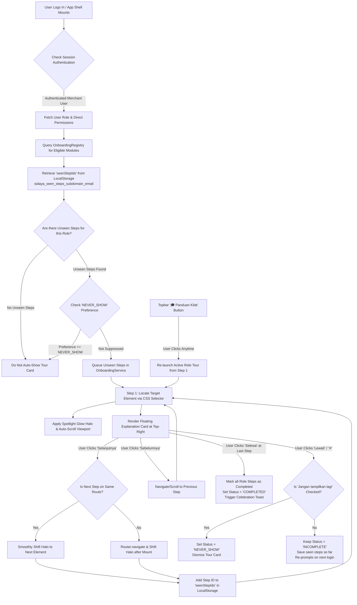
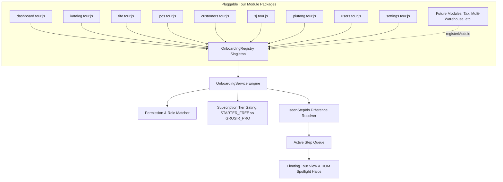
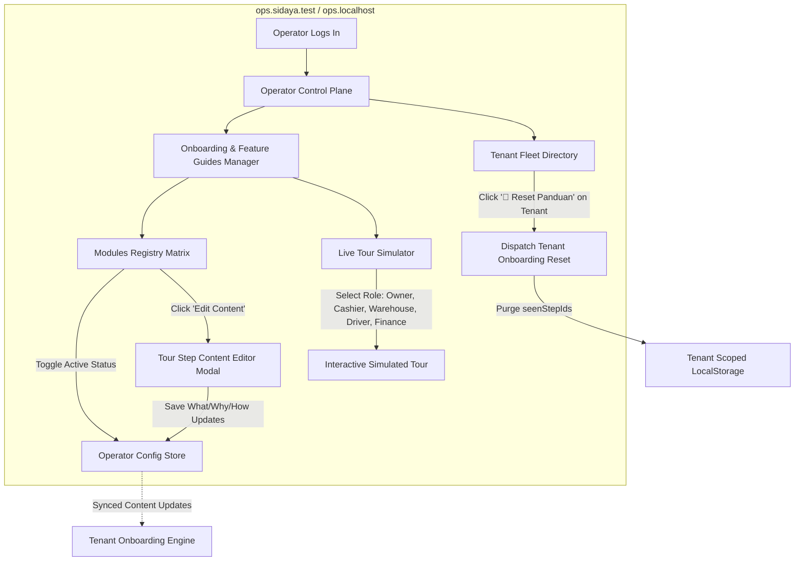

# 13. Modular Role-Based Onboarding & Interactive Tour System

## 1. Executive Summary & Objective

The **SiDaya Onboarding & Interactive Tour System** is an extensible, pluggable client-side walkthrough engine designed to guide new tenants (owners/directors) and tenant staff members (cashiers, warehouse leads, logistics drivers, finance) through the application's core operational capabilities.

Inspired by modern interactive SaaS onboarding (OpenTrain.ai), the system features:
1. **OpenTrain-Style Floating Card**: Positioned at the top-right viewport, explaining each component with a consistent 4-part structure (**Apa Ini**, **Mengapa Penting**, **Dari Mana Asalnya**, and **Langkah Penggunaan / Setup - How & Where**).
2. **Dynamic Spotlight Focus**: Live pulsing glow halo (`.onboarding-spotlight-active`) that centers and highlights the targeted DOM element with smooth viewport scrolling.
3. **Pluggable Module Registry (`OnboardingRegistry`)**: Zero-coupling architecture where each functional module registers its own tour package independently.
4. **Granular Step-Level Tracking (`seenStepIds`)**: Tracks individual completed steps per user/tenant. Promoted staff members (e.g. Cashier promoted to Warehouse) automatically receive tours only for newly unlocked capabilities.
5. **Enforced / Mandatory First-Time Lifecycle**: Runs automatically on login until the user completes the tour or skips with **"Jangan tampilkan lagi"** checked.
6. **Centralized Operator Plane Management (`ops.` Subdomain)**: Platform operators can view module statuses, edit step text live without code deploys, simulate tours for any role, and reset onboarding for specific tenants.

---

## 2. System Architecture & Component Flowcharts

### 2.1 Flowchart 1: Tenant & User Interactive Tour Execution Lifecycle



---

### 2.2 Flowchart 2: Pluggable Module Registry Architecture



---

### 2.3 Flowchart 3: Operator Control Plane Management (`ops.` Subdomain)



---

## 3. Granular Step-Level ID Matrix

Each component tutorial has a globally unique permanent ID:

```ts
type TourStepId =
  // Pilar 01: Executive Dashboard
  | 'kpi_omset'                 // Omset Harian
  | 'kpi_margin'                // Estimasi Margin & Laba Kotor
  | 'kpi_piutang'               // Total Piutang Belum Lunas
  | 'kpi_cashmix'               // Rasio Kas vs Piutang
  | 'dashboard_checklist'       // 4-Step Setup Checklist Toko
  // Pilar 02: Master SKU & HPP
  | 'catalog_actions_import'    // Tambah Produk & Impor Massal CSV
  | 'catalog_table_browse'      // Direktori Stok Master SKU
  | 'catalog_cogs_guard'        // Proteksi Modal COGS 🔒 Private
  // Pilar 02: Inbound Lot FIFO
  | 'fifo_inbound_receive'      // Formulir Penerimaan Muatan Masuk
  | 'fifo_batch_table'          // Tabel Lot Batch & Umur Stok
  | 'fifo_simulator'            // Simulator Alokasi Otomatis FIFO
  // Pilar 05: Kasir POS Grosir
  | 'pos_barcode_scan'          // Fast-Scan Barcode & Pencarian Cepat
  | 'pos_packaging_units'       // Pilihan Multi-Satuan (Karung/Bal/Pcs)
  | 'pos_cart_discount'         // Keranjang & Diskon Grosir Otomatis
  | 'pos_tempo_credit'          // Pembayaran Kasbon & Limit Plafon
  | 'pos_shift_close'           // Penutupan Shift Kasir & Rekonsiliasi Kas
  // Pilar 05: Faktur & Penjualan
  | 'invoices_history_reprint'  // Riwayat Faktur & Cetak Ulang Struk
  | 'invoices_csv_export'       // Ekspor Rekap Penjualan CSV
  // Pilar 03: CRM & Plafon Piutang
  | 'crm_add_customer'          // Pendaftaran Mitra Toko Baru
  | 'crm_credit_limit'          // Plafon Kredit & Batas Tempo (TOP)
  // Pilar 06: Surat Jalan (POD)
  | 'sj_create_manifest'        // Penerbitan Manifest Surat Jalan
  | 'sj_driver_manifest'        // Daftar Rute & Muatan Supir
  | 'sj_pod_signature'          // Tanda Tangan Digital Serah Terima POD
  // Pilar 07: Buku Piutang & WA PayLink
  | 'piutang_aging_buckets'     // Klasifikasi Umur Piutang (0-7 s/d >30 Hari)
  | 'piutang_wa_paylink'        // Tombol Kirim Tagihan WhatsApp PayLink
  // Pilar 08: Staf & Hak Akses
  | 'users_invite_staff'        // Undangan Staf & Template Preset Izin
  | 'users_direct_permissions'  // Hak Akses Langsung & Keamanan PIN
  // Pilar 09: Pengaturan Toko
  | 'settings_bank_identity'    // Rekening Bank Resmi Kop Faktur
  | 'settings_subdomain_domain' // Subdomain Mandiri & Domain Kustom;
```

---

## 4. Role Mapping & Granular Steps Matrix

| Role | Required Permissions / Predicate | Step Count | Mapped Step IDs |
| :--- | :--- | :--- | :--- |
| **👑 Tenant Owner** | `isOwner === true` | **18 Steps** | `kpi_omset`, `kpi_margin`, `kpi_piutang`, `dashboard_checklist`, `catalog_actions_import`, `catalog_cogs_guard`, `fifo_inbound_receive`, `fifo_simulator`, `pos_barcode_scan`, `pos_cart_discount`, `crm_credit_limit`, `sj_create_manifest`, `sj_pod_signature`, `piutang_aging_buckets`, `piutang_wa_paylink`, `users_invite_staff`, `users_direct_permissions`, `settings_bank_identity` |
| **🛒 Kasir POS** | `pos:checkout` | **6 Steps** | `pos_barcode_scan`, `pos_packaging_units`, `pos_cart_discount`, `pos_tempo_credit`, `pos_shift_close`, `invoices_history_reprint` |
| **📦 Kepala Gudang** | `inventory:inbound` | **5 Steps** | `fifo_inbound_receive`, `fifo_batch_table`, `fifo_simulator`, `sj_create_manifest`, `catalog_table_browse` |
| **🚚 Supir Logistik** | `logistics:sign_pod` | **3 Steps** | `sj_driver_manifest`, `sj_pod_signature`, `invoices_history_reprint` |
| **📊 Finance / Akuntansi**| `finance:reports` | **5 Steps** | `kpi_omset`, `piutang_aging_buckets`, `piutang_wa_paylink`, `invoices_csv_export`, `settings_bank_identity` |

---

## 5. Floating Card UI Specification

### 5.1 Card Structure
```
┌────────────────────────────────────────────────────────────┐
│ [👑 PEMILIK TOKO]   Langkah 2 dari 18 (18 Baru)       [ ✕ ] │
│ ▓▓░░░░░░░░░░░░░░░░░░░░░░░░░░░░░░░░░░░░░░░░░░░░░░░░░░░  11%  │
├────────────────────────────────────────────────────────────┤
│ 📈 Estimasi Margin & Laba Kotor                            │
│                                                            │
│ 📌 APA INI?                                                │
│ Selisih keuntungan antara harga jual grosir dengan HPP.    │
│                                                            │
│ 💡 MENGAPA PENTING?                                        │
│ Menjamin bisnis untung sehat dan modal tidak bocor diskon. │
│                                                            │
│ 🚀 LANGKAH PENGGUNAAN & SETUP:                             │
│ Untuk atur margin & diskon grosir kuantiti bertingkat:     │
│ Buka menu 'Master SKU & Harga' > Edit Produk > Tier Harga. │
├────────────────────────────────────────────────────────────┤
│ [ ] Jangan tampilkan lagi untuk peran ini                  │
│ [ Lewati ]                 [ ← Sebelumnya ] [ Selanjutnya → ]│
└────────────────────────────────────────────────────────────┘
```

### 5.2 Spotlight Halo CSS Specification
```css
.onboarding-spotlight-active {
  position: relative;
  z-index: 9998 !important;
  box-shadow: 0 0 0 4px rgba(99, 102, 241, 0.65), 0 0 28px rgba(99, 102, 241, 0.4) !important;
  border-radius: 10px;
  animation: spotlight-pulse 2s infinite ease-in-out;
  transition: all 0.3s ease;
}

@keyframes spotlight-pulse {
  0% { box-shadow: 0 0 0 3px rgba(99, 102, 241, 0.5), 0 0 15px rgba(99, 102, 241, 0.25); }
  50% { box-shadow: 0 0 0 6px rgba(99, 102, 241, 0.8), 0 0 32px rgba(99, 102, 241, 0.5); }
  100% { box-shadow: 0 0 0 3px rgba(99, 102, 241, 0.5), 0 0 15px rgba(99, 102, 241, 0.25); }
}
```

---

## 6. Implementation Checklist & File Manifest

- [ ] **Core Engine**:
  - `preview/js/onboarding/onboarding.registry.js`
  - `preview/js/onboarding/onboarding.service.js`
  - `preview/js/onboarding/onboarding.view.js`
- [ ] **Pluggable Tour Modules**:
  - `preview/js/onboarding/modules/dashboard.tour.js`
  - `preview/js/onboarding/modules/katalog.tour.js`
  - `preview/js/onboarding/modules/fifo.tour.js`
  - `preview/js/onboarding/modules/pos.tour.js`
  - `preview/js/onboarding/modules/customers.tour.js`
  - `preview/js/onboarding/modules/sj.tour.js`
  - `preview/js/onboarding/modules/piutang.tour.js`
  - `preview/js/onboarding/modules/users.tour.js`
  - `preview/js/onboarding/modules/settings.tour.js`
- [ ] **Operator Control Plane**:
  - `preview/js/views/operator.view.js` (Add Onboarding Manager card & Fleet Reset action)
  - `preview/js/controllers/operator.controller.js` (Add management handlers)
- [ ] **View DOM Anchors**:
  - Add ID tags across all 9 views to anchor spotlight halos cleanly.
- [ ] **Layout & App Mount**:
  - Add "🎓 Panduan Kilat" to topbar controls in `preview/js/views/layout.view.js`.
  - Include scripts in `preview/index.html` and register auto-start in `preview/js/app.js`.
