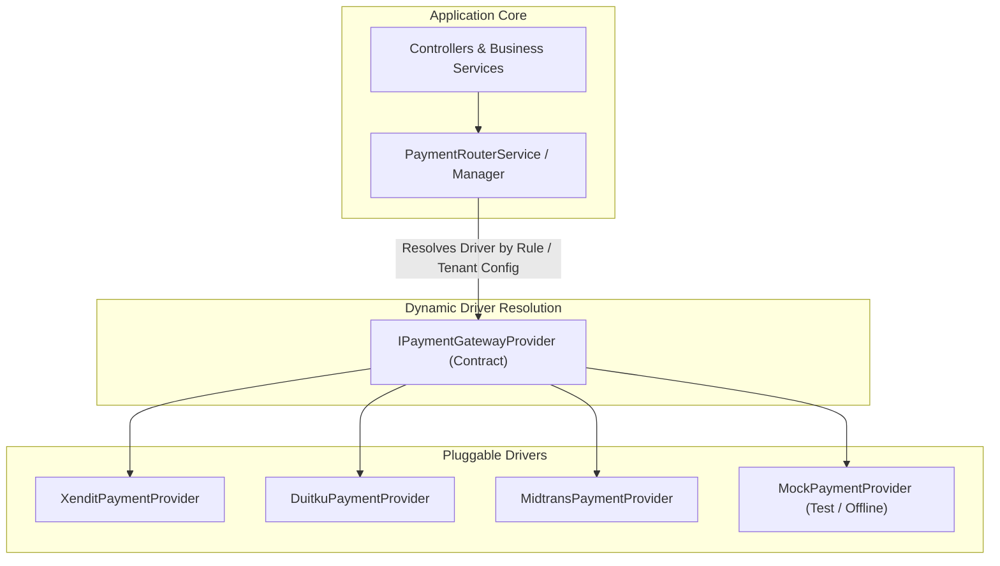
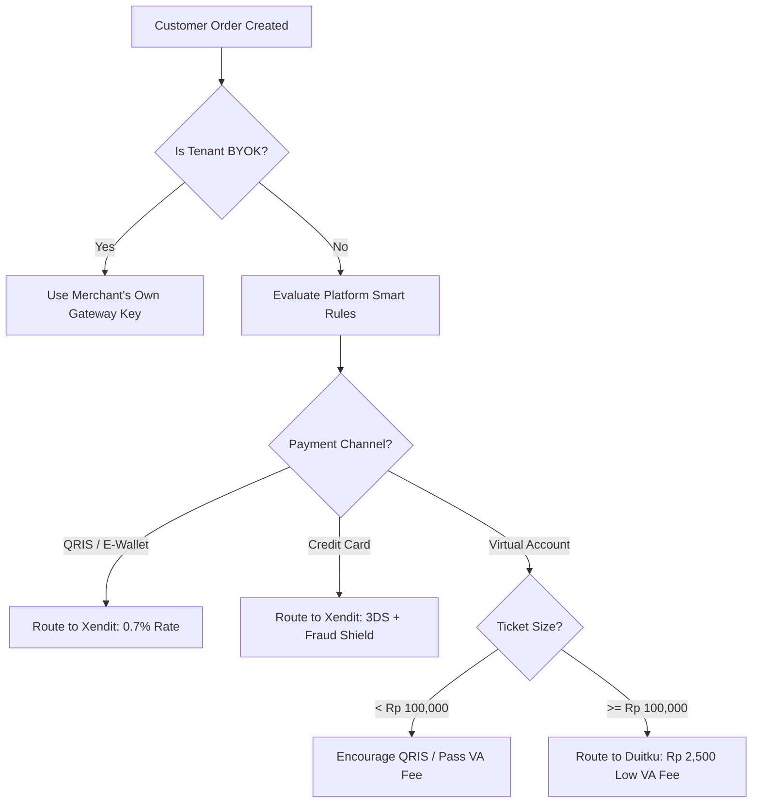

# Third-Party Agnostic Architecture & Granular Smart Payment Routing

> **Architectural Standard: Driver/Adapter Pattern for Third-Party Services & Dynamic Multi-Rail Payment Routing**

---

## 1. Core Architectural Principle: Third-Party Agnostic (Driver Pattern)

All third-party external integrations in **SiDaya** (Payment Gateways, Messaging/WhatsApp, Storage/S3, Hardware/Printers) follow the **Driver / Adapter Pattern** (inspired by Laravel's Manager/Driver architecture).



### Why Provider-Prefixed Environment Keys are Required

Even in a third-party agnostic system, provider credentials **must** use distinct environment variable prefixes (e.g. `XENDIT_SECRET_KEY`, `DUITKU_MERCHANT_KEY`):

1. **Different Credential Shapes**: Xendit uses `SecretKey + WebhookVerificationToken`, Duitku uses `MerchantCode + ApiKey`, Midtrans uses `ServerKey + ClientKey`. A generic `PAYMENT_KEY` cannot represent these varying requirements.
2. **Concurrent Multi-Driver Pool in Memory**: The `PaymentRouterService` initializes all configured drivers at boot time.
3. **Instant Zero-Downtime Hot-Swapping**: You switch the global driver instantly via `PAYMENT_DEFAULT_DRIVER=XENDIT` without restarting or changing code.
4. **Granular Per-Transaction Routing**: Allows simultaneously routing QRIS via Xendit, high-volume Virtual Accounts via Duitku, and Cards via Xendit in the same runtime.

---

## 2. Granular Smart Payment Routing Engine

The payment routing engine evaluates transactions through a series of **Granular Routing Rules** before choosing the active gateway:

```typescript
export interface PaymentRoutingRule {
  name: string;
  priority: number;
  evaluate: (dto: CreatePaymentSessionDTO) => boolean;
  targetProvider: 'XENDIT' | 'DUITKU' | 'MIDTRANS' | 'CUSTOM_GATEWAY';
}
```

### Dynamic Routing Strategies



1. **Tenant BYOK Priority**: If the merchant provided their own encrypted gateway keys in `/settings/payments`, use their dedicated account directly.
2. **Channel-Based Routing**:
   - **QRIS & E-Wallets**: Routed to **Xendit** for instant settlement and best-in-class webhook reliability.
   - **Virtual Accounts (VA)**: Routed to **Duitku** to minimize flat per-transaction fees (saving Rp 1,500 – Rp 2,000 per VA).
   - **Credit / Debit Cards**: Routed to **Xendit** for strict 3D-Secure and fraud prevention.
3. **Amount Threshold Routing**:
   - Small transactions (< Rp 100,000) default to QRIS.
   - Large wholesale orders (> Rp 1,000,000) unlock multi-bank Virtual Accounts.
4. **Circuit Breaker / Failover**: If the primary gateway health check fails or returns consecutive 5xx errors, traffic automatically fails over to the secondary standby gateway.

---

## 3. Infrastructure & Webhook Topology for `sidaya.my.id`

### 3.1 DNS Architecture (Staging / Testing)

| Subdomain | Target | Purpose |
| :--- | :--- | :--- |
| `api.sidaya.my.id` | Server IP / Caddy Proxy | Core Backend API & Webhook Receivers |
| `pay.sidaya.my.id` | Server IP / Caddy Proxy | Customer PayLink Checkout Portal |
| `sidaya.my.id` | Server IP / Caddy Proxy | Main App & Merchant Workspaces |
| `*.sidaya.my.id` | Server IP / Caddy Proxy | Dynamic Tenant Subdomains |

### 3.2 Caddy Reverse Proxy Configuration

```caddyfile
# Staging HTTPS Reverse Proxy with Automatic Let's Encrypt SSL

api.sidaya.my.id {
    reverse_proxy localhost:4000 {
        header_up Host {host}
        header_up X-Real-IP {remote_host}
        header_up X-Forwarded-For {remote_host}
        header_up X-Forwarded-Proto https
    }
}

pay.sidaya.my.id {
    reverse_proxy localhost:3000
}

sidaya.my.id, *.sidaya.my.id {
    reverse_proxy localhost:3333
}
```

### 3.3 Xendit Webhook Registry

In the Xendit Dashboard (**Settings ➔ Webhooks**), register the following endpoints:

| Xendit Event | Webhook Endpoint URL |
| :--- | :--- |
| **Payment received (Invoices)** | `https://api.sidaya.my.id/api/v1/webhooks/payment/xendit` |
| **Virtual Account paid (FVA)** | `https://api.sidaya.my.id/api/v1/webhooks/payment/xendit` |
| **QR Code paid (QRIS)** | `https://api.sidaya.my.id/api/v1/webhooks/payment/xendit` |
| **E-Wallet payment status** | `https://api.sidaya.my.id/api/v1/webhooks/payment/xendit` |
| **Recurring / Subscriptions** | `https://api.sidaya.my.id/api/v1/webhooks/billing/platform` |
| **Disbursement sent** | `https://api.sidaya.my.id/api/v1/webhooks/payment/xendit` |

---

## 4. Cryptographic Security Standards

1. **Constant-Time Signature Validation**: All incoming callbacks use `crypto.timingSafeEqual` against the provider's verification token (`x-callback-token` for Xendit, MD5 hash for Duitku) to prevent side-channel timing attacks.
2. **Tenant Credential Encryption**: Merchant BYOK keys are encrypted at rest using **AES-256-GCM** with a hardware/cluster master key before persistence.
3. **Idempotency**: All webhook handlers record incoming `gatewayTransactionId` in `processed_payment_events` with an atomic unique constraint to eliminate double-crediting or duplicate stock decrements.
